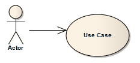

##### [Use](https://sparxsystems.com/enterprise_architect_user_guide/15.1/model_domains/use.html)

Description
A Use relationship indicates that one element requires another to perform some interaction. The Use relationship does not specify how the target supplier is used, other than that the source client uses it in definition or implementation.

Описание
Отношение использования указывает, что один элемент требует другого для выполнения некоторого взаимодействия. Отношение использования не определяет, как используется целевой поставщик, кроме того, что исходный клиент использует его в определении или реализации.

You typically use the Use relationship in Use Case diagrams to model how Actors use system functionality (Use Cases).

Обычно отношение использования используется в диаграммах вариантов использования для моделирования того, как субъекты используют функциональные возможности системы (сценарии использования).

Notes
* It is more usual (and correct UML) to have an Association between an Actor and a Use Case
* The Usage relationship, used in Class diagrams, is a different relationship
Ноты
* Более обычным (и правильным) UML является наличие ассоциации между действующим лицом и вариантом использования.
* Отношения использования, используемые в диаграммах классов, представляют собой разные отношения.

Toolbox icon

Learn more
* [Use Case Diagram](https://sparxsystems.com/enterprise_architect_user_guide/15.1/model_domains/usecasediagram.html)
* [Association](https://sparxsystems.com/enterprise_architect_user_guide/15.1/model_domains/associate.html)
* [Usage](https://sparxsystems.com/enterprise_architect_user_guide/15.1/model_domains/usage.html)

Выучить больше
* Диаграмма вариантов использования
* ассоциация
* использование
