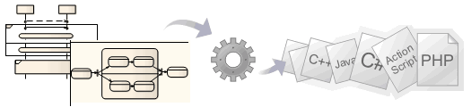

-- [Behavioral Models](https://sparxsystems.com/enterprise_architect_user_guide/15.1/model_domains/code_generation_from_behaviora.html)

Мощные возможности системного проектирования Enterprise Architect можно использовать для генерации кода для языков описания программного обеспечения, систем и оборудования непосредственно из поведенческих моделей, таких как StateMachine, Sequence (Interaction) и Activity diagrams. Поддерживаемые языки включают C (OO), C ++, C #, Java, VB.Net, VHDL, Verilog и SystemC.

Программный код может быть сгенерирован из диаграмм StateMachine, Sequence и Activity, а языки описания оборудования - из диаграмм StateMachine (с использованием шаблонов Legacy State Machine).

-- Сгенерируйте код из поведенческих диаграмм с помощью проекта EAExample

* Откройте файл EAExample.eap, выбрав ленту «Пуск> Справка> Справка> Открыть пример модели».Open the EAExample.eap file by selecting the 'Start > Help > Help > Open the Example Model' ribbon option.

В окне браузера выберите любой из этих пакетов:

Примеры языков программного обеспечения:

* Пример модели> Разработка программного обеспечения> Модель Java с поведением Example Model > Software Engineering > Java Model With Behaviors

Создайте классы Account и Order

* Пример модели> Системное проектирование> Модель реализации> Программное обеспечение> C # Example Model > Systems Engineering > Implementation Model > Software > C#

Создайте класс DataProcessor

* Пример модели> Системное проектирование> Пример SysML> Модель реализации> Программное обеспечение> C ++ Example Model > Systems Engineering > SysML Example > Implementation Model > Software > C++

Создать класс ввода-вывода Generate the IO Class

* Пример модели> Системное проектирование> Пример SysML> Модель реализации> Программное обеспечение> Java Example Model > Systems Engineering > SysML Example > Implementation Model > Software > Java

Создать класс ввода-вывода

* Пример модели> Системное проектирование> Пример SysML> Модель реализации> Программное обеспечение> VBNet Example Model > Systems Engineering > SysML Example > Implementation Model > Software > VBNet

Создать класс ввода-вывода

Примеры аппаратного языка: Hardware Language Examples:

* Пример модели> Системное проектирование> Пример SysML: портативный аудиоплеер> Модель реализации> Аппаратное обеспечение> SystemC Example Model > Systems Engineering > SysML Example: Portable  Audio Player > Implementation Model > Hardware > SystemC

Создайте класс PlayBack

* Пример модели> Системное проектирование> Пример SysML: портативный аудиоплеер> Модель реализации> Оборудование> VHDL Example Model > Systems Engineering > SysML Example: Portable  Audio Player > Implementation Model > Hardware > VHDL

Создайте класс PlayBack

* Пример модели> Системное проектирование> Пример SysML: портативный аудиоплеер> Модель реализации> Аппаратное обеспечение> Verilog Example Model > Systems Engineering > SysML Example: Portable  Audio Player > Implementation Model > Hardware > Verilog

Создайте класс PlayBack

По завершении нажмите Ctrl + E, чтобы открыть сгенерированный исходный код.

Вы должны увидеть методы, созданные в коде.

Notes
* Software code generation from behavioral models is available in the Unified and Ultimate editions of Enterprise Architect
* Hardware code generation from StateMachine models is available in the Unified and Ultimate editions of Enterprise Architect
* For C(OO), on the 'C Specifications' page of the 'Preferences' dialog set the 'Object Oriented Support' option to True
* To be able to generate code from behavioral models, all behavioral constructs should be contained within a Class; if the behavioral constructs refer to external elements outside the current Package, you must add an Import connector from the current Package to the Package containing the external elements
* Code synchronization is not supported for behavioral code

* Генерация программного кода из поведенческих моделей доступна в редакциях Unified и Ultimate Enterprise Architect.
* Генерация аппаратного кода из моделей StateMachine доступна в редакциях Unified и Ultimate Enterprise Architect.
* Для C (OO) на странице C Specifications диалогового окна Preferences установите для параметра Object Oriented Support значение True.
* Чтобы иметь возможность генерировать код из поведенческих моделей, все поведенческие конструкции должны содержаться в классе; если поведенческие конструкции относятся к внешним элементам вне текущего пакета, необходимо добавить коннектор импорта из текущего пакета в пакет, содержащий внешние элементы
* Синхронизация кода не поддерживается для поведенческого кода

Learn more
* [Legacy StateMachine Templates](https://sparxsystems.com/enterprise_architect_user_guide/15.1/model_domains/code_generation-state_machin.html)
* [Interaction (Sequence) diagrams](https://sparxsystems.com/enterprise_architect_user_guide/15.1/model_domains/code_generation-interaction_.html)
* [Activity diagrams](https://sparxsystems.com/enterprise_architect_user_guide/15.1/model_domains/code_generation-activity_dia.html)
* [StateMachine modeling for HDLs](https://sparxsystems.com/enterprise_architect_user_guide/15.1/model_domains/hw_code_generation-state_mac.html)
* [Behavior](https://sparxsystems.com/enterprise_architect_user_guide/15.1/modeling/behavioral_modeling.html)
* [Object Oriented Programming In C](https://sparxsystems.com/enterprise_architect_user_guide/15.1/model_domains/ooprogrammingusingc.html)

* Устаревшие шаблоны StateMachine
* Диаграммы взаимодействия (последовательности)
* Диаграммы деятельности
* StateMachine моделирование для HDL
* Поведение
* Объектно-ориентированное программирование на C

