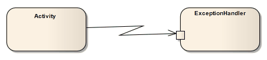

##### [Interrupt Flow](https://sparxsystems.com/enterprise_architect_user_guide/15.1/model_domains/interruptflow.html)

-- Description
The Interrupt Flow is a connection used to define the two UML concepts of connectors for Exception Handler and Interruptible Activity Region. An Interrupt Flow is a type of activity edge. It is typically used in an Activity diagram, modeling an active transition.

Описание
Поток прерывания - это соединение, используемое для определения двух концепций соединителей UML для обработчика исключений и области прерывания. Поток прерывания - это вид активности. Обычно он используется на диаграмме действий, моделируя активный переход.

-- Toolbox icon

Learn more
* Exception Handler
* Interruptible Activity Region
* Activity diagram

Выучить больше
* Обработчик исключений
* Область прерывистой активности
* Диаграмма деятельности

OMG UML Specification:
The OMG UML specification (UML Superstructure Specification, v2.1.1, p.327) states:

'An activity edge is an abstract class for directed connections between two activity nodes.'

Спецификация OMG UML:
Спецификация OMG UML (Спецификация надстройки UML, v2.1.1, стр. 327) гласит:

«Граница активности - это абстрактный класс для направленных соединений между двумя узлами активности».
