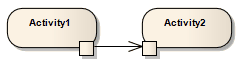

##### [Object Flow](https://sparxsystems.com/enterprise_architect_user_guide/15.1/model_domains/objectflow.html)

-- Description
Object Flows are used in Activity diagrams and StateMachine diagrams. When used in an Activity diagram, an Object Flow connects two elements, with specific data passing through it, modeling an active transition. To view sample Activity diagrams using Object Flows, see the Object Flows in Activity Diagrams topic.

Описание
Потоки объектов используются в диаграммах действий и диаграммах StateMachine. При использовании на диаграмме действий поток объектов соединяет два элемента, через которые проходят определенные данные, моделируя активный переход. Чтобы просмотреть образцы диаграмм действий с использованием потоков объектов, см. Раздел «Потоки объектов в диаграммах действий» .

In StateMachine diagrams, an Object Flow is a specification of a state flow or transition. It implies the passing of an Object instance between elements at run-time.

В диаграммах StateMachine поток объектов - это спецификация потока или перехода состояний. Это подразумевает передачу экземпляра объекта между элементами во время выполнения.

You can insert an Object Flow from the 'State' or 'Activity' pages of the Toolbox, or from the drop-down list of all relationships located in the header toolbar. You can also modify a transition connection to an Object Flow by selecting the 'ObjectFlow' checkbox on the connection 'Properties' dialog

Вы можете вставить поток объектов со страниц «Состояние» или «Действие» панели инструментов или из раскрывающегося списка всех взаимосвязей, расположенных на панели инструментов заголовка. Вы также можете изменить соединение перехода с потоком объектов, установив флажок «ObjectFlow» в диалоговом окне «Свойства» соединения.

See the Control Flow topic for information on setting up Guards and Weights on Object Flows.

-- Toolbox icon

Learn more
* [Activity Diagram](https://sparxsystems.com/enterprise_architect_user_guide/15.1/model_domains/activitydiagram.html)
* [Control Flow](https://sparxsystems.com/enterprise_architect_user_guide/15.1/model_domains/controlflow.html)
* [Object Flows in Activity Diagrams](https://sparxsystems.com/enterprise_architect_user_guide/15.1/model_domains/objectflowactivitydiagram.html)
* [Object Node](https://sparxsystems.com/enterprise_architect_user_guide/15.1/model_domains/object_node.html)

Выучить больше
* Диаграмма деятельности
* Поток управления
* Потоки объектов на диаграммах действий
* Узел объекта

OMG UML Specification:
The OMG UML specification (UML Superstructure Specification, v2.1.1, p.389) states:

An object flow is an activity edge that only passes object and data tokens.

Спецификация OMG UML:
Спецификация OMG UML (Спецификация надстройки UML, v2.1.1, стр.389) гласит:

Поток объектов - это граница активности, которая передает только токены объектов и данных.

