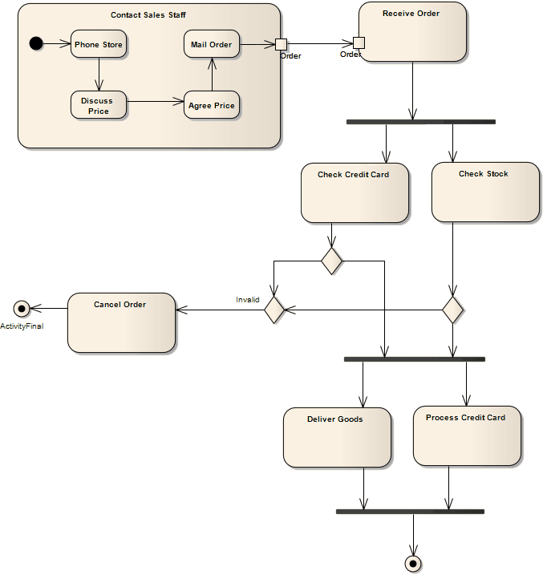

#### [Activity Diagram Диаграмма деятельности](https://sparxsystems.com/enterprise_architect_user_guide/15.1/model_domains/activitydiagram.html)

Activity diagrams are used to model system behaviors, and the way in which these behaviors are related in an overall flow of the system (that is, dynamic element interactions). The logical paths a process follows, based on various conditions, concurrent processing, data access, interruptions and other logical path distinctions, are all used to construct a process, system or procedure.

Диаграммы действий используются для моделирования поведения системы и способа, которым эти поведения связаны в общем потоке системы (то есть взаимодействия динамических элементов). Логические пути, по которым следует процесс, основанные на различных условиях, одновременной обработке, доступе к данным, прерываниях и других различиях логических путей, - все они используются для создания процесса, системы или процедуры.

Вы генерируете элементы диаграммы действий и соединители на страницах Activity в панели инструментов Diagram .

You generate Activity diagram elements and connectors from the 'Activity' pages of the Diagram Toolbox.

-- Пример диаграммы
На этой диаграмме показаны некоторые функции диаграмм действий, включая действия, действия, начальные узлы, конечные узлы и точки принятия решений.

Example Diagram
This diagram illustrates some of the features of Activity diagrams, including Activities, Actions, Start Nodes, End Nodes and Decision points.

| Icon                                     | Description                              | See also                                 |
|------------------------------------------|------------------------------------------|------------------------------------------|
|  | 
An Activity element organizes and specifies the participation of subordinate behaviors, such as sub-Activities or Actions, to reflect the control and data flow of a process.
 | <a href="https://sparxsystems.com/enterprise_architect_user_guide/15.1/model_domains/activity.html" style="box-sizing: border-box; text-decoration: none; cursor: url(&quot;data:image/png;base64,iVBORw0KGgoAAAANSUhEUgAAABAAAAAQCAYAAAAf8/9hAAABaUlEQVQ4T2NkwAZY1f9DhP+lM/y+PQurGqggI6akisytj+ceg8TVREwZGH7fxKIGoQtTkk1F69brc1cpMEBV89brs9eoaMB/TQaGWzcYGKS4GBiefUP3MhYvqGncen3mOrJCZ5NAhr1n1jPs3LKbITc6H2jQk+8weaIMgCn++OEDw+H9xxmERAQZEgJyDjP8uWXHyMCqdiU+PVJ74cwVkBBnV1e/9eo00MmY4M+fPwwvX7wASzgaBILVAw1Q/3/rzWmwIDjamBg0cBkAUvP0yRPcBoBkvG3CGbYeWYk17fz5/Zvh5cuXaAaAuEiuwJfq3rx5w/Dzxw8sBhBpCMz5qGGAbCUel/z69Yvh9atXcNWOBgEXGH7fMsSMRqAh+y+sZ+AXEGDg4eEBa3j29CnD///Q/AXkBzjEM3x8fRqsF3tGYVF7Ud1eJO7iZYcRJPGBuQyPbl0BmvzyK24DYNpY1X+BghjFFLTcCQDviqMRO9+fjwAAAABJRU5ErkJggg==&quot;) 14 0, auto !important; color: rgb(0, 102, 221); outline: none; display: block; line-height: normal; margin: 0px; padding: 10px 0px;">Activity</a> |
|  | 
A Structured Activity is an activity node that can have subordinate nodes as an independent Activity Group.
 | <a href="https://sparxsystems.com/enterprise_architect_user_guide/15.1/model_domains/loop_and_conditional_nodes.html" style="box-sizing: border-box; text-decoration: none; cursor: url(&quot;data:image/png;base64,iVBORw0KGgoAAAANSUhEUgAAABAAAAAQCAYAAAAf8/9hAAABaUlEQVQ4T2NkwAZY1f9DhP+lM/y+PQurGqggI6akisytj+ceg8TVREwZGH7fxKIGoQtTkk1F69brc1cpMEBV89brs9eoaMB/TQaGWzcYGKS4GBiefUP3MhYvqGncen3mOrJCZ5NAhr1n1jPs3LKbITc6H2jQk+8weaIMgCn++OEDw+H9xxmERAQZEgJyDjP8uWXHyMCqdiU+PVJ74cwVkBBnV1e/9eo00MmY4M+fPwwvX7wASzgaBILVAw1Q/3/rzWmwIDjamBg0cBkAUvP0yRPcBoBkvG3CGbYeWYk17fz5/Zvh5cuXaAaAuEiuwJfq3rx5w/Dzxw8sBhBpCMz5qGGAbCUel/z69Yvh9atXcNWOBgEXGH7fMsSMRqAh+y+sZ+AXEGDg4eEBa3j29CnD///Q/AXkBzjEM3x8fRqsF3tGYVF7Ud1eJO7iZYcRJPGBuQyPbl0BmvzyK24DYNpY1X+BghjFFLTcCQDviqMRO9+fjwAAAABJRU5ErkJggg==&quot;) 14 0, auto !important; color: rgb(0, 102, 221); outline: none; display: block; line-height: normal; margin: 0px; padding: 10px 0px;">Structured Activity</a> |
|  | 
An Action element describes a basic process or transformation that occurs within a system, and is the basic functional unit within an Activity diagram.
 | <a href="https://sparxsystems.com/enterprise_architect_user_guide/15.1/model_domains/action.html" style="box-sizing: border-box; text-decoration: none; cursor: url(&quot;data:image/png;base64,iVBORw0KGgoAAAANSUhEUgAAABAAAAAQCAYAAAAf8/9hAAABaUlEQVQ4T2NkwAZY1f9DhP+lM/y+PQurGqggI6akisytj+ceg8TVREwZGH7fxKIGoQtTkk1F69brc1cpMEBV89brs9eoaMB/TQaGWzcYGKS4GBiefUP3MhYvqGncen3mOrJCZ5NAhr1n1jPs3LKbITc6H2jQk+8weaIMgCn++OEDw+H9xxmERAQZEgJyDjP8uWXHyMCqdiU+PVJ74cwVkBBnV1e/9eo00MmY4M+fPwwvX7wASzgaBILVAw1Q/3/rzWmwIDjamBg0cBkAUvP0yRPcBoBkvG3CGbYeWYk17fz5/Zvh5cuXaAaAuEiuwJfq3rx5w/Dzxw8sBhBpCMz5qGGAbCUel/z69Yvh9atXcNWOBgEXGH7fMsSMRqAh+y+sZ+AXEGDg4eEBa3j29CnD///Q/AXkBzjEM3x8fRqsF3tGYVF7Ud1eJO7iZYcRJPGBuQyPbl0BmvzyK24DYNpY1X+BghjFFLTcCQDviqMRO9+fjwAAAABJRU5ErkJggg==&quot;) 14 0, auto !important; color: rgb(0, 102, 221); outline: none; display: block; line-height: normal; margin: 0px; padding: 10px 0px;">Action</a> |
|  | 
A Partition element is used to logically organize an Activity's elements.
 | <a href="https://sparxsystems.com/enterprise_architect_user_guide/15.1/model_domains/partition.html" style="box-sizing: border-box; text-decoration: none; cursor: url(&quot;data:image/png;base64,iVBORw0KGgoAAAANSUhEUgAAABAAAAAQCAYAAAAf8/9hAAABaUlEQVQ4T2NkwAZY1f9DhP+lM/y+PQurGqggI6akisytj+ceg8TVREwZGH7fxKIGoQtTkk1F69brc1cpMEBV89brs9eoaMB/TQaGWzcYGKS4GBiefUP3MhYvqGncen3mOrJCZ5NAhr1n1jPs3LKbITc6H2jQk+8weaIMgCn++OEDw+H9xxmERAQZEgJyDjP8uWXHyMCqdiU+PVJ74cwVkBBnV1e/9eo00MmY4M+fPwwvX7wASzgaBILVAw1Q/3/rzWmwIDjamBg0cBkAUvP0yRPcBoBkvG3CGbYeWYk17fz5/Zvh5cuXaAaAuEiuwJfq3rx5w/Dzxw8sBhBpCMz5qGGAbCUel/z69Yvh9atXcNWOBgEXGH7fMsSMRqAh+y+sZ+AXEGDg4eEBa3j29CnD///Q/AXkBzjEM3x8fRqsF3tGYVF7Ud1eJO7iZYcRJPGBuQyPbl0BmvzyK24DYNpY1X+BghjFFLTcCQDviqMRO9+fjwAAAABJRU5ErkJggg==&quot;) 14 0, auto !important; color: rgb(0, 102, 221); outline: none; display: block; line-height: normal; margin: 0px; padding: 10px 0px;">Partition</a> |
|  | 
An Object is a particular instance of a Class at run time.
 | <a href="https://sparxsystems.com/enterprise_architect_user_guide/15.1/model_domains/object.html" style="box-sizing: border-box; text-decoration: none; cursor: url(&quot;data:image/png;base64,iVBORw0KGgoAAAANSUhEUgAAABAAAAAQCAYAAAAf8/9hAAABaUlEQVQ4T2NkwAZY1f9DhP+lM/y+PQurGqggI6akisytj+ceg8TVREwZGH7fxKIGoQtTkk1F69brc1cpMEBV89brs9eoaMB/TQaGWzcYGKS4GBiefUP3MhYvqGncen3mOrJCZ5NAhr1n1jPs3LKbITc6H2jQk+8weaIMgCn++OEDw+H9xxmERAQZEgJyDjP8uWXHyMCqdiU+PVJ74cwVkBBnV1e/9eo00MmY4M+fPwwvX7wASzgaBILVAw1Q/3/rzWmwIDjamBg0cBkAUvP0yRPcBoBkvG3CGbYeWYk17fz5/Zvh5cuXaAaAuEiuwJfq3rx5w/Dzxw8sBhBpCMz5qGGAbCUel/z69Yvh9atXcNWOBgEXGH7fMsSMRqAh+y+sZ+AXEGDg4eEBa3j29CnD///Q/AXkBzjEM3x8fRqsF3tGYVF7Ud1eJO7iZYcRJPGBuQyPbl0BmvzyK24DYNpY1X+BghjFFLTcCQDviqMRO9+fjwAAAABJRU5ErkJggg==&quot;) 14 0, auto !important; color: rgb(0, 102, 221); outline: none; display: block; line-height: normal; margin: 0px; padding: 10px 0px;">Object</a> |
|  | 
A Central Buffer Node is an object node for managing flows from multiple sources and destinations, represented in an Activity diagram.
 | <a href="https://sparxsystems.com/enterprise_architect_user_guide/15.1/model_domains/central_buffer_node.html" style="box-sizing: border-box; text-decoration: none; cursor: url(&quot;data:image/png;base64,iVBORw0KGgoAAAANSUhEUgAAABAAAAAQCAYAAAAf8/9hAAABaUlEQVQ4T2NkwAZY1f9DhP+lM/y+PQurGqggI6akisytj+ceg8TVREwZGH7fxKIGoQtTkk1F69brc1cpMEBV89brs9eoaMB/TQaGWzcYGKS4GBiefUP3MhYvqGncen3mOrJCZ5NAhr1n1jPs3LKbITc6H2jQk+8weaIMgCn++OEDw+H9xxmERAQZEgJyDjP8uWXHyMCqdiU+PVJ74cwVkBBnV1e/9eo00MmY4M+fPwwvX7wASzgaBILVAw1Q/3/rzWmwIDjamBg0cBkAUvP0yRPcBoBkvG3CGbYeWYk17fz5/Zvh5cuXaAaAuEiuwJfq3rx5w/Dzxw8sBhBpCMz5qGGAbCUel/z69Yvh9atXcNWOBgEXGH7fMsSMRqAh+y+sZ+AXEGDg4eEBa3j29CnD///Q/AXkBzjEM3x8fRqsF3tGYVF7Ud1eJO7iZYcRJPGBuQyPbl0BmvzyK24DYNpY1X+BghjFFLTcCQDviqMRO9+fjwAAAABJRU5ErkJggg==&quot;) 14 0, auto !important; color: rgb(0, 102, 221); outline: none; display: block; line-height: normal; margin: 0px; padding: 10px 0px;">Central Buffer Node</a> |
|  | 
A Datastore defines permanently stored data.
 | <a href="https://sparxsystems.com/enterprise_architect_user_guide/15.1/model_domains/datastore.html" style="box-sizing: border-box; text-decoration: none; cursor: url(&quot;data:image/png;base64,iVBORw0KGgoAAAANSUhEUgAAABAAAAAQCAYAAAAf8/9hAAABaUlEQVQ4T2NkwAZY1f9DhP+lM/y+PQurGqggI6akisytj+ceg8TVREwZGH7fxKIGoQtTkk1F69brc1cpMEBV89brs9eoaMB/TQaGWzcYGKS4GBiefUP3MhYvqGncen3mOrJCZ5NAhr1n1jPs3LKbITc6H2jQk+8weaIMgCn++OEDw+H9xxmERAQZEgJyDjP8uWXHyMCqdiU+PVJ74cwVkBBnV1e/9eo00MmY4M+fPwwvX7wASzgaBILVAw1Q/3/rzWmwIDjamBg0cBkAUvP0yRPcBoBkvG3CGbYeWYk17fz5/Zvh5cuXaAaAuEiuwJfq3rx5w/Dzxw8sBhBpCMz5qGGAbCUel/z69Yvh9atXcNWOBgEXGH7fMsSMRqAh+y+sZ+AXEGDg4eEBa3j29CnD///Q/AXkBzjEM3x8fRqsF3tGYVF7Ud1eJO7iZYcRJPGBuQyPbl0BmvzyK24DYNpY1X+BghjFFLTcCQDviqMRO9+fjwAAAABJRU5ErkJggg==&quot;) 14 0, auto !important; color: rgb(0, 102, 221); outline: none; display: block; line-height: normal; margin: 0px; padding: 10px 0px;">Datastore</a> |
|  | 
In an Activity diagram or Interaction Overview diagram, a Decision indicates a point of conditional progression: if a condition is True, then processing continues one way; if not, then another.
 | <a href="https://sparxsystems.com/enterprise_architect_user_guide/15.1/model_domains/decision.html" style="box-sizing: border-box; text-decoration: none; cursor: url(&quot;data:image/png;base64,iVBORw0KGgoAAAANSUhEUgAAABAAAAAQCAYAAAAf8/9hAAABaUlEQVQ4T2NkwAZY1f9DhP+lM/y+PQurGqggI6akisytj+ceg8TVREwZGH7fxKIGoQtTkk1F69brc1cpMEBV89brs9eoaMB/TQaGWzcYGKS4GBiefUP3MhYvqGncen3mOrJCZ5NAhr1n1jPs3LKbITc6H2jQk+8weaIMgCn++OEDw+H9xxmERAQZEgJyDjP8uWXHyMCqdiU+PVJ74cwVkBBnV1e/9eo00MmY4M+fPwwvX7wASzgaBILVAw1Q/3/rzWmwIDjamBg0cBkAUvP0yRPcBoBkvG3CGbYeWYk17fz5/Zvh5cuXaAaAuEiuwJfq3rx5w/Dzxw8sBhBpCMz5qGGAbCUel/z69Yvh9atXcNWOBgEXGH7fMsSMRqAh+y+sZ+AXEGDg4eEBa3j29CnD///Q/AXkBzjEM3x8fRqsF3tGYVF7Ud1eJO7iZYcRJPGBuQyPbl0BmvzyK24DYNpY1X+BghjFFLTcCQDviqMRO9+fjwAAAABJRU5ErkJggg==&quot;) 14 0, auto !important; color: rgb(0, 102, 221); outline: none; display: block; line-height: normal; margin: 0px; padding: 10px 0px;">Decision</a> |
|  | 
A Merge Node brings together a number of alternative flow paths in Activity, Analysis and Interaction Overview diagrams.
 | <a href="https://sparxsystems.com/enterprise_architect_user_guide/15.1/model_domains/merge_node.html" style="box-sizing: border-box; text-decoration: none; cursor: url(&quot;data:image/png;base64,iVBORw0KGgoAAAANSUhEUgAAABAAAAAQCAYAAAAf8/9hAAABaUlEQVQ4T2NkwAZY1f9DhP+lM/y+PQurGqggI6akisytj+ceg8TVREwZGH7fxKIGoQtTkk1F69brc1cpMEBV89brs9eoaMB/TQaGWzcYGKS4GBiefUP3MhYvqGncen3mOrJCZ5NAhr1n1jPs3LKbITc6H2jQk+8weaIMgCn++OEDw+H9xxmERAQZEgJyDjP8uWXHyMCqdiU+PVJ74cwVkBBnV1e/9eo00MmY4M+fPwwvX7wASzgaBILVAw1Q/3/rzWmwIDjamBg0cBkAUvP0yRPcBoBkvG3CGbYeWYk17fz5/Zvh5cuXaAaAuEiuwJfq3rx5w/Dzxw8sBhBpCMz5qGGAbCUel/z69Yvh9atXcNWOBgEXGH7fMsSMRqAh+y+sZ+AXEGDg4eEBa3j29CnD///Q/AXkBzjEM3x8fRqsF3tGYVF7Ud1eJO7iZYcRJPGBuQyPbl0BmvzyK24DYNpY1X+BghjFFLTcCQDviqMRO9+fjwAAAABJRU5ErkJggg==&quot;) 14 0, auto !important; color: rgb(0, 102, 221); outline: none; display: block; line-height: normal; margin: 0px; padding: 10px 0px;">Merge</a> |
|  | 
The Send element depicts the action of sending a signal, in an Activity diagram.
 | <a href="https://sparxsystems.com/enterprise_architect_user_guide/15.1/model_domains/send.html" style="box-sizing: border-box; text-decoration: none; cursor: url(&quot;data:image/png;base64,iVBORw0KGgoAAAANSUhEUgAAABAAAAAQCAYAAAAf8/9hAAABaUlEQVQ4T2NkwAZY1f9DhP+lM/y+PQurGqggI6akisytj+ceg8TVREwZGH7fxKIGoQtTkk1F69brc1cpMEBV89brs9eoaMB/TQaGWzcYGKS4GBiefUP3MhYvqGncen3mOrJCZ5NAhr1n1jPs3LKbITc6H2jQk+8weaIMgCn++OEDw+H9xxmERAQZEgJyDjP8uWXHyMCqdiU+PVJ74cwVkBBnV1e/9eo00MmY4M+fPwwvX7wASzgaBILVAw1Q/3/rzWmwIDjamBg0cBkAUvP0yRPcBoBkvG3CGbYeWYk17fz5/Zvh5cuXaAaAuEiuwJfq3rx5w/Dzxw8sBhBpCMz5qGGAbCUel/z69Yvh9atXcNWOBgEXGH7fMsSMRqAh+y+sZ+AXEGDg4eEBa3j29CnD///Q/AXkBzjEM3x8fRqsF3tGYVF7Ud1eJO7iZYcRJPGBuQyPbl0BmvzyK24DYNpY1X+BghjFFLTcCQDviqMRO9+fjwAAAABJRU5ErkJggg==&quot;) 14 0, auto !important; color: rgb(0, 102, 221); outline: none; display: block; line-height: normal; margin: 0px; padding: 10px 0px;">Send</a> |
|  | 
A Receive element defines the acceptance or receipt of a request, in an Activity diagram.
 | <a href="https://sparxsystems.com/enterprise_architect_user_guide/15.1/model_domains/receive.html" style="box-sizing: border-box; text-decoration: none; cursor: url(&quot;data:image/png;base64,iVBORw0KGgoAAAANSUhEUgAAABAAAAAQCAYAAAAf8/9hAAABaUlEQVQ4T2NkwAZY1f9DhP+lM/y+PQurGqggI6akisytj+ceg8TVREwZGH7fxKIGoQtTkk1F69brc1cpMEBV89brs9eoaMB/TQaGWzcYGKS4GBiefUP3MhYvqGncen3mOrJCZ5NAhr1n1jPs3LKbITc6H2jQk+8weaIMgCn++OEDw+H9xxmERAQZEgJyDjP8uWXHyMCqdiU+PVJ74cwVkBBnV1e/9eo00MmY4M+fPwwvX7wASzgaBILVAw1Q/3/rzWmwIDjamBg0cBkAUvP0yRPcBoBkvG3CGbYeWYk17fz5/Zvh5cuXaAaAuEiuwJfq3rx5w/Dzxw8sBhBpCMz5qGGAbCUel/z69Yvh9atXcNWOBgEXGH7fMsSMRqAh+y+sZ+AXEGDg4eEBa3j29CnD///Q/AXkBzjEM3x8fRqsF3tGYVF7Ud1eJO7iZYcRJPGBuQyPbl0BmvzyK24DYNpY1X+BghjFFLTcCQDviqMRO9+fjwAAAABJRU5ErkJggg==&quot;) 14 0, auto !important; color: rgb(0, 102, 221); outline: none; display: block; line-height: normal; margin: 0px; padding: 10px 0px;">Receive</a> |
|  | 
A Synch state is useful for indicating that concurrent paths of a StateMachine are synchronized. It is used to split and rejoin periods of parallel processing.
 | <a href="https://sparxsystems.com/enterprise_architect_user_guide/15.1/model_domains/synch.html" style="box-sizing: border-box; text-decoration: none; cursor: url(&quot;data:image/png;base64,iVBORw0KGgoAAAANSUhEUgAAABAAAAAQCAYAAAAf8/9hAAABaUlEQVQ4T2NkwAZY1f9DhP+lM/y+PQurGqggI6akisytj+ceg8TVREwZGH7fxKIGoQtTkk1F69brc1cpMEBV89brs9eoaMB/TQaGWzcYGKS4GBiefUP3MhYvqGncen3mOrJCZ5NAhr1n1jPs3LKbITc6H2jQk+8weaIMgCn++OEDw+H9xxmERAQZEgJyDjP8uWXHyMCqdiU+PVJ74cwVkBBnV1e/9eo00MmY4M+fPwwvX7wASzgaBILVAw1Q/3/rzWmwIDjamBg0cBkAUvP0yRPcBoBkvG3CGbYeWYk17fz5/Zvh5cuXaAaAuEiuwJfq3rx5w/Dzxw8sBhBpCMz5qGGAbCUel/z69Yvh9atXcNWOBgEXGH7fMsSMRqAh+y+sZ+AXEGDg4eEBa3j29CnD///Q/AXkBzjEM3x8fRqsF3tGYVF7Ud1eJO7iZYcRJPGBuQyPbl0BmvzyK24DYNpY1X+BghjFFLTcCQDviqMRO9+fjwAAAABJRU5ErkJggg==&quot;) 14 0, auto !important; color: rgb(0, 102, 221); outline: none; display: block; line-height: normal; margin: 0px; padding: 10px 0px;">Synch</a> |
|  | 
An Initial element is used to define the start of a flow when an Activity is invoked.
 | <a href="https://sparxsystems.com/enterprise_architect_user_guide/15.1/model_domains/initial.html" style="box-sizing: border-box; text-decoration: none; cursor: url(&quot;data:image/png;base64,iVBORw0KGgoAAAANSUhEUgAAABAAAAAQCAYAAAAf8/9hAAABaUlEQVQ4T2NkwAZY1f9DhP+lM/y+PQurGqggI6akisytj+ceg8TVREwZGH7fxKIGoQtTkk1F69brc1cpMEBV89brs9eoaMB/TQaGWzcYGKS4GBiefUP3MhYvqGncen3mOrJCZ5NAhr1n1jPs3LKbITc6H2jQk+8weaIMgCn++OEDw+H9xxmERAQZEgJyDjP8uWXHyMCqdiU+PVJ74cwVkBBnV1e/9eo00MmY4M+fPwwvX7wASzgaBILVAw1Q/3/rzWmwIDjamBg0cBkAUvP0yRPcBoBkvG3CGbYeWYk17fz5/Zvh5cuXaAaAuEiuwJfq3rx5w/Dzxw8sBhBpCMz5qGGAbCUel/z69Yvh9atXcNWOBgEXGH7fMsSMRqAh+y+sZ+AXEGDg4eEBa3j29CnD///Q/AXkBzjEM3x8fRqsF3tGYVF7Ud1eJO7iZYcRJPGBuQyPbl0BmvzyK24DYNpY1X+BghjFFLTcCQDviqMRO9+fjwAAAABJRU5ErkJggg==&quot;) 14 0, auto !important; color: rgb(0, 102, 221); outline: none; display: block; line-height: normal; margin: 0px; padding: 10px 0px;">Initial</a> |
|  | 
The Activity Final element indicates the completion of an Activity; upon reaching the Final, all execution in the Activity diagram is aborted.
 | <a href="https://sparxsystems.com/enterprise_architect_user_guide/15.1/model_domains/final.html" style="box-sizing: border-box; text-decoration: none; cursor: url(&quot;data:image/png;base64,iVBORw0KGgoAAAANSUhEUgAAABAAAAAQCAYAAAAf8/9hAAABaUlEQVQ4T2NkwAZY1f9DhP+lM/y+PQurGqggI6akisytj+ceg8TVREwZGH7fxKIGoQtTkk1F69brc1cpMEBV89brs9eoaMB/TQaGWzcYGKS4GBiefUP3MhYvqGncen3mOrJCZ5NAhr1n1jPs3LKbITc6H2jQk+8weaIMgCn++OEDw+H9xxmERAQZEgJyDjP8uWXHyMCqdiU+PVJ74cwVkBBnV1e/9eo00MmY4M+fPwwvX7wASzgaBILVAw1Q/3/rzWmwIDjamBg0cBkAUvP0yRPcBoBkvG3CGbYeWYk17fz5/Zvh5cuXaAaAuEiuwJfq3rx5w/Dzxw8sBhBpCMz5qGGAbCUel/z69Yvh9atXcNWOBgEXGH7fMsSMRqAh+y+sZ+AXEGDg4eEBa3j29CnD///Q/AXkBzjEM3x8fRqsF3tGYVF7Ud1eJO7iZYcRJPGBuQyPbl0BmvzyK24DYNpY1X+BghjFFLTcCQDviqMRO9+fjwAAAABJRU5ErkJggg==&quot;) 14 0, auto !important; color: rgb(0, 102, 221); outline: none; display: block; line-height: normal; margin: 0px; padding: 10px 0px;">Final</a> |
|  | 
The Flow Final element depicts an exit from the system, as opposed to the Activity Final, which represents the completion of the Activity.
 | <a href="https://sparxsystems.com/enterprise_architect_user_guide/15.1/model_domains/flowfinal.html" style="box-sizing: border-box; text-decoration: none; cursor: url(&quot;data:image/png;base64,iVBORw0KGgoAAAANSUhEUgAAABAAAAAQCAYAAAAf8/9hAAABaUlEQVQ4T2NkwAZY1f9DhP+lM/y+PQurGqggI6akisytj+ceg8TVREwZGH7fxKIGoQtTkk1F69brc1cpMEBV89brs9eoaMB/TQaGWzcYGKS4GBiefUP3MhYvqGncen3mOrJCZ5NAhr1n1jPs3LKbITc6H2jQk+8weaIMgCn++OEDw+H9xxmERAQZEgJyDjP8uWXHyMCqdiU+PVJ74cwVkBBnV1e/9eo00MmY4M+fPwwvX7wASzgaBILVAw1Q/3/rzWmwIDjamBg0cBkAUvP0yRPcBoBkvG3CGbYeWYk17fz5/Zvh5cuXaAaAuEiuwJfq3rx5w/Dzxw8sBhBpCMz5qGGAbCUel/z69Yvh9atXcNWOBgEXGH7fMsSMRqAh+y+sZ+AXEGDg4eEBa3j29CnD///Q/AXkBzjEM3x8fRqsF3tGYVF7Ud1eJO7iZYcRJPGBuQyPbl0BmvzyK24DYNpY1X+BghjFFLTcCQDviqMRO9+fjwAAAABJRU5ErkJggg==&quot;) 14 0, auto !important; color: rgb(0, 102, 221); outline: none; display: block; line-height: normal; margin: 0px; padding: 10px 0px;">Flow Final</a> |
|  | 
Enterprise Architect supports two types of Region element: Expansion Regions and Interruptible Activity Regions.

An Expansion Region surrounds a process to be imposed multiple times on the incoming data, once for every element in the input collection.

An Interruptible Activity Region surrounds a group of Activity elements, all affected by certain interrupts in such a way that all tokens passing within the region are terminated should the interruption(s) be raised.
 | <a href="https://sparxsystems.com/enterprise_architect_user_guide/15.1/model_domains/region.html" style="box-sizing: border-box; text-decoration: none; cursor: url(&quot;data:image/png;base64,iVBORw0KGgoAAAANSUhEUgAAABAAAAAQCAYAAAAf8/9hAAABaUlEQVQ4T2NkwAZY1f9DhP+lM/y+PQurGqggI6akisytj+ceg8TVREwZGH7fxKIGoQtTkk1F69brc1cpMEBV89brs9eoaMB/TQaGWzcYGKS4GBiefUP3MhYvqGncen3mOrJCZ5NAhr1n1jPs3LKbITc6H2jQk+8weaIMgCn++OEDw+H9xxmERAQZEgJyDjP8uWXHyMCqdiU+PVJ74cwVkBBnV1e/9eo00MmY4M+fPwwvX7wASzgaBILVAw1Q/3/rzWmwIDjamBg0cBkAUvP0yRPcBoBkvG3CGbYeWYk17fz5/Zvh5cuXaAaAuEiuwJfq3rx5w/Dzxw8sBhBpCMz5qGGAbCUel/z69Yvh9atXcNWOBgEXGH7fMsSMRqAh+y+sZ+AXEGDg4eEBa3j29CnD///Q/AXkBzjEM3x8fRqsF3tGYVF7Ud1eJO7iZYcRJPGBuQyPbl0BmvzyK24DYNpY1X+BghjFFLTcCQDviqMRO9+fjwAAAABJRU5ErkJggg==&quot;) 14 0, auto !important; color: rgb(0, 102, 221); outline: none; display: block; line-height: normal; margin: 0px; padding: 10px 0px;">Region</a> |
|  | 
The Exception Handler element defines the group of operations to carry out when an exception occurs.
 | <a href="https://sparxsystems.com/enterprise_architect_user_guide/15.1/model_domains/exception.html" style="box-sizing: border-box; text-decoration: none; cursor: url(&quot;data:image/png;base64,iVBORw0KGgoAAAANSUhEUgAAABAAAAAQCAYAAAAf8/9hAAABaUlEQVQ4T2NkwAZY1f9DhP+lM/y+PQurGqggI6akisytj+ceg8TVREwZGH7fxKIGoQtTkk1F69brc1cpMEBV89brs9eoaMB/TQaGWzcYGKS4GBiefUP3MhYvqGncen3mOrJCZ5NAhr1n1jPs3LKbITc6H2jQk+8weaIMgCn++OEDw+H9xxmERAQZEgJyDjP8uWXHyMCqdiU+PVJ74cwVkBBnV1e/9eo00MmY4M+fPwwvX7wASzgaBILVAw1Q/3/rzWmwIDjamBg0cBkAUvP0yRPcBoBkvG3CGbYeWYk17fz5/Zvh5cuXaAaAuEiuwJfq3rx5w/Dzxw8sBhBpCMz5qGGAbCUel/z69Yvh9atXcNWOBgEXGH7fMsSMRqAh+y+sZ+AXEGDg4eEBa3j29CnD///Q/AXkBzjEM3x8fRqsF3tGYVF7Ud1eJO7iZYcRJPGBuQyPbl0BmvzyK24DYNpY1X+BghjFFLTcCQDviqMRO9+fjwAAAABJRU5ErkJggg==&quot;) 14 0, auto !important; color: rgb(0, 102, 221); outline: none; display: block; line-height: normal; margin: 0px; padding: 10px 0px;">Exception</a> |
|  | 
A Fork/Join element can be used to:

1)  Split a single flow into a number of concurrent flows

2)  Join a number of concurrent flows or

3)  Both join and fork a number of incoming flows to a number of outgoing flows
 | <a href="https://sparxsystems.com/enterprise_architect_user_guide/15.1/model_domains/forkjoin.html" style="box-sizing: border-box; text-decoration: none; cursor: url(&quot;data:image/png;base64,iVBORw0KGgoAAAANSUhEUgAAABAAAAAQCAYAAAAf8/9hAAABaUlEQVQ4T2NkwAZY1f9DhP+lM/y+PQurGqggI6akisytj+ceg8TVREwZGH7fxKIGoQtTkk1F69brc1cpMEBV89brs9eoaMB/TQaGWzcYGKS4GBiefUP3MhYvqGncen3mOrJCZ5NAhr1n1jPs3LKbITc6H2jQk+8weaIMgCn++OEDw+H9xxmERAQZEgJyDjP8uWXHyMCqdiU+PVJ74cwVkBBnV1e/9eo00MmY4M+fPwwvX7wASzgaBILVAw1Q/3/rzWmwIDjamBg0cBkAUvP0yRPcBoBkvG3CGbYeWYk17fz5/Zvh5cuXaAaAuEiuwJfq3rx5w/Dzxw8sBhBpCMz5qGGAbCUel/z69Yvh9atXcNWOBgEXGH7fMsSMRqAh+y+sZ+AXEGDg4eEBa3j29CnD///Q/AXkBzjEM3x8fRqsF3tGYVF7Ud1eJO7iZYcRJPGBuQyPbl0BmvzyK24DYNpY1X+BghjFFLTcCQDviqMRO9+fjwAAAABJRU5ErkJggg==&quot;) 14 0, auto !important; color: rgb(0, 102, 221); outline: none; display: block; line-height: normal; margin: 0px; padding: 10px 0px;">Fork/Join</a><a href="https://sparxsystems.com/enterprise_architect_user_guide/15.1/model_domains/fork.html" style="box-sizing: border-box; text-decoration: none; cursor: url(&quot;data:image/png;base64,iVBORw0KGgoAAAANSUhEUgAAABAAAAAQCAYAAAAf8/9hAAABaUlEQVQ4T2NkwAZY1f9DhP+lM/y+PQurGqggI6akisytj+ceg8TVREwZGH7fxKIGoQtTkk1F69brc1cpMEBV89brs9eoaMB/TQaGWzcYGKS4GBiefUP3MhYvqGncen3mOrJCZ5NAhr1n1jPs3LKbITc6H2jQk+8weaIMgCn++OEDw+H9xxmERAQZEgJyDjP8uWXHyMCqdiU+PVJ74cwVkBBnV1e/9eo00MmY4M+fPwwvX7wASzgaBILVAw1Q/3/rzWmwIDjamBg0cBkAUvP0yRPcBoBkvG3CGbYeWYk17fz5/Zvh5cuXaAaAuEiuwJfq3rx5w/Dzxw8sBhBpCMz5qGGAbCUel/z69Yvh9atXcNWOBgEXGH7fMsSMRqAh+y+sZ+AXEGDg4eEBa3j29CnD///Q/AXkBzjEM3x8fRqsF3tGYVF7Ud1eJO7iZYcRJPGBuQyPbl0BmvzyK24DYNpY1X+BghjFFLTcCQDviqMRO9+fjwAAAABJRU5ErkJggg==&quot;) 14 0, auto !important; color: rgb(0, 102, 221); outline: none; display: block; line-height: normal; margin: 0px; padding: 10px 0px;">Fork</a><a href="https://sparxsystems.com/enterprise_architect_user_guide/15.1/model_domains/join.html" style="box-sizing: border-box; text-decoration: none; cursor: url(&quot;data:image/png;base64,iVBORw0KGgoAAAANSUhEUgAAABAAAAAQCAYAAAAf8/9hAAABaUlEQVQ4T2NkwAZY1f9DhP+lM/y+PQurGqggI6akisytj+ceg8TVREwZGH7fxKIGoQtTkk1F69brc1cpMEBV89brs9eoaMB/TQaGWzcYGKS4GBiefUP3MhYvqGncen3mOrJCZ5NAhr1n1jPs3LKbITc6H2jQk+8weaIMgCn++OEDw+H9xxmERAQZEgJyDjP8uWXHyMCqdiU+PVJ74cwVkBBnV1e/9eo00MmY4M+fPwwvX7wASzgaBILVAw1Q/3/rzWmwIDjamBg0cBkAUvP0yRPcBoBkvG3CGbYeWYk17fz5/Zvh5cuXaAaAuEiuwJfq3rx5w/Dzxw8sBhBpCMz5qGGAbCUel/z69Yvh9atXcNWOBgEXGH7fMsSMRqAh+y+sZ+AXEGDg4eEBa3j29CnD///Q/AXkBzjEM3x8fRqsF3tGYVF7Ud1eJO7iZYcRJPGBuQyPbl0BmvzyK24DYNpY1X+BghjFFLTcCQDviqMRO9+fjwAAAABJRU5ErkJggg==&quot;) 14 0, auto !important; color: rgb(0, 102, 221); outline: none; display: block; line-height: normal; margin: 0px; padding: 10px 0px;">Join</a> |
|  | 
A Fork/Join element can be used to:

1)  Split a single flow into a number of concurrent flows

2)  Join a number of concurrent flows or

3)  Both join and fork a number of incoming flows to a number of outgoing flows
 | <a href="https://sparxsystems.com/enterprise_architect_user_guide/15.1/model_domains/join.html" style="box-sizing: border-box; text-decoration: none; cursor: url(&quot;data:image/png;base64,iVBORw0KGgoAAAANSUhEUgAAABAAAAAQCAYAAAAf8/9hAAABaUlEQVQ4T2NkwAZY1f9DhP+lM/y+PQurGqggI6akisytj+ceg8TVREwZGH7fxKIGoQtTkk1F69brc1cpMEBV89brs9eoaMB/TQaGWzcYGKS4GBiefUP3MhYvqGncen3mOrJCZ5NAhr1n1jPs3LKbITc6H2jQk+8weaIMgCn++OEDw+H9xxmERAQZEgJyDjP8uWXHyMCqdiU+PVJ74cwVkBBnV1e/9eo00MmY4M+fPwwvX7wASzgaBILVAw1Q/3/rzWmwIDjamBg0cBkAUvP0yRPcBoBkvG3CGbYeWYk17fz5/Zvh5cuXaAaAuEiuwJfq3rx5w/Dzxw8sBhBpCMz5qGGAbCUel/z69Yvh9atXcNWOBgEXGH7fMsSMRqAh+y+sZ+AXEGDg4eEBa3j29CnD///Q/AXkBzjEM3x8fRqsF3tGYVF7Ud1eJO7iZYcRJPGBuQyPbl0BmvzyK24DYNpY1X+BghjFFLTcCQDviqMRO9+fjwAAAABJRU5ErkJggg==&quot;) 14 0, auto !important; color: rgb(0, 102, 221); outline: none; display: block; line-height: normal; margin: 0px; padding: 10px 0px;">Join</a><a href="https://sparxsystems.com/enterprise_architect_user_guide/15.1/model_domains/forkjoin.html" style="box-sizing: border-box; text-decoration: none; cursor: url(&quot;data:image/png;base64,iVBORw0KGgoAAAANSUhEUgAAABAAAAAQCAYAAAAf8/9hAAABaUlEQVQ4T2NkwAZY1f9DhP+lM/y+PQurGqggI6akisytj+ceg8TVREwZGH7fxKIGoQtTkk1F69brc1cpMEBV89brs9eoaMB/TQaGWzcYGKS4GBiefUP3MhYvqGncen3mOrJCZ5NAhr1n1jPs3LKbITc6H2jQk+8weaIMgCn++OEDw+H9xxmERAQZEgJyDjP8uWXHyMCqdiU+PVJ74cwVkBBnV1e/9eo00MmY4M+fPwwvX7wASzgaBILVAw1Q/3/rzWmwIDjamBg0cBkAUvP0yRPcBoBkvG3CGbYeWYk17fz5/Zvh5cuXaAaAuEiuwJfq3rx5w/Dzxw8sBhBpCMz5qGGAbCUel/z69Yvh9atXcNWOBgEXGH7fMsSMRqAh+y+sZ+AXEGDg4eEBa3j29CnD///Q/AXkBzjEM3x8fRqsF3tGYVF7Ud1eJO7iZYcRJPGBuQyPbl0BmvzyK24DYNpY1X+BghjFFLTcCQDviqMRO9+fjwAAAABJRU5ErkJggg==&quot;) 14 0, auto !important; color: rgb(0, 102, 221); outline: none; display: block; line-height: normal; margin: 0px; padding: 10px 0px;">Fork/Join</a><a href="https://sparxsystems.com/enterprise_architect_user_guide/15.1/model_domains/fork.html" style="box-sizing: border-box; text-decoration: none; cursor: url(&quot;data:image/png;base64,iVBORw0KGgoAAAANSUhEUgAAABAAAAAQCAYAAAAf8/9hAAABaUlEQVQ4T2NkwAZY1f9DhP+lM/y+PQurGqggI6akisytj+ceg8TVREwZGH7fxKIGoQtTkk1F69brc1cpMEBV89brs9eoaMB/TQaGWzcYGKS4GBiefUP3MhYvqGncen3mOrJCZ5NAhr1n1jPs3LKbITc6H2jQk+8weaIMgCn++OEDw+H9xxmERAQZEgJyDjP8uWXHyMCqdiU+PVJ74cwVkBBnV1e/9eo00MmY4M+fPwwvX7wASzgaBILVAw1Q/3/rzWmwIDjamBg0cBkAUvP0yRPcBoBkvG3CGbYeWYk17fz5/Zvh5cuXaAaAuEiuwJfq3rx5w/Dzxw8sBhBpCMz5qGGAbCUel/z69Yvh9atXcNWOBgEXGH7fMsSMRqAh+y+sZ+AXEGDg4eEBa3j29CnD///Q/AXkBzjEM3x8fRqsF3tGYVF7Ud1eJO7iZYcRJPGBuQyPbl0BmvzyK24DYNpY1X+BghjFFLTcCQDviqMRO9+fjwAAAABJRU5ErkJggg==&quot;) 14 0, auto !important; color: rgb(0, 102, 221); outline: none; display: block; line-height: normal; margin: 0px; padding: 10px 0px;">Fork</a> |

| Icon                                     | Description                              | See also                                 |
|------------------------------------------|------------------------------------------|------------------------------------------|
|  | 
The Control Flow connects two nodes in an Activity diagram, modeling an active transition.
 | <a href="https://sparxsystems.com/enterprise_architect_user_guide/15.1/model_domains/controlflow.html" style="box-sizing: border-box; text-decoration: none; cursor: url(&quot;data:image/png;base64,iVBORw0KGgoAAAANSUhEUgAAABAAAAAQCAYAAAAf8/9hAAABaUlEQVQ4T2NkwAZY1f9DhP+lM/y+PQurGqggI6akisytj+ceg8TVREwZGH7fxKIGoQtTkk1F69brc1cpMEBV89brs9eoaMB/TQaGWzcYGKS4GBiefUP3MhYvqGncen3mOrJCZ5NAhr1n1jPs3LKbITc6H2jQk+8weaIMgCn++OEDw+H9xxmERAQZEgJyDjP8uWXHyMCqdiU+PVJ74cwVkBBnV1e/9eo00MmY4M+fPwwvX7wASzgaBILVAw1Q/3/rzWmwIDjamBg0cBkAUvP0yRPcBoBkvG3CGbYeWYk17fz5/Zvh5cuXaAaAuEiuwJfq3rx5w/Dzxw8sBhBpCMz5qGGAbCUel/z69Yvh9atXcNWOBgEXGH7fMsSMRqAh+y+sZ+AXEGDg4eEBa3j29CnD///Q/AXkBzjEM3x8fRqsF3tGYVF7Ud1eJO7iZYcRJPGBuQyPbl0BmvzyK24DYNpY1X+BghjFFLTcCQDviqMRO9+fjwAAAABJRU5ErkJggg==&quot;) 14 0, auto !important; color: rgb(0, 102, 221); outline: none; display: block; line-height: normal; margin: 0px; padding: 10px 0px;">Control Flow</a> |
|  | 
An Object Flow connects two elements, with specific data passing through it, modeling an active transition.
 | <a href="https://sparxsystems.com/enterprise_architect_user_guide/15.1/model_domains/objectflow.html" style="box-sizing: border-box; text-decoration: none; cursor: url(&quot;data:image/png;base64,iVBORw0KGgoAAAANSUhEUgAAABAAAAAQCAYAAAAf8/9hAAABaUlEQVQ4T2NkwAZY1f9DhP+lM/y+PQurGqggI6akisytj+ceg8TVREwZGH7fxKIGoQtTkk1F69brc1cpMEBV89brs9eoaMB/TQaGWzcYGKS4GBiefUP3MhYvqGncen3mOrJCZ5NAhr1n1jPs3LKbITc6H2jQk+8weaIMgCn++OEDw+H9xxmERAQZEgJyDjP8uWXHyMCqdiU+PVJ74cwVkBBnV1e/9eo00MmY4M+fPwwvX7wASzgaBILVAw1Q/3/rzWmwIDjamBg0cBkAUvP0yRPcBoBkvG3CGbYeWYk17fz5/Zvh5cuXaAaAuEiuwJfq3rx5w/Dzxw8sBhBpCMz5qGGAbCUel/z69Yvh9atXcNWOBgEXGH7fMsSMRqAh+y+sZ+AXEGDg4eEBa3j29CnD///Q/AXkBzjEM3x8fRqsF3tGYVF7Ud1eJO7iZYcRJPGBuQyPbl0BmvzyK24DYNpY1X+BghjFFLTcCQDviqMRO9+fjwAAAABJRU5ErkJggg==&quot;) 14 0, auto !important; color: rgb(0, 102, 221); outline: none; display: block; line-height: normal; margin: 0px; padding: 10px 0px;">Object Flow</a> |
|  | 
The Interrupt Flow defines the two UML concepts of connectors for Exception Handler and Interruptible Activity Region.
 | <a href="https://sparxsystems.com/enterprise_architect_user_guide/15.1/model_domains/interruptflow.html" style="box-sizing: border-box; text-decoration: none; cursor: url(&quot;data:image/png;base64,iVBORw0KGgoAAAANSUhEUgAAABAAAAAQCAYAAAAf8/9hAAABaUlEQVQ4T2NkwAZY1f9DhP+lM/y+PQurGqggI6akisytj+ceg8TVREwZGH7fxKIGoQtTkk1F69brc1cpMEBV89brs9eoaMB/TQaGWzcYGKS4GBiefUP3MhYvqGncen3mOrJCZ5NAhr1n1jPs3LKbITc6H2jQk+8weaIMgCn++OEDw+H9xxmERAQZEgJyDjP8uWXHyMCqdiU+PVJ74cwVkBBnV1e/9eo00MmY4M+fPwwvX7wASzgaBILVAw1Q/3/rzWmwIDjamBg0cBkAUvP0yRPcBoBkvG3CGbYeWYk17fz5/Zvh5cuXaAaAuEiuwJfq3rx5w/Dzxw8sBhBpCMz5qGGAbCUel/z69Yvh9atXcNWOBgEXGH7fMsSMRqAh+y+sZ+AXEGDg4eEBa3j29CnD///Q/AXkBzjEM3x8fRqsF3tGYVF7Ud1eJO7iZYcRJPGBuQyPbl0BmvzyK24DYNpY1X+BghjFFLTcCQDviqMRO9+fjwAAAABJRU5ErkJggg==&quot;) 14 0, auto !important; color: rgb(239, 128, 0); outline: none; display: block; line-height: normal; margin: 0px; padding: 10px 0px;">Interrupt Flow</a> |

-- Значки панели инструментов элемента диаграммы активности

| Значок                                   | Описание                                 | Смотрите также                           |
|------------------------------------------|------------------------------------------|------------------------------------------|
|  | 
Элемент Activity организует и определяет участие подчиненных действий, таких как подчиненные действия или действия, чтобы отразить управление и поток данных процесса.
 | <a href="https://sparxsystems.com/enterprise_architect_user_guide/15.1/model_domains/activity.html" style="box-sizing: border-box; text-decoration: none; cursor: url(&quot;data:image/png;base64,iVBORw0KGgoAAAANSUhEUgAAABAAAAAQCAYAAAAf8/9hAAABaUlEQVQ4T2NkwAZY1f9DhP+lM/y+PQurGqggI6akisytj+ceg8TVREwZGH7fxKIGoQtTkk1F69brc1cpMEBV89brs9eoaMB/TQaGWzcYGKS4GBiefUP3MhYvqGncen3mOrJCZ5NAhr1n1jPs3LKbITc6H2jQk+8weaIMgCn++OEDw+H9xxmERAQZEgJyDjP8uWXHyMCqdiU+PVJ74cwVkBBnV1e/9eo00MmY4M+fPwwvX7wASzgaBILVAw1Q/3/rzWmwIDjamBg0cBkAUvP0yRPcBoBkvG3CGbYeWYk17fz5/Zvh5cuXaAaAuEiuwJfq3rx5w/Dzxw8sBhBpCMz5qGGAbCUel/z69Yvh9atXcNWOBgEXGH7fMsSMRqAh+y+sZ+AXEGDg4eEBa3j29CnD///Q/AXkBzjEM3x8fRqsF3tGYVF7Ud1eJO7iZYcRJPGBuQyPbl0BmvzyK24DYNpY1X+BghjFFLTcCQDviqMRO9+fjwAAAABJRU5ErkJggg==&quot;) 14 0, auto !important; color: rgb(0, 102, 221); outline: none; display: block; line-height: normal; margin: 0px; padding: 10px 0px;">Деятельность</a> |
|  | 
Структурированное действие - это узел действия, который может иметь подчиненные узлы как независимую группу действий.
 | <a href="https://sparxsystems.com/enterprise_architect_user_guide/15.1/model_domains/loop_and_conditional_nodes.html" style="box-sizing: border-box; text-decoration: none; cursor: url(&quot;data:image/png;base64,iVBORw0KGgoAAAANSUhEUgAAABAAAAAQCAYAAAAf8/9hAAABaUlEQVQ4T2NkwAZY1f9DhP+lM/y+PQurGqggI6akisytj+ceg8TVREwZGH7fxKIGoQtTkk1F69brc1cpMEBV89brs9eoaMB/TQaGWzcYGKS4GBiefUP3MhYvqGncen3mOrJCZ5NAhr1n1jPs3LKbITc6H2jQk+8weaIMgCn++OEDw+H9xxmERAQZEgJyDjP8uWXHyMCqdiU+PVJ74cwVkBBnV1e/9eo00MmY4M+fPwwvX7wASzgaBILVAw1Q/3/rzWmwIDjamBg0cBkAUvP0yRPcBoBkvG3CGbYeWYk17fz5/Zvh5cuXaAaAuEiuwJfq3rx5w/Dzxw8sBhBpCMz5qGGAbCUel/z69Yvh9atXcNWOBgEXGH7fMsSMRqAh+y+sZ+AXEGDg4eEBa3j29CnD///Q/AXkBzjEM3x8fRqsF3tGYVF7Ud1eJO7iZYcRJPGBuQyPbl0BmvzyK24DYNpY1X+BghjFFLTcCQDviqMRO9+fjwAAAABJRU5ErkJggg==&quot;) 14 0, auto !important; color: rgb(0, 102, 221); outline: none; display: block; line-height: normal; margin: 0px; padding: 10px 0px;">Структурированная деятельность</a> |
|  | 
Элемент Action описывает базовый процесс или преобразование, происходящее в системе, и является основной функциональной единицей в диаграмме Activity.
 | <a href="https://sparxsystems.com/enterprise_architect_user_guide/15.1/model_domains/action.html" style="box-sizing: border-box; text-decoration: none; cursor: url(&quot;data:image/png;base64,iVBORw0KGgoAAAANSUhEUgAAABAAAAAQCAYAAAAf8/9hAAABaUlEQVQ4T2NkwAZY1f9DhP+lM/y+PQurGqggI6akisytj+ceg8TVREwZGH7fxKIGoQtTkk1F69brc1cpMEBV89brs9eoaMB/TQaGWzcYGKS4GBiefUP3MhYvqGncen3mOrJCZ5NAhr1n1jPs3LKbITc6H2jQk+8weaIMgCn++OEDw+H9xxmERAQZEgJyDjP8uWXHyMCqdiU+PVJ74cwVkBBnV1e/9eo00MmY4M+fPwwvX7wASzgaBILVAw1Q/3/rzWmwIDjamBg0cBkAUvP0yRPcBoBkvG3CGbYeWYk17fz5/Zvh5cuXaAaAuEiuwJfq3rx5w/Dzxw8sBhBpCMz5qGGAbCUel/z69Yvh9atXcNWOBgEXGH7fMsSMRqAh+y+sZ+AXEGDg4eEBa3j29CnD///Q/AXkBzjEM3x8fRqsF3tGYVF7Ud1eJO7iZYcRJPGBuQyPbl0BmvzyK24DYNpY1X+BghjFFLTcCQDviqMRO9+fjwAAAABJRU5ErkJggg==&quot;) 14 0, auto !important; color: rgb(0, 102, 221); outline: none; display: block; line-height: normal; margin: 0px; padding: 10px 0px;">действие</a> |
|  | 
Элемент Partition используется для логической организации элементов Activity.
 | <a href="https://sparxsystems.com/enterprise_architect_user_guide/15.1/model_domains/partition.html" style="box-sizing: border-box; text-decoration: none; cursor: url(&quot;data:image/png;base64,iVBORw0KGgoAAAANSUhEUgAAABAAAAAQCAYAAAAf8/9hAAABaUlEQVQ4T2NkwAZY1f9DhP+lM/y+PQurGqggI6akisytj+ceg8TVREwZGH7fxKIGoQtTkk1F69brc1cpMEBV89brs9eoaMB/TQaGWzcYGKS4GBiefUP3MhYvqGncen3mOrJCZ5NAhr1n1jPs3LKbITc6H2jQk+8weaIMgCn++OEDw+H9xxmERAQZEgJyDjP8uWXHyMCqdiU+PVJ74cwVkBBnV1e/9eo00MmY4M+fPwwvX7wASzgaBILVAw1Q/3/rzWmwIDjamBg0cBkAUvP0yRPcBoBkvG3CGbYeWYk17fz5/Zvh5cuXaAaAuEiuwJfq3rx5w/Dzxw8sBhBpCMz5qGGAbCUel/z69Yvh9atXcNWOBgEXGH7fMsSMRqAh+y+sZ+AXEGDg4eEBa3j29CnD///Q/AXkBzjEM3x8fRqsF3tGYVF7Ud1eJO7iZYcRJPGBuQyPbl0BmvzyK24DYNpY1X+BghjFFLTcCQDviqMRO9+fjwAAAABJRU5ErkJggg==&quot;) 14 0, auto !important; color: rgb(0, 102, 221); outline: none; display: block; line-height: normal; margin: 0px; padding: 10px 0px;">раздел</a> |
|  | 
Объект - это конкретный экземпляр класса во время выполнения.
 | <a href="https://sparxsystems.com/enterprise_architect_user_guide/15.1/model_domains/object.html" style="box-sizing: border-box; text-decoration: none; cursor: url(&quot;data:image/png;base64,iVBORw0KGgoAAAANSUhEUgAAABAAAAAQCAYAAAAf8/9hAAABaUlEQVQ4T2NkwAZY1f9DhP+lM/y+PQurGqggI6akisytj+ceg8TVREwZGH7fxKIGoQtTkk1F69brc1cpMEBV89brs9eoaMB/TQaGWzcYGKS4GBiefUP3MhYvqGncen3mOrJCZ5NAhr1n1jPs3LKbITc6H2jQk+8weaIMgCn++OEDw+H9xxmERAQZEgJyDjP8uWXHyMCqdiU+PVJ74cwVkBBnV1e/9eo00MmY4M+fPwwvX7wASzgaBILVAw1Q/3/rzWmwIDjamBg0cBkAUvP0yRPcBoBkvG3CGbYeWYk17fz5/Zvh5cuXaAaAuEiuwJfq3rx5w/Dzxw8sBhBpCMz5qGGAbCUel/z69Yvh9atXcNWOBgEXGH7fMsSMRqAh+y+sZ+AXEGDg4eEBa3j29CnD///Q/AXkBzjEM3x8fRqsF3tGYVF7Ud1eJO7iZYcRJPGBuQyPbl0BmvzyK24DYNpY1X+BghjFFLTcCQDviqMRO9+fjwAAAABJRU5ErkJggg==&quot;) 14 0, auto !important; color: rgb(0, 102, 221); outline: none; display: block; line-height: normal; margin: 0px; padding: 10px 0px;">объект</a> |
|  | 
Центральный буферный узел - это объектный узел для управления потоками из нескольких источников и мест назначения, представленный на диаграмме действий.
 | <a href="https://sparxsystems.com/enterprise_architect_user_guide/15.1/model_domains/central_buffer_node.html" style="box-sizing: border-box; text-decoration: none; cursor: url(&quot;data:image/png;base64,iVBORw0KGgoAAAANSUhEUgAAABAAAAAQCAYAAAAf8/9hAAABaUlEQVQ4T2NkwAZY1f9DhP+lM/y+PQurGqggI6akisytj+ceg8TVREwZGH7fxKIGoQtTkk1F69brc1cpMEBV89brs9eoaMB/TQaGWzcYGKS4GBiefUP3MhYvqGncen3mOrJCZ5NAhr1n1jPs3LKbITc6H2jQk+8weaIMgCn++OEDw+H9xxmERAQZEgJyDjP8uWXHyMCqdiU+PVJ74cwVkBBnV1e/9eo00MmY4M+fPwwvX7wASzgaBILVAw1Q/3/rzWmwIDjamBg0cBkAUvP0yRPcBoBkvG3CGbYeWYk17fz5/Zvh5cuXaAaAuEiuwJfq3rx5w/Dzxw8sBhBpCMz5qGGAbCUel/z69Yvh9atXcNWOBgEXGH7fMsSMRqAh+y+sZ+AXEGDg4eEBa3j29CnD///Q/AXkBzjEM3x8fRqsF3tGYVF7Ud1eJO7iZYcRJPGBuQyPbl0BmvzyK24DYNpY1X+BghjFFLTcCQDviqMRO9+fjwAAAABJRU5ErkJggg==&quot;) 14 0, auto !important; color: rgb(0, 102, 221); outline: none; display: block; line-height: normal; margin: 0px; padding: 10px 0px;">Центральный буферный узел</a> |
|  | 
Хранилище данных определяет постоянно хранимые данные.
 | <a href="https://sparxsystems.com/enterprise_architect_user_guide/15.1/model_domains/datastore.html" style="box-sizing: border-box; text-decoration: none; cursor: url(&quot;data:image/png;base64,iVBORw0KGgoAAAANSUhEUgAAABAAAAAQCAYAAAAf8/9hAAABaUlEQVQ4T2NkwAZY1f9DhP+lM/y+PQurGqggI6akisytj+ceg8TVREwZGH7fxKIGoQtTkk1F69brc1cpMEBV89brs9eoaMB/TQaGWzcYGKS4GBiefUP3MhYvqGncen3mOrJCZ5NAhr1n1jPs3LKbITc6H2jQk+8weaIMgCn++OEDw+H9xxmERAQZEgJyDjP8uWXHyMCqdiU+PVJ74cwVkBBnV1e/9eo00MmY4M+fPwwvX7wASzgaBILVAw1Q/3/rzWmwIDjamBg0cBkAUvP0yRPcBoBkvG3CGbYeWYk17fz5/Zvh5cuXaAaAuEiuwJfq3rx5w/Dzxw8sBhBpCMz5qGGAbCUel/z69Yvh9atXcNWOBgEXGH7fMsSMRqAh+y+sZ+AXEGDg4eEBa3j29CnD///Q/AXkBzjEM3x8fRqsF3tGYVF7Ud1eJO7iZYcRJPGBuQyPbl0BmvzyK24DYNpY1X+BghjFFLTcCQDviqMRO9+fjwAAAABJRU5ErkJggg==&quot;) 14 0, auto !important; color: rgb(0, 102, 221); outline: none; display: block; line-height: normal; margin: 0px; padding: 10px 0px;">Хранилище данных</a> |
|  | 
На диаграмме действий или диаграмме обзора взаимодействия, решение указывает точку условного развития: если условие истинно , обработка продолжается в одном направлении; если нет, то другой.
 | <a href="https://sparxsystems.com/enterprise_architect_user_guide/15.1/model_domains/decision.html" style="box-sizing: border-box; text-decoration: none; cursor: url(&quot;data:image/png;base64,iVBORw0KGgoAAAANSUhEUgAAABAAAAAQCAYAAAAf8/9hAAABaUlEQVQ4T2NkwAZY1f9DhP+lM/y+PQurGqggI6akisytj+ceg8TVREwZGH7fxKIGoQtTkk1F69brc1cpMEBV89brs9eoaMB/TQaGWzcYGKS4GBiefUP3MhYvqGncen3mOrJCZ5NAhr1n1jPs3LKbITc6H2jQk+8weaIMgCn++OEDw+H9xxmERAQZEgJyDjP8uWXHyMCqdiU+PVJ74cwVkBBnV1e/9eo00MmY4M+fPwwvX7wASzgaBILVAw1Q/3/rzWmwIDjamBg0cBkAUvP0yRPcBoBkvG3CGbYeWYk17fz5/Zvh5cuXaAaAuEiuwJfq3rx5w/Dzxw8sBhBpCMz5qGGAbCUel/z69Yvh9atXcNWOBgEXGH7fMsSMRqAh+y+sZ+AXEGDg4eEBa3j29CnD///Q/AXkBzjEM3x8fRqsF3tGYVF7Ud1eJO7iZYcRJPGBuQyPbl0BmvzyK24DYNpY1X+BghjFFLTcCQDviqMRO9+fjwAAAABJRU5ErkJggg==&quot;) 14 0, auto !important; color: rgb(0, 102, 221); outline: none; display: block; line-height: normal; margin: 0px; padding: 10px 0px;">Решение</a> |
|  | 
Узел слияния объединяет несколько альтернативных путей потока на диаграммах Activity, Analysis и Interaction Overview.
 | <a href="https://sparxsystems.com/enterprise_architect_user_guide/15.1/model_domains/merge_node.html" style="box-sizing: border-box; text-decoration: none; cursor: url(&quot;data:image/png;base64,iVBORw0KGgoAAAANSUhEUgAAABAAAAAQCAYAAAAf8/9hAAABaUlEQVQ4T2NkwAZY1f9DhP+lM/y+PQurGqggI6akisytj+ceg8TVREwZGH7fxKIGoQtTkk1F69brc1cpMEBV89brs9eoaMB/TQaGWzcYGKS4GBiefUP3MhYvqGncen3mOrJCZ5NAhr1n1jPs3LKbITc6H2jQk+8weaIMgCn++OEDw+H9xxmERAQZEgJyDjP8uWXHyMCqdiU+PVJ74cwVkBBnV1e/9eo00MmY4M+fPwwvX7wASzgaBILVAw1Q/3/rzWmwIDjamBg0cBkAUvP0yRPcBoBkvG3CGbYeWYk17fz5/Zvh5cuXaAaAuEiuwJfq3rx5w/Dzxw8sBhBpCMz5qGGAbCUel/z69Yvh9atXcNWOBgEXGH7fMsSMRqAh+y+sZ+AXEGDg4eEBa3j29CnD///Q/AXkBzjEM3x8fRqsF3tGYVF7Ud1eJO7iZYcRJPGBuQyPbl0BmvzyK24DYNpY1X+BghjFFLTcCQDviqMRO9+fjwAAAABJRU5ErkJggg==&quot;) 14 0, auto !important; color: rgb(0, 102, 221); outline: none; display: block; line-height: normal; margin: 0px; padding: 10px 0px;">Объединить</a> |
|  | 
Элемент Send изображает действие отправки сигнала на диаграмме Activity.
 | <a href="https://sparxsystems.com/enterprise_architect_user_guide/15.1/model_domains/send.html" style="box-sizing: border-box; text-decoration: none; cursor: url(&quot;data:image/png;base64,iVBORw0KGgoAAAANSUhEUgAAABAAAAAQCAYAAAAf8/9hAAABaUlEQVQ4T2NkwAZY1f9DhP+lM/y+PQurGqggI6akisytj+ceg8TVREwZGH7fxKIGoQtTkk1F69brc1cpMEBV89brs9eoaMB/TQaGWzcYGKS4GBiefUP3MhYvqGncen3mOrJCZ5NAhr1n1jPs3LKbITc6H2jQk+8weaIMgCn++OEDw+H9xxmERAQZEgJyDjP8uWXHyMCqdiU+PVJ74cwVkBBnV1e/9eo00MmY4M+fPwwvX7wASzgaBILVAw1Q/3/rzWmwIDjamBg0cBkAUvP0yRPcBoBkvG3CGbYeWYk17fz5/Zvh5cuXaAaAuEiuwJfq3rx5w/Dzxw8sBhBpCMz5qGGAbCUel/z69Yvh9atXcNWOBgEXGH7fMsSMRqAh+y+sZ+AXEGDg4eEBa3j29CnD///Q/AXkBzjEM3x8fRqsF3tGYVF7Ud1eJO7iZYcRJPGBuQyPbl0BmvzyK24DYNpY1X+BghjFFLTcCQDviqMRO9+fjwAAAABJRU5ErkJggg==&quot;) 14 0, auto !important; color: rgb(0, 102, 221); outline: none; display: block; line-height: normal; margin: 0px; padding: 10px 0px;">послать</a> |
|  | 
Элемент Receive определяет принятие или получение запроса на диаграмме действий.
 | <a href="https://sparxsystems.com/enterprise_architect_user_guide/15.1/model_domains/receive.html" style="box-sizing: border-box; text-decoration: none; cursor: url(&quot;data:image/png;base64,iVBORw0KGgoAAAANSUhEUgAAABAAAAAQCAYAAAAf8/9hAAABaUlEQVQ4T2NkwAZY1f9DhP+lM/y+PQurGqggI6akisytj+ceg8TVREwZGH7fxKIGoQtTkk1F69brc1cpMEBV89brs9eoaMB/TQaGWzcYGKS4GBiefUP3MhYvqGncen3mOrJCZ5NAhr1n1jPs3LKbITc6H2jQk+8weaIMgCn++OEDw+H9xxmERAQZEgJyDjP8uWXHyMCqdiU+PVJ74cwVkBBnV1e/9eo00MmY4M+fPwwvX7wASzgaBILVAw1Q/3/rzWmwIDjamBg0cBkAUvP0yRPcBoBkvG3CGbYeWYk17fz5/Zvh5cuXaAaAuEiuwJfq3rx5w/Dzxw8sBhBpCMz5qGGAbCUel/z69Yvh9atXcNWOBgEXGH7fMsSMRqAh+y+sZ+AXEGDg4eEBa3j29CnD///Q/AXkBzjEM3x8fRqsF3tGYVF7Ud1eJO7iZYcRJPGBuQyPbl0BmvzyK24DYNpY1X+BghjFFLTcCQDviqMRO9+fjwAAAABJRU5ErkJggg==&quot;) 14 0, auto !important; color: rgb(0, 102, 221); outline: none; display: block; line-height: normal; margin: 0px; padding: 10px 0px;">Получить</a> |
|  | 
Состояние Synch полезно для указания того, что параллельные пути StateMachine синхронизированы. Он используется для разделения и объединения периодов параллельной обработки.
 | <a href="https://sparxsystems.com/enterprise_architect_user_guide/15.1/model_domains/synch.html" style="box-sizing: border-box; text-decoration: none; cursor: url(&quot;data:image/png;base64,iVBORw0KGgoAAAANSUhEUgAAABAAAAAQCAYAAAAf8/9hAAABaUlEQVQ4T2NkwAZY1f9DhP+lM/y+PQurGqggI6akisytj+ceg8TVREwZGH7fxKIGoQtTkk1F69brc1cpMEBV89brs9eoaMB/TQaGWzcYGKS4GBiefUP3MhYvqGncen3mOrJCZ5NAhr1n1jPs3LKbITc6H2jQk+8weaIMgCn++OEDw+H9xxmERAQZEgJyDjP8uWXHyMCqdiU+PVJ74cwVkBBnV1e/9eo00MmY4M+fPwwvX7wASzgaBILVAw1Q/3/rzWmwIDjamBg0cBkAUvP0yRPcBoBkvG3CGbYeWYk17fz5/Zvh5cuXaAaAuEiuwJfq3rx5w/Dzxw8sBhBpCMz5qGGAbCUel/z69Yvh9atXcNWOBgEXGH7fMsSMRqAh+y+sZ+AXEGDg4eEBa3j29CnD///Q/AXkBzjEM3x8fRqsF3tGYVF7Ud1eJO7iZYcRJPGBuQyPbl0BmvzyK24DYNpY1X+BghjFFLTcCQDviqMRO9+fjwAAAABJRU5ErkJggg==&quot;) 14 0, auto !important; color: rgb(0, 102, 221); outline: none; display: block; line-height: normal; margin: 0px; padding: 10px 0px;">Synch</a> |
|  | 
Элемент Initial используется для определения начала потока при вызове Activity.
 | <a href="https://sparxsystems.com/enterprise_architect_user_guide/15.1/model_domains/initial.html" style="box-sizing: border-box; text-decoration: none; cursor: url(&quot;data:image/png;base64,iVBORw0KGgoAAAANSUhEUgAAABAAAAAQCAYAAAAf8/9hAAABaUlEQVQ4T2NkwAZY1f9DhP+lM/y+PQurGqggI6akisytj+ceg8TVREwZGH7fxKIGoQtTkk1F69brc1cpMEBV89brs9eoaMB/TQaGWzcYGKS4GBiefUP3MhYvqGncen3mOrJCZ5NAhr1n1jPs3LKbITc6H2jQk+8weaIMgCn++OEDw+H9xxmERAQZEgJyDjP8uWXHyMCqdiU+PVJ74cwVkBBnV1e/9eo00MmY4M+fPwwvX7wASzgaBILVAw1Q/3/rzWmwIDjamBg0cBkAUvP0yRPcBoBkvG3CGbYeWYk17fz5/Zvh5cuXaAaAuEiuwJfq3rx5w/Dzxw8sBhBpCMz5qGGAbCUel/z69Yvh9atXcNWOBgEXGH7fMsSMRqAh+y+sZ+AXEGDg4eEBa3j29CnD///Q/AXkBzjEM3x8fRqsF3tGYVF7Ud1eJO7iZYcRJPGBuQyPbl0BmvzyK24DYNpY1X+BghjFFLTcCQDviqMRO9+fjwAAAABJRU5ErkJggg==&quot;) 14 0, auto !important; color: rgb(0, 102, 221); outline: none; display: block; line-height: normal; margin: 0px; padding: 10px 0px;">начальный</a> |
|  | 
Элемент Activity Final указывает на завершение Activity; по достижении Финала все выполнение на диаграмме действий прерывается.
 | <a href="https://sparxsystems.com/enterprise_architect_user_guide/15.1/model_domains/final.html" style="box-sizing: border-box; text-decoration: none; cursor: url(&quot;data:image/png;base64,iVBORw0KGgoAAAANSUhEUgAAABAAAAAQCAYAAAAf8/9hAAABaUlEQVQ4T2NkwAZY1f9DhP+lM/y+PQurGqggI6akisytj+ceg8TVREwZGH7fxKIGoQtTkk1F69brc1cpMEBV89brs9eoaMB/TQaGWzcYGKS4GBiefUP3MhYvqGncen3mOrJCZ5NAhr1n1jPs3LKbITc6H2jQk+8weaIMgCn++OEDw+H9xxmERAQZEgJyDjP8uWXHyMCqdiU+PVJ74cwVkBBnV1e/9eo00MmY4M+fPwwvX7wASzgaBILVAw1Q/3/rzWmwIDjamBg0cBkAUvP0yRPcBoBkvG3CGbYeWYk17fz5/Zvh5cuXaAaAuEiuwJfq3rx5w/Dzxw8sBhBpCMz5qGGAbCUel/z69Yvh9atXcNWOBgEXGH7fMsSMRqAh+y+sZ+AXEGDg4eEBa3j29CnD///Q/AXkBzjEM3x8fRqsF3tGYVF7Ud1eJO7iZYcRJPGBuQyPbl0BmvzyK24DYNpY1X+BghjFFLTcCQDviqMRO9+fjwAAAABJRU5ErkJggg==&quot;) 14 0, auto !important; color: rgb(0, 102, 221); outline: none; display: block; line-height: normal; margin: 0px; padding: 10px 0px;">окончательный</a> |
|  | 
Элемент Flow Final изображает выход из системы, в отличие от элемента Activity Final, который представляет собой завершение Activity.
 | <a href="https://sparxsystems.com/enterprise_architect_user_guide/15.1/model_domains/flowfinal.html" style="box-sizing: border-box; text-decoration: none; cursor: url(&quot;data:image/png;base64,iVBORw0KGgoAAAANSUhEUgAAABAAAAAQCAYAAAAf8/9hAAABaUlEQVQ4T2NkwAZY1f9DhP+lM/y+PQurGqggI6akisytj+ceg8TVREwZGH7fxKIGoQtTkk1F69brc1cpMEBV89brs9eoaMB/TQaGWzcYGKS4GBiefUP3MhYvqGncen3mOrJCZ5NAhr1n1jPs3LKbITc6H2jQk+8weaIMgCn++OEDw+H9xxmERAQZEgJyDjP8uWXHyMCqdiU+PVJ74cwVkBBnV1e/9eo00MmY4M+fPwwvX7wASzgaBILVAw1Q/3/rzWmwIDjamBg0cBkAUvP0yRPcBoBkvG3CGbYeWYk17fz5/Zvh5cuXaAaAuEiuwJfq3rx5w/Dzxw8sBhBpCMz5qGGAbCUel/z69Yvh9atXcNWOBgEXGH7fMsSMRqAh+y+sZ+AXEGDg4eEBa3j29CnD///Q/AXkBzjEM3x8fRqsF3tGYVF7Ud1eJO7iZYcRJPGBuQyPbl0BmvzyK24DYNpY1X+BghjFFLTcCQDviqMRO9+fjwAAAABJRU5ErkJggg==&quot;) 14 0, auto !important; color: rgb(0, 102, 221); outline: none; display: block; line-height: normal; margin: 0px; padding: 10px 0px;">Финал потока</a> |
|  | 
Enterprise Architect поддерживает два типа элементов региона: области расширения и области прерывистой активности.

Область расширения окружает процесс, который многократно накладывается на входящие данные, по одному разу для каждого элемента во входной коллекции.

Область действия с возможностью прерывания окружает группу элементов действия, на все из которых воздействуют определенные прерывания таким образом, что все токены, проходящие внутри области, прекращаются в случае возникновения прерывания (й).
 | <a href="https://sparxsystems.com/enterprise_architect_user_guide/15.1/model_domains/region.html" style="box-sizing: border-box; text-decoration: none; cursor: url(&quot;data:image/png;base64,iVBORw0KGgoAAAANSUhEUgAAABAAAAAQCAYAAAAf8/9hAAABaUlEQVQ4T2NkwAZY1f9DhP+lM/y+PQurGqggI6akisytj+ceg8TVREwZGH7fxKIGoQtTkk1F69brc1cpMEBV89brs9eoaMB/TQaGWzcYGKS4GBiefUP3MhYvqGncen3mOrJCZ5NAhr1n1jPs3LKbITc6H2jQk+8weaIMgCn++OEDw+H9xxmERAQZEgJyDjP8uWXHyMCqdiU+PVJ74cwVkBBnV1e/9eo00MmY4M+fPwwvX7wASzgaBILVAw1Q/3/rzWmwIDjamBg0cBkAUvP0yRPcBoBkvG3CGbYeWYk17fz5/Zvh5cuXaAaAuEiuwJfq3rx5w/Dzxw8sBhBpCMz5qGGAbCUel/z69Yvh9atXcNWOBgEXGH7fMsSMRqAh+y+sZ+AXEGDg4eEBa3j29CnD///Q/AXkBzjEM3x8fRqsF3tGYVF7Ud1eJO7iZYcRJPGBuQyPbl0BmvzyK24DYNpY1X+BghjFFLTcCQDviqMRO9+fjwAAAABJRU5ErkJggg==&quot;) 14 0, auto !important; color: rgb(0, 102, 221); outline: none; display: block; line-height: normal; margin: 0px; padding: 10px 0px;">Область</a> |
|  | 
Элемент Exception Handler определяет группу операций, выполняемых при возникновении исключения.
 | <a href="https://sparxsystems.com/enterprise_architect_user_guide/15.1/model_domains/exception.html" style="box-sizing: border-box; text-decoration: none; cursor: url(&quot;data:image/png;base64,iVBORw0KGgoAAAANSUhEUgAAABAAAAAQCAYAAAAf8/9hAAABaUlEQVQ4T2NkwAZY1f9DhP+lM/y+PQurGqggI6akisytj+ceg8TVREwZGH7fxKIGoQtTkk1F69brc1cpMEBV89brs9eoaMB/TQaGWzcYGKS4GBiefUP3MhYvqGncen3mOrJCZ5NAhr1n1jPs3LKbITc6H2jQk+8weaIMgCn++OEDw+H9xxmERAQZEgJyDjP8uWXHyMCqdiU+PVJ74cwVkBBnV1e/9eo00MmY4M+fPwwvX7wASzgaBILVAw1Q/3/rzWmwIDjamBg0cBkAUvP0yRPcBoBkvG3CGbYeWYk17fz5/Zvh5cuXaAaAuEiuwJfq3rx5w/Dzxw8sBhBpCMz5qGGAbCUel/z69Yvh9atXcNWOBgEXGH7fMsSMRqAh+y+sZ+AXEGDg4eEBa3j29CnD///Q/AXkBzjEM3x8fRqsF3tGYVF7Ud1eJO7iZYcRJPGBuQyPbl0BmvzyK24DYNpY1X+BghjFFLTcCQDviqMRO9+fjwAAAABJRU5ErkJggg==&quot;) 14 0, auto !important; color: rgb(0, 102, 221); outline: none; display: block; line-height: normal; margin: 0px; padding: 10px 0px;">исключение</a> |
|  | 
Элемент Fork / Join может использоваться для:

1) Разделите один поток на несколько параллельных потоков

2) Присоединитесь к нескольким параллельным потокам или

3) Как объединить, так и разделить несколько входящих потоков на несколько исходящих.
 | <a href="https://sparxsystems.com/enterprise_architect_user_guide/15.1/model_domains/forkjoin.html" style="box-sizing: border-box; text-decoration: none; cursor: url(&quot;data:image/png;base64,iVBORw0KGgoAAAANSUhEUgAAABAAAAAQCAYAAAAf8/9hAAABaUlEQVQ4T2NkwAZY1f9DhP+lM/y+PQurGqggI6akisytj+ceg8TVREwZGH7fxKIGoQtTkk1F69brc1cpMEBV89brs9eoaMB/TQaGWzcYGKS4GBiefUP3MhYvqGncen3mOrJCZ5NAhr1n1jPs3LKbITc6H2jQk+8weaIMgCn++OEDw+H9xxmERAQZEgJyDjP8uWXHyMCqdiU+PVJ74cwVkBBnV1e/9eo00MmY4M+fPwwvX7wASzgaBILVAw1Q/3/rzWmwIDjamBg0cBkAUvP0yRPcBoBkvG3CGbYeWYk17fz5/Zvh5cuXaAaAuEiuwJfq3rx5w/Dzxw8sBhBpCMz5qGGAbCUel/z69Yvh9atXcNWOBgEXGH7fMsSMRqAh+y+sZ+AXEGDg4eEBa3j29CnD///Q/AXkBzjEM3x8fRqsF3tGYVF7Ud1eJO7iZYcRJPGBuQyPbl0BmvzyK24DYNpY1X+BghjFFLTcCQDviqMRO9+fjwAAAABJRU5ErkJggg==&quot;) 14 0, auto !important; color: rgb(0, 102, 221); outline: none; display: block; line-height: normal; margin: 0px; padding: 10px 0px;">Вилка / Регистрация</a><a href="https://sparxsystems.com/enterprise_architect_user_guide/15.1/model_domains/fork.html" style="box-sizing: border-box; text-decoration: none; cursor: url(&quot;data:image/png;base64,iVBORw0KGgoAAAANSUhEUgAAABAAAAAQCAYAAAAf8/9hAAABaUlEQVQ4T2NkwAZY1f9DhP+lM/y+PQurGqggI6akisytj+ceg8TVREwZGH7fxKIGoQtTkk1F69brc1cpMEBV89brs9eoaMB/TQaGWzcYGKS4GBiefUP3MhYvqGncen3mOrJCZ5NAhr1n1jPs3LKbITc6H2jQk+8weaIMgCn++OEDw+H9xxmERAQZEgJyDjP8uWXHyMCqdiU+PVJ74cwVkBBnV1e/9eo00MmY4M+fPwwvX7wASzgaBILVAw1Q/3/rzWmwIDjamBg0cBkAUvP0yRPcBoBkvG3CGbYeWYk17fz5/Zvh5cuXaAaAuEiuwJfq3rx5w/Dzxw8sBhBpCMz5qGGAbCUel/z69Yvh9atXcNWOBgEXGH7fMsSMRqAh+y+sZ+AXEGDg4eEBa3j29CnD///Q/AXkBzjEM3x8fRqsF3tGYVF7Ud1eJO7iZYcRJPGBuQyPbl0BmvzyK24DYNpY1X+BghjFFLTcCQDviqMRO9+fjwAAAABJRU5ErkJggg==&quot;) 14 0, auto !important; color: rgb(0, 102, 221); outline: none; display: block; line-height: normal; margin: 0px; padding: 10px 0px;">вилка</a><a href="https://sparxsystems.com/enterprise_architect_user_guide/15.1/model_domains/join.html" style="box-sizing: border-box; text-decoration: none; cursor: url(&quot;data:image/png;base64,iVBORw0KGgoAAAANSUhEUgAAABAAAAAQCAYAAAAf8/9hAAABaUlEQVQ4T2NkwAZY1f9DhP+lM/y+PQurGqggI6akisytj+ceg8TVREwZGH7fxKIGoQtTkk1F69brc1cpMEBV89brs9eoaMB/TQaGWzcYGKS4GBiefUP3MhYvqGncen3mOrJCZ5NAhr1n1jPs3LKbITc6H2jQk+8weaIMgCn++OEDw+H9xxmERAQZEgJyDjP8uWXHyMCqdiU+PVJ74cwVkBBnV1e/9eo00MmY4M+fPwwvX7wASzgaBILVAw1Q/3/rzWmwIDjamBg0cBkAUvP0yRPcBoBkvG3CGbYeWYk17fz5/Zvh5cuXaAaAuEiuwJfq3rx5w/Dzxw8sBhBpCMz5qGGAbCUel/z69Yvh9atXcNWOBgEXGH7fMsSMRqAh+y+sZ+AXEGDg4eEBa3j29CnD///Q/AXkBzjEM3x8fRqsF3tGYVF7Ud1eJO7iZYcRJPGBuQyPbl0BmvzyK24DYNpY1X+BghjFFLTcCQDviqMRO9+fjwAAAABJRU5ErkJggg==&quot;) 14 0, auto !important; color: rgb(0, 102, 221); outline: none; display: block; line-height: normal; margin: 0px; padding: 10px 0px;">Присоединиться</a> |
|  | 
Элемент Fork / Join может использоваться для:

1) Разделите один поток на несколько параллельных потоков

2) Присоединитесь к нескольким параллельным потокам или

3) Как объединить, так и разделить несколько входящих потоков на несколько исходящих.
 | <a href="https://sparxsystems.com/enterprise_architect_user_guide/15.1/model_domains/join.html" style="box-sizing: border-box; text-decoration: none; cursor: url(&quot;data:image/png;base64,iVBORw0KGgoAAAANSUhEUgAAABAAAAAQCAYAAAAf8/9hAAABaUlEQVQ4T2NkwAZY1f9DhP+lM/y+PQurGqggI6akisytj+ceg8TVREwZGH7fxKIGoQtTkk1F69brc1cpMEBV89brs9eoaMB/TQaGWzcYGKS4GBiefUP3MhYvqGncen3mOrJCZ5NAhr1n1jPs3LKbITc6H2jQk+8weaIMgCn++OEDw+H9xxmERAQZEgJyDjP8uWXHyMCqdiU+PVJ74cwVkBBnV1e/9eo00MmY4M+fPwwvX7wASzgaBILVAw1Q/3/rzWmwIDjamBg0cBkAUvP0yRPcBoBkvG3CGbYeWYk17fz5/Zvh5cuXaAaAuEiuwJfq3rx5w/Dzxw8sBhBpCMz5qGGAbCUel/z69Yvh9atXcNWOBgEXGH7fMsSMRqAh+y+sZ+AXEGDg4eEBa3j29CnD///Q/AXkBzjEM3x8fRqsF3tGYVF7Ud1eJO7iZYcRJPGBuQyPbl0BmvzyK24DYNpY1X+BghjFFLTcCQDviqMRO9+fjwAAAABJRU5ErkJggg==&quot;) 14 0, auto !important; color: rgb(0, 102, 221); outline: none; display: block; line-height: normal; margin: 0px; padding: 10px 0px;">Присоединиться</a><a href="https://sparxsystems.com/enterprise_architect_user_guide/15.1/model_domains/forkjoin.html" style="box-sizing: border-box; text-decoration: none; cursor: url(&quot;data:image/png;base64,iVBORw0KGgoAAAANSUhEUgAAABAAAAAQCAYAAAAf8/9hAAABaUlEQVQ4T2NkwAZY1f9DhP+lM/y+PQurGqggI6akisytj+ceg8TVREwZGH7fxKIGoQtTkk1F69brc1cpMEBV89brs9eoaMB/TQaGWzcYGKS4GBiefUP3MhYvqGncen3mOrJCZ5NAhr1n1jPs3LKbITc6H2jQk+8weaIMgCn++OEDw+H9xxmERAQZEgJyDjP8uWXHyMCqdiU+PVJ74cwVkBBnV1e/9eo00MmY4M+fPwwvX7wASzgaBILVAw1Q/3/rzWmwIDjamBg0cBkAUvP0yRPcBoBkvG3CGbYeWYk17fz5/Zvh5cuXaAaAuEiuwJfq3rx5w/Dzxw8sBhBpCMz5qGGAbCUel/z69Yvh9atXcNWOBgEXGH7fMsSMRqAh+y+sZ+AXEGDg4eEBa3j29CnD///Q/AXkBzjEM3x8fRqsF3tGYVF7Ud1eJO7iZYcRJPGBuQyPbl0BmvzyK24DYNpY1X+BghjFFLTcCQDviqMRO9+fjwAAAABJRU5ErkJggg==&quot;) 14 0, auto !important; color: rgb(0, 102, 221); outline: none; display: block; line-height: normal; margin: 0px; padding: 10px 0px;">Вилка / Регистрация</a><a href="https://sparxsystems.com/enterprise_architect_user_guide/15.1/model_domains/fork.html" style="box-sizing: border-box; text-decoration: none; cursor: url(&quot;data:image/png;base64,iVBORw0KGgoAAAANSUhEUgAAABAAAAAQCAYAAAAf8/9hAAABaUlEQVQ4T2NkwAZY1f9DhP+lM/y+PQurGqggI6akisytj+ceg8TVREwZGH7fxKIGoQtTkk1F69brc1cpMEBV89brs9eoaMB/TQaGWzcYGKS4GBiefUP3MhYvqGncen3mOrJCZ5NAhr1n1jPs3LKbITc6H2jQk+8weaIMgCn++OEDw+H9xxmERAQZEgJyDjP8uWXHyMCqdiU+PVJ74cwVkBBnV1e/9eo00MmY4M+fPwwvX7wASzgaBILVAw1Q/3/rzWmwIDjamBg0cBkAUvP0yRPcBoBkvG3CGbYeWYk17fz5/Zvh5cuXaAaAuEiuwJfq3rx5w/Dzxw8sBhBpCMz5qGGAbCUel/z69Yvh9atXcNWOBgEXGH7fMsSMRqAh+y+sZ+AXEGDg4eEBa3j29CnD///Q/AXkBzjEM3x8fRqsF3tGYVF7Ud1eJO7iZYcRJPGBuQyPbl0BmvzyK24DYNpY1X+BghjFFLTcCQDviqMRO9+fjwAAAABJRU5ErkJggg==&quot;) 14 0, auto !important; color: rgb(0, 102, 221); outline: none; display: block; line-height: normal; margin: 0px; padding: 10px 0px;">вилка</a> |

-- Значки панели инструментов соединителя диаграммы активности

| Icon                                     | Description                              | See also                                 |
|------------------------------------------|------------------------------------------|------------------------------------------|
|  | 
The Control Flow connects two nodes in an Activity diagram, modeling an active transition.
 | <a href="https://sparxsystems.com/enterprise_architect_user_guide/15.1/model_domains/controlflow.html" style="box-sizing: border-box; text-decoration: none; cursor: url(&quot;data:image/png;base64,iVBORw0KGgoAAAANSUhEUgAAABAAAAAQCAYAAAAf8/9hAAABaUlEQVQ4T2NkwAZY1f9DhP+lM/y+PQurGqggI6akisytj+ceg8TVREwZGH7fxKIGoQtTkk1F69brc1cpMEBV89brs9eoaMB/TQaGWzcYGKS4GBiefUP3MhYvqGncen3mOrJCZ5NAhr1n1jPs3LKbITc6H2jQk+8weaIMgCn++OEDw+H9xxmERAQZEgJyDjP8uWXHyMCqdiU+PVJ74cwVkBBnV1e/9eo00MmY4M+fPwwvX7wASzgaBILVAw1Q/3/rzWmwIDjamBg0cBkAUvP0yRPcBoBkvG3CGbYeWYk17fz5/Zvh5cuXaAaAuEiuwJfq3rx5w/Dzxw8sBhBpCMz5qGGAbCUel/z69Yvh9atXcNWOBgEXGH7fMsSMRqAh+y+sZ+AXEGDg4eEBa3j29CnD///Q/AXkBzjEM3x8fRqsF3tGYVF7Ud1eJO7iZYcRJPGBuQyPbl0BmvzyK24DYNpY1X+BghjFFLTcCQDviqMRO9+fjwAAAABJRU5ErkJggg==&quot;) 14 0, auto !important; color: rgb(0, 102, 221); outline: none; display: block; line-height: normal; margin: 0px; padding: 10px 0px;">Control Flow</a> |
|  | 
An Object Flow connects two elements, with specific data passing through it, modeling an active transition.
 | <a href="https://sparxsystems.com/enterprise_architect_user_guide/15.1/model_domains/objectflow.html" style="box-sizing: border-box; text-decoration: none; cursor: url(&quot;data:image/png;base64,iVBORw0KGgoAAAANSUhEUgAAABAAAAAQCAYAAAAf8/9hAAABaUlEQVQ4T2NkwAZY1f9DhP+lM/y+PQurGqggI6akisytj+ceg8TVREwZGH7fxKIGoQtTkk1F69brc1cpMEBV89brs9eoaMB/TQaGWzcYGKS4GBiefUP3MhYvqGncen3mOrJCZ5NAhr1n1jPs3LKbITc6H2jQk+8weaIMgCn++OEDw+H9xxmERAQZEgJyDjP8uWXHyMCqdiU+PVJ74cwVkBBnV1e/9eo00MmY4M+fPwwvX7wASzgaBILVAw1Q/3/rzWmwIDjamBg0cBkAUvP0yRPcBoBkvG3CGbYeWYk17fz5/Zvh5cuXaAaAuEiuwJfq3rx5w/Dzxw8sBhBpCMz5qGGAbCUel/z69Yvh9atXcNWOBgEXGH7fMsSMRqAh+y+sZ+AXEGDg4eEBa3j29CnD///Q/AXkBzjEM3x8fRqsF3tGYVF7Ud1eJO7iZYcRJPGBuQyPbl0BmvzyK24DYNpY1X+BghjFFLTcCQDviqMRO9+fjwAAAABJRU5ErkJggg==&quot;) 14 0, auto !important; color: rgb(0, 102, 221); outline: none; display: block; line-height: normal; margin: 0px; padding: 10px 0px;">Object Flow</a> |
|  | 
The Interrupt Flow defines the two UML concepts of connectors for Exception Handler and Interruptible Activity Region.
 | <a href="https://sparxsystems.com/enterprise_architect_user_guide/15.1/model_domains/interruptflow.html" style="box-sizing: border-box; text-decoration: none; cursor: url(&quot;data:image/png;base64,iVBORw0KGgoAAAANSUhEUgAAABAAAAAQCAYAAAAf8/9hAAABaUlEQVQ4T2NkwAZY1f9DhP+lM/y+PQurGqggI6akisytj+ceg8TVREwZGH7fxKIGoQtTkk1F69brc1cpMEBV89brs9eoaMB/TQaGWzcYGKS4GBiefUP3MhYvqGncen3mOrJCZ5NAhr1n1jPs3LKbITc6H2jQk+8weaIMgCn++OEDw+H9xxmERAQZEgJyDjP8uWXHyMCqdiU+PVJ74cwVkBBnV1e/9eo00MmY4M+fPwwvX7wASzgaBILVAw1Q/3/rzWmwIDjamBg0cBkAUvP0yRPcBoBkvG3CGbYeWYk17fz5/Zvh5cuXaAaAuEiuwJfq3rx5w/Dzxw8sBhBpCMz5qGGAbCUel/z69Yvh9atXcNWOBgEXGH7fMsSMRqAh+y+sZ+AXEGDg4eEBa3j29CnD///Q/AXkBzjEM3x8fRqsF3tGYVF7Ud1eJO7iZYcRJPGBuQyPbl0BmvzyK24DYNpY1X+BghjFFLTcCQDviqMRO9+fjwAAAABJRU5ErkJggg==&quot;) 14 0, auto !important; color: rgb(0, 102, 221); outline: none; display: block; line-height: normal; margin: 0px; padding: 10px 0px;">Interrupt Flow</a> |

| Значок                                   | Описание                                 | Смотрите также                           |
|------------------------------------------|------------------------------------------|------------------------------------------|
|  | 
Поток управления соединяет два узла на диаграмме действий, моделируя активный переход.
 | <a href="https://sparxsystems.com/enterprise_architect_user_guide/15.1/model_domains/controlflow.html" style="box-sizing: border-box; text-decoration: none; cursor: url(&quot;data:image/png;base64,iVBORw0KGgoAAAANSUhEUgAAABAAAAAQCAYAAAAf8/9hAAABaUlEQVQ4T2NkwAZY1f9DhP+lM/y+PQurGqggI6akisytj+ceg8TVREwZGH7fxKIGoQtTkk1F69brc1cpMEBV89brs9eoaMB/TQaGWzcYGKS4GBiefUP3MhYvqGncen3mOrJCZ5NAhr1n1jPs3LKbITc6H2jQk+8weaIMgCn++OEDw+H9xxmERAQZEgJyDjP8uWXHyMCqdiU+PVJ74cwVkBBnV1e/9eo00MmY4M+fPwwvX7wASzgaBILVAw1Q/3/rzWmwIDjamBg0cBkAUvP0yRPcBoBkvG3CGbYeWYk17fz5/Zvh5cuXaAaAuEiuwJfq3rx5w/Dzxw8sBhBpCMz5qGGAbCUel/z69Yvh9atXcNWOBgEXGH7fMsSMRqAh+y+sZ+AXEGDg4eEBa3j29CnD///Q/AXkBzjEM3x8fRqsF3tGYVF7Ud1eJO7iZYcRJPGBuQyPbl0BmvzyK24DYNpY1X+BghjFFLTcCQDviqMRO9+fjwAAAABJRU5ErkJggg==&quot;) 14 0, auto !important; color: rgb(0, 102, 221); outline: none; display: block; line-height: normal; margin: 0px; padding: 10px 0px;">Поток управления</a> |
|  | 
Поток объектов соединяет два элемента, через которые проходят определенные данные, моделируя активный переход.
 | <a href="https://sparxsystems.com/enterprise_architect_user_guide/15.1/model_domains/objectflow.html" style="box-sizing: border-box; text-decoration: none; cursor: url(&quot;data:image/png;base64,iVBORw0KGgoAAAANSUhEUgAAABAAAAAQCAYAAAAf8/9hAAABaUlEQVQ4T2NkwAZY1f9DhP+lM/y+PQurGqggI6akisytj+ceg8TVREwZGH7fxKIGoQtTkk1F69brc1cpMEBV89brs9eoaMB/TQaGWzcYGKS4GBiefUP3MhYvqGncen3mOrJCZ5NAhr1n1jPs3LKbITc6H2jQk+8weaIMgCn++OEDw+H9xxmERAQZEgJyDjP8uWXHyMCqdiU+PVJ74cwVkBBnV1e/9eo00MmY4M+fPwwvX7wASzgaBILVAw1Q/3/rzWmwIDjamBg0cBkAUvP0yRPcBoBkvG3CGbYeWYk17fz5/Zvh5cuXaAaAuEiuwJfq3rx5w/Dzxw8sBhBpCMz5qGGAbCUel/z69Yvh9atXcNWOBgEXGH7fMsSMRqAh+y+sZ+AXEGDg4eEBa3j29CnD///Q/AXkBzjEM3x8fRqsF3tGYVF7Ud1eJO7iZYcRJPGBuQyPbl0BmvzyK24DYNpY1X+BghjFFLTcCQDviqMRO9+fjwAAAABJRU5ErkJggg==&quot;) 14 0, auto !important; color: rgb(0, 102, 221); outline: none; display: block; line-height: normal; margin: 0px; padding: 10px 0px;">Поток объектов</a> |
|  | 
Поток прерывания определяет две концепции соединителей UML для обработчика исключений и области прерывания.
 | <a href="https://sparxsystems.com/enterprise_architect_user_guide/15.1/model_domains/interruptflow.html" style="box-sizing: border-box; text-decoration: none; cursor: url(&quot;data:image/png;base64,iVBORw0KGgoAAAANSUhEUgAAABAAAAAQCAYAAAAf8/9hAAABaUlEQVQ4T2NkwAZY1f9DhP+lM/y+PQurGqggI6akisytj+ceg8TVREwZGH7fxKIGoQtTkk1F69brc1cpMEBV89brs9eoaMB/TQaGWzcYGKS4GBiefUP3MhYvqGncen3mOrJCZ5NAhr1n1jPs3LKbITc6H2jQk+8weaIMgCn++OEDw+H9xxmERAQZEgJyDjP8uWXHyMCqdiU+PVJ74cwVkBBnV1e/9eo00MmY4M+fPwwvX7wASzgaBILVAw1Q/3/rzWmwIDjamBg0cBkAUvP0yRPcBoBkvG3CGbYeWYk17fz5/Zvh5cuXaAaAuEiuwJfq3rx5w/Dzxw8sBhBpCMz5qGGAbCUel/z69Yvh9atXcNWOBgEXGH7fMsSMRqAh+y+sZ+AXEGDg4eEBa3j29CnD///Q/AXkBzjEM3x8fRqsF3tGYVF7Ud1eJO7iZYcRJPGBuQyPbl0BmvzyK24DYNpY1X+BghjFFLTcCQDviqMRO9+fjwAAAABJRU5ErkJggg==&quot;) 14 0, auto !important; color: rgb(239, 128, 0); outline: none; display: block; line-height: normal; margin: 0px; padding: 10px 0px;">Прерывание потока</a> |

Notes
* You can create Analysis diagrams (Simplified Activity diagrams) containing the elements most useful for business process modeling, using the 'New Diagram' dialog
* You can perform model simulations on Activity models, and the model that you simulate can contain elements from more than one Package; to include the external elements in the simulation, you must create a Package diagram containing the 'parent' Package and the 'external' Packages containing the external elements, then create a Package Import connector from the parent Package to each external Package

* Вы можете создавать диаграммы анализа (упрощенные диаграммы действий), содержащие элементы, наиболее полезные для моделирования бизнес-процессов, используя диалог «Новая диаграмма».
* Вы можете выполнять моделирование моделей действий, и моделируемая вами модель может содержать элементы из более чем одного пакета; чтобы включить внешние элементы в моделирование, вы должны создать диаграмму пакета, содержащую «родительский» пакет и «внешние» пакеты, содержащие внешние элементы, а затем создать коннектор импорта пакетов из родительского пакета для каждого внешнего пакета.

Learn more
* Analysis Diagram
* New Diagram
* Activity Toolbox
* Model Simulation

* [Диаграмма анализа](https://sparxsystems.com/enterprise_architect_user_guide/15.1/model_domains/analysisdiagram.html)
* [Новая диаграмма](https://sparxsystems.com/enterprise_architect_user_guide/15.1/modeling/newdiagrams.html)
* [Панель инструментов активности](https://sparxsystems.com/enterprise_architect_user_guide/15.1/modeling/activitygroup.html)
* [Моделирование модели](https://sparxsystems.com/enterprise_architect_user_guide/15.1/model_simulation/model_simulation.html)

