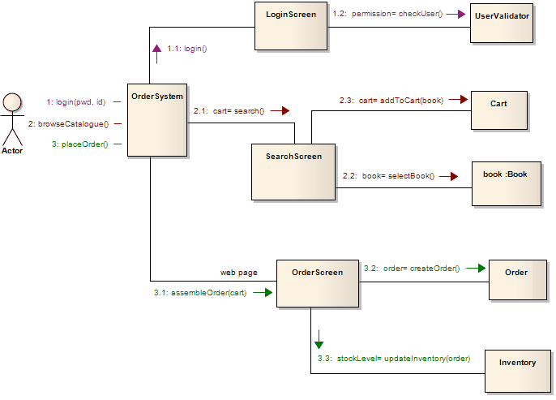

#### [Communication Diagram](https://sparxsystems.com/enterprise_architect_user_guide/15.1/model_domains/communicationdiagram.html)

аграмма связи - это диаграмма, которая показывает взаимодействия между элементами во время выполнения во многом так же, как диаграмма последовательности. Однако диаграммы связи используются для визуализации отношений между объектами, а диаграммы последовательностей более эффективны для визуализации обработки во времени.

В коммуникационных диаграммах используются упорядоченные помеченные ассоциации для иллюстрации обработки. Нумерация важна для обозначения порядка и вложенности обработки. Схема нумерации может быть:

1

1,1

1.1.1

1.1.2

1.2 и так далее.

Новый сегмент номера начинается для нового уровня обработки и будет эквивалентен вызову метода.

Вы генерируете элементы схемы связи и соединители на страницах «Связь» панели инструментов схемы .

-- Пример диаграммы
Этот пример иллюстрирует диаграмму взаимодействия между взаимодействующими экземплярами объекта. Обратите внимание на использование уровней сообщений для захвата связанных потоков и разные цвета сообщений.

-- Значки панели инструментов элемента диаграммы связи

| Значок                                   | Описание                                 | Смотрите также                           |
|------------------------------------------|------------------------------------------|------------------------------------------|
|  | 
Актер - пользователь системы; Пользователь может означать человека-пользователя, машину или даже другую систему или подсистему в модели.
 | <a href="https://sparxsystems.com/enterprise_architect_user_guide/15.1/model_domains/actor.html" style="box-sizing: border-box; text-decoration: none; cursor: url(&quot;data:image/png;base64,iVBORw0KGgoAAAANSUhEUgAAABAAAAAQCAYAAAAf8/9hAAABaUlEQVQ4T2NkwAZY1f9DhP+lM/y+PQurGqggI6akisytj+ceg8TVREwZGH7fxKIGoQtTkk1F69brc1cpMEBV89brs9eoaMB/TQaGWzcYGKS4GBiefUP3MhYvqGncen3mOrJCZ5NAhr1n1jPs3LKbITc6H2jQk+8weaIMgCn++OEDw+H9xxmERAQZEgJyDjP8uWXHyMCqdiU+PVJ74cwVkBBnV1e/9eo00MmY4M+fPwwvX7wASzgaBILVAw1Q/3/rzWmwIDjamBg0cBkAUvP0yRPcBoBkvG3CGbYeWYk17fz5/Zvh5cuXaAaAuEiuwJfq3rx5w/Dzxw8sBhBpCMz5qGGAbCUel/z69Yvh9atXcNWOBgEXGH7fMsSMRqAh+y+sZ+AXEGDg4eEBa3j29CnD///Q/AXkBzjEM3x8fRqsF3tGYVF7Ud1eJO7iZYcRJPGBuQyPbl0BmvzyK24DYNpY1X+BghjFFLTcCQDviqMRO9+fjwAAAABJRU5ErkJggg==&quot;) 14 0, auto !important; color: rgb(0, 102, 221); outline: none; display: block; line-height: normal; margin: 0px; padding: 10px 0px;">Актер</a> |
|  | 
Объект - это конкретный экземпляр класса во время выполнения.
 | <a href="https://sparxsystems.com/enterprise_architect_user_guide/15.1/model_domains/object.html" style="box-sizing: border-box; text-decoration: none; cursor: url(&quot;data:image/png;base64,iVBORw0KGgoAAAANSUhEUgAAABAAAAAQCAYAAAAf8/9hAAABaUlEQVQ4T2NkwAZY1f9DhP+lM/y+PQurGqggI6akisytj+ceg8TVREwZGH7fxKIGoQtTkk1F69brc1cpMEBV89brs9eoaMB/TQaGWzcYGKS4GBiefUP3MhYvqGncen3mOrJCZ5NAhr1n1jPs3LKbITc6H2jQk+8weaIMgCn++OEDw+H9xxmERAQZEgJyDjP8uWXHyMCqdiU+PVJ74cwVkBBnV1e/9eo00MmY4M+fPwwvX7wASzgaBILVAw1Q/3/rzWmwIDjamBg0cBkAUvP0yRPcBoBkvG3CGbYeWYk17fz5/Zvh5cuXaAaAuEiuwJfq3rx5w/Dzxw8sBhBpCMz5qGGAbCUel/z69Yvh9atXcNWOBgEXGH7fMsSMRqAh+y+sZ+AXEGDg4eEBa3j29CnD///Q/AXkBzjEM3x8fRqsF3tGYVF7Ud1eJO7iZYcRJPGBuQyPbl0BmvzyK24DYNpY1X+BghjFFLTcCQDviqMRO9+fjwAAAABJRU5ErkJggg==&quot;) 14 0, auto !important; color: rgb(0, 102, 221); outline: none; display: block; line-height: normal; margin: 0px; padding: 10px 0px;">объект</a> |
|  | 
Граница - это стереотипный объект, который моделирует некоторые границы системы, обычно экран пользовательского интерфейса.
 | <a href="https://sparxsystems.com/enterprise_architect_user_guide/15.1/model_domains/boundary.html" style="box-sizing: border-box; text-decoration: none; cursor: url(&quot;data:image/png;base64,iVBORw0KGgoAAAANSUhEUgAAABAAAAAQCAYAAAAf8/9hAAABaUlEQVQ4T2NkwAZY1f9DhP+lM/y+PQurGqggI6akisytj+ceg8TVREwZGH7fxKIGoQtTkk1F69brc1cpMEBV89brs9eoaMB/TQaGWzcYGKS4GBiefUP3MhYvqGncen3mOrJCZ5NAhr1n1jPs3LKbITc6H2jQk+8weaIMgCn++OEDw+H9xxmERAQZEgJyDjP8uWXHyMCqdiU+PVJ74cwVkBBnV1e/9eo00MmY4M+fPwwvX7wASzgaBILVAw1Q/3/rzWmwIDjamBg0cBkAUvP0yRPcBoBkvG3CGbYeWYk17fz5/Zvh5cuXaAaAuEiuwJfq3rx5w/Dzxw8sBhBpCMz5qGGAbCUel/z69Yvh9atXcNWOBgEXGH7fMsSMRqAh+y+sZ+AXEGDg4eEBa3j29CnD///Q/AXkBzjEM3x8fRqsF3tGYVF7Ud1eJO7iZYcRJPGBuQyPbl0BmvzyK24DYNpY1X+BghjFFLTcCQDviqMRO9+fjwAAAABJRU5ErkJggg==&quot;) 14 0, auto !important; color: rgb(0, 102, 221); outline: none; display: block; line-height: normal; margin: 0px; padding: 10px 0px;">граничный</a> |
|  | 
Элемент Control представляет собой контролирующую организацию или менеджера, который организует и планирует другие действия и элементы.
 | <a href="https://sparxsystems.com/enterprise_architect_user_guide/15.1/model_domains/control.html" style="box-sizing: border-box; text-decoration: none; cursor: url(&quot;data:image/png;base64,iVBORw0KGgoAAAANSUhEUgAAABAAAAAQCAYAAAAf8/9hAAABaUlEQVQ4T2NkwAZY1f9DhP+lM/y+PQurGqggI6akisytj+ceg8TVREwZGH7fxKIGoQtTkk1F69brc1cpMEBV89brs9eoaMB/TQaGWzcYGKS4GBiefUP3MhYvqGncen3mOrJCZ5NAhr1n1jPs3LKbITc6H2jQk+8weaIMgCn++OEDw+H9xxmERAQZEgJyDjP8uWXHyMCqdiU+PVJ74cwVkBBnV1e/9eo00MmY4M+fPwwvX7wASzgaBILVAw1Q/3/rzWmwIDjamBg0cBkAUvP0yRPcBoBkvG3CGbYeWYk17fz5/Zvh5cuXaAaAuEiuwJfq3rx5w/Dzxw8sBhBpCMz5qGGAbCUel/z69Yvh9atXcNWOBgEXGH7fMsSMRqAh+y+sZ+AXEGDg4eEBa3j29CnD///Q/AXkBzjEM3x8fRqsF3tGYVF7Ud1eJO7iZYcRJPGBuQyPbl0BmvzyK24DYNpY1X+BghjFFLTcCQDviqMRO9+fjwAAAABJRU5ErkJggg==&quot;) 14 0, auto !important; color: rgb(0, 102, 221); outline: none; display: block; line-height: normal; margin: 0px; padding: 10px 0px;">контроль</a> |
|  | 
Сущность - это стереотипный объект, который моделирует механизм хранения или сохранения, который фиксирует информацию или знания в системе.
 | <a href="https://sparxsystems.com/enterprise_architect_user_guide/15.1/model_domains/entity.html" style="box-sizing: border-box; text-decoration: none; cursor: url(&quot;data:image/png;base64,iVBORw0KGgoAAAANSUhEUgAAABAAAAAQCAYAAAAf8/9hAAABaUlEQVQ4T2NkwAZY1f9DhP+lM/y+PQurGqggI6akisytj+ceg8TVREwZGH7fxKIGoQtTkk1F69brc1cpMEBV89brs9eoaMB/TQaGWzcYGKS4GBiefUP3MhYvqGncen3mOrJCZ5NAhr1n1jPs3LKbITc6H2jQk+8weaIMgCn++OEDw+H9xxmERAQZEgJyDjP8uWXHyMCqdiU+PVJ74cwVkBBnV1e/9eo00MmY4M+fPwwvX7wASzgaBILVAw1Q/3/rzWmwIDjamBg0cBkAUvP0yRPcBoBkvG3CGbYeWYk17fz5/Zvh5cuXaAaAuEiuwJfq3rx5w/Dzxw8sBhBpCMz5qGGAbCUel/z69Yvh9atXcNWOBgEXGH7fMsSMRqAh+y+sZ+AXEGDg4eEBa3j29CnD///Q/AXkBzjEM3x8fRqsF3tGYVF7Ud1eJO7iZYcRJPGBuQyPbl0BmvzyK24DYNpY1X+BghjFFLTcCQDviqMRO9+fjwAAAABJRU5ErkJggg==&quot;) 14 0, auto !important; color: rgb(0, 102, 221); outline: none; display: block; line-height: normal; margin: 0px; padding: 10px 0px;">сущность</a> |
|  | 
Пакеты используются для организации содержимого вашего проекта, но при добавлении на диаграмму их можно использовать для структурных или реляционных изображений.
 | <a href="https://sparxsystems.com/enterprise_architect_user_guide/15.1/model_domains/package.html" style="box-sizing: border-box; text-decoration: none; cursor: url(&quot;data:image/png;base64,iVBORw0KGgoAAAANSUhEUgAAABAAAAAQCAYAAAAf8/9hAAABaUlEQVQ4T2NkwAZY1f9DhP+lM/y+PQurGqggI6akisytj+ceg8TVREwZGH7fxKIGoQtTkk1F69brc1cpMEBV89brs9eoaMB/TQaGWzcYGKS4GBiefUP3MhYvqGncen3mOrJCZ5NAhr1n1jPs3LKbITc6H2jQk+8weaIMgCn++OEDw+H9xxmERAQZEgJyDjP8uWXHyMCqdiU+PVJ74cwVkBBnV1e/9eo00MmY4M+fPwwvX7wASzgaBILVAw1Q/3/rzWmwIDjamBg0cBkAUvP0yRPcBoBkvG3CGbYeWYk17fz5/Zvh5cuXaAaAuEiuwJfq3rx5w/Dzxw8sBhBpCMz5qGGAbCUel/z69Yvh9atXcNWOBgEXGH7fMsSMRqAh+y+sZ+AXEGDg4eEBa3j29CnD///Q/AXkBzjEM3x8fRqsF3tGYVF7Ud1eJO7iZYcRJPGBuQyPbl0BmvzyK24DYNpY1X+BghjFFLTcCQDviqMRO9+fjwAAAABJRU5ErkJggg==&quot;) 14 0, auto !important; color: rgb(0, 102, 221); outline: none; display: block; line-height: normal; margin: 0px; padding: 10px 0px;">пакет</a> |

-- Значки панели инструментов соединителя схемы связи

| Значок                                   | Описание                                 | Смотрите также                           |
|------------------------------------------|------------------------------------------|------------------------------------------|
|  | 
Ассоциация подразумевает, что два элемента модели имеют отношение, обычно реализуемое как переменная экземпляра в одном или обоих классах.
 | <a href="https://sparxsystems.com/enterprise_architect_user_guide/15.1/model_domains/associate.html" style="box-sizing: border-box; text-decoration: none; cursor: url(&quot;data:image/png;base64,iVBORw0KGgoAAAANSUhEUgAAABAAAAAQCAYAAAAf8/9hAAABaUlEQVQ4T2NkwAZY1f9DhP+lM/y+PQurGqggI6akisytj+ceg8TVREwZGH7fxKIGoQtTkk1F69brc1cpMEBV89brs9eoaMB/TQaGWzcYGKS4GBiefUP3MhYvqGncen3mOrJCZ5NAhr1n1jPs3LKbITc6H2jQk+8weaIMgCn++OEDw+H9xxmERAQZEgJyDjP8uWXHyMCqdiU+PVJ74cwVkBBnV1e/9eo00MmY4M+fPwwvX7wASzgaBILVAw1Q/3/rzWmwIDjamBg0cBkAUvP0yRPcBoBkvG3CGbYeWYk17fz5/Zvh5cuXaAaAuEiuwJfq3rx5w/Dzxw8sBhBpCMz5qGGAbCUel/z69Yvh9atXcNWOBgEXGH7fMsSMRqAh+y+sZ+AXEGDg4eEBa3j29CnD///Q/AXkBzjEM3x8fRqsF3tGYVF7Ud1eJO7iZYcRJPGBuQyPbl0BmvzyK24DYNpY1X+BghjFFLTcCQDviqMRO9+fjwAAAABJRU5ErkJggg==&quot;) 14 0, auto !important; color: rgb(0, 102, 221); outline: none; display: block; line-height: normal; margin: 0px; padding: 10px 0px;">ассоциация</a> |
|  | 
Соединитель вложенности - это альтернативное графическое обозначение для выражения включения или вложения элементов в другие элементы.
 | <a href="https://sparxsystems.com/enterprise_architect_user_guide/15.1/model_domains/nesting.html" style="box-sizing: border-box; text-decoration: none; cursor: url(&quot;data:image/png;base64,iVBORw0KGgoAAAANSUhEUgAAABAAAAAQCAYAAAAf8/9hAAABaUlEQVQ4T2NkwAZY1f9DhP+lM/y+PQurGqggI6akisytj+ceg8TVREwZGH7fxKIGoQtTkk1F69brc1cpMEBV89brs9eoaMB/TQaGWzcYGKS4GBiefUP3MhYvqGncen3mOrJCZ5NAhr1n1jPs3LKbITc6H2jQk+8weaIMgCn++OEDw+H9xxmERAQZEgJyDjP8uWXHyMCqdiU+PVJ74cwVkBBnV1e/9eo00MmY4M+fPwwvX7wASzgaBILVAw1Q/3/rzWmwIDjamBg0cBkAUvP0yRPcBoBkvG3CGbYeWYk17fz5/Zvh5cuXaAaAuEiuwJfq3rx5w/Dzxw8sBhBpCMz5qGGAbCUel/z69Yvh9atXcNWOBgEXGH7fMsSMRqAh+y+sZ+AXEGDg4eEBa3j29CnD///Q/AXkBzjEM3x8fRqsF3tGYVF7Ud1eJO7iZYcRJPGBuQyPbl0BmvzyK24DYNpY1X+BghjFFLTcCQDviqMRO9+fjwAAAABJRU5ErkJggg==&quot;) 14 0, auto !important; color: rgb(0, 102, 221); outline: none; display: block; line-height: normal; margin: 0px; padding: 10px 0px;">гнездование</a> |
|  | 
Соединитель реализует, что исходный объект реализует или реализует свой целевой объект.
 | <a href="https://sparxsystems.com/enterprise_architect_user_guide/15.1/model_domains/realise.html" style="box-sizing: border-box; text-decoration: none; cursor: url(&quot;data:image/png;base64,iVBORw0KGgoAAAANSUhEUgAAABAAAAAQCAYAAAAf8/9hAAABaUlEQVQ4T2NkwAZY1f9DhP+lM/y+PQurGqggI6akisytj+ceg8TVREwZGH7fxKIGoQtTkk1F69brc1cpMEBV89brs9eoaMB/TQaGWzcYGKS4GBiefUP3MhYvqGncen3mOrJCZ5NAhr1n1jPs3LKbITc6H2jQk+8weaIMgCn++OEDw+H9xxmERAQZEgJyDjP8uWXHyMCqdiU+PVJ74cwVkBBnV1e/9eo00MmY4M+fPwwvX7wASzgaBILVAw1Q/3/rzWmwIDjamBg0cBkAUvP0yRPcBoBkvG3CGbYeWYk17fz5/Zvh5cuXaAaAuEiuwJfq3rx5w/Dzxw8sBhBpCMz5qGGAbCUel/z69Yvh9atXcNWOBgEXGH7fMsSMRqAh+y+sZ+AXEGDg4eEBa3j29CnD///Q/AXkBzjEM3x8fRqsF3tGYVF7Ud1eJO7iZYcRJPGBuQyPbl0BmvzyK24DYNpY1X+BghjFFLTcCQDviqMRO9+fjwAAAABJRU5ErkJggg==&quot;) 14 0, auto !important; color: rgb(0, 102, 221); outline: none; display: block; line-height: normal; margin: 0px; padding: 10px 0px;">реализация</a> |

* [Communication Diagrams in Color](https://sparxsystems.com/enterprise_architect_user_guide/15.1/model_domains/communicationdiagramsincolo.html)
* [Messages (Communication Diagrams)](https://sparxsystems.com/enterprise_architect_user_guide/15.1/model_domains/message(communication).html)
* [Create a Communication Message](https://sparxsystems.com/enterprise_architect_user_guide/15.1/model_domains/createacommmessage.html)
* [Reorder Messages](https://sparxsystems.com/enterprise_architect_user_guide/15.1/model_domains/reordercommmessages.html)

* Диаграммы связи в цвете
* Сообщения (схемы связи)
* Создать коммуникационное сообщение
* Изменить порядок сообщений

