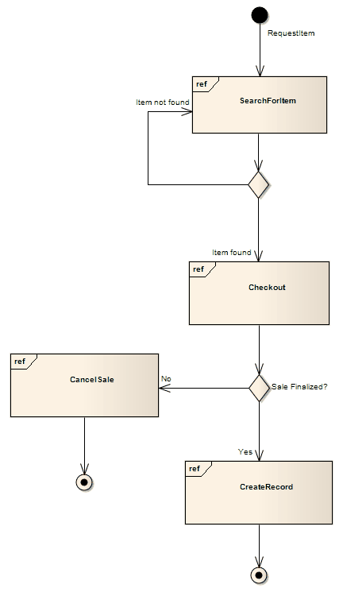

#### [Interaction Overview Diagram](https://sparxsystems.com/enterprise_architect_user_guide/15.1/model_domains/interactionoverviewdiagram.html)

Диаграммы обзора взаимодействия визуализируют взаимодействие между другими диаграммами взаимодействия, чтобы проиллюстрировать поток управления, служащий всеобъемлющей цели. Поскольку диаграммы обзора взаимодействия являются вариантом диаграмм действий, большая часть обозначений диаграмм такая же, как и процесс построения диаграммы.

Точки принятия решения, развилки, соединения, начальные и конечные точки одинаковы. Однако вместо элементов Activity используются прямоугольные элементы двух типов:

* Элементы взаимодействия отображают встроенную диаграмму взаимодействия, которая может быть любого из четырех типов (последовательность, время, связь или обзор взаимодействия).
* Элементы возникновения взаимодействия - это ссылки на существующую диаграмму взаимодействия: они визуально представлены фреймом со ссылкой в ​​пространстве заголовка фрейма; название диаграммы указывается в содержимом фрейма

Чтобы создать событие взаимодействия, просто перетащите диаграмму взаимодействия из окна браузера на диаграмму обзора взаимодействия. Отображается рамка ссылки, инкапсулирующая экземпляр диаграммы взаимодействия.

Вы генерируете элементы диаграммы Обзор взаимодействия и соединители на страницах «Действия» панели инструментов диаграммы .

-- Пример диаграммы
Эта диаграмма изображает образец процесса продажи, показанный на диаграмме обзора взаимодействия, с подпроцессами, абстрагируемыми в пределах событий взаимодействия.

Диаграмма выглядит очень похожей на диаграмму действий и концептуализирована таким же образом; по мере того, как поток переходит во взаимодействие, необходимо выполнить соответствующий процесс взаимодействия, прежде чем поток обзора взаимодействия сможет продвинуться вперед.

-- Обзор взаимодействия Значки панели инструментов элемента диаграммы

| Значок                                   | Описание                                 | Смотрите также                           |
|------------------------------------------|------------------------------------------|------------------------------------------|
|  | 
Элемент Partition используется для логической организации элементов.
 | <a href="https://sparxsystems.com/enterprise_architect_user_guide/15.1/model_domains/partition.html" style="box-sizing: border-box; text-decoration: none; cursor: url(&quot;data:image/png;base64,iVBORw0KGgoAAAANSUhEUgAAABAAAAAQCAYAAAAf8/9hAAABaUlEQVQ4T2NkwAZY1f9DhP+lM/y+PQurGqggI6akisytj+ceg8TVREwZGH7fxKIGoQtTkk1F69brc1cpMEBV89brs9eoaMB/TQaGWzcYGKS4GBiefUP3MhYvqGncen3mOrJCZ5NAhr1n1jPs3LKbITc6H2jQk+8weaIMgCn++OEDw+H9xxmERAQZEgJyDjP8uWXHyMCqdiU+PVJ74cwVkBBnV1e/9eo00MmY4M+fPwwvX7wASzgaBILVAw1Q/3/rzWmwIDjamBg0cBkAUvP0yRPcBoBkvG3CGbYeWYk17fz5/Zvh5cuXaAaAuEiuwJfq3rx5w/Dzxw8sBhBpCMz5qGGAbCUel/z69Yvh9atXcNWOBgEXGH7fMsSMRqAh+y+sZ+AXEGDg4eEBa3j29CnD///Q/AXkBzjEM3x8fRqsF3tGYVF7Ud1eJO7iZYcRJPGBuQyPbl0BmvzyK24DYNpY1X+BghjFFLTcCQDviqMRO9+fjwAAAABJRU5ErkJggg==&quot;) 14 0, auto !important; color: rgb(0, 102, 221); outline: none; display: block; line-height: normal; margin: 0px; padding: 10px 0px;">раздел</a> |
|  | 
Решение - это элемент, который указывает точку условного развития: если условие истинно, обработка продолжается в одном направлении; если нет, то другой.
 | <a href="https://sparxsystems.com/enterprise_architect_user_guide/15.1/model_domains/decision.html" style="box-sizing: border-box; text-decoration: none; cursor: url(&quot;data:image/png;base64,iVBORw0KGgoAAAANSUhEUgAAABAAAAAQCAYAAAAf8/9hAAABaUlEQVQ4T2NkwAZY1f9DhP+lM/y+PQurGqggI6akisytj+ceg8TVREwZGH7fxKIGoQtTkk1F69brc1cpMEBV89brs9eoaMB/TQaGWzcYGKS4GBiefUP3MhYvqGncen3mOrJCZ5NAhr1n1jPs3LKbITc6H2jQk+8weaIMgCn++OEDw+H9xxmERAQZEgJyDjP8uWXHyMCqdiU+PVJ74cwVkBBnV1e/9eo00MmY4M+fPwwvX7wASzgaBILVAw1Q/3/rzWmwIDjamBg0cBkAUvP0yRPcBoBkvG3CGbYeWYk17fz5/Zvh5cuXaAaAuEiuwJfq3rx5w/Dzxw8sBhBpCMz5qGGAbCUel/z69Yvh9atXcNWOBgEXGH7fMsSMRqAh+y+sZ+AXEGDg4eEBa3j29CnD///Q/AXkBzjEM3x8fRqsF3tGYVF7Ud1eJO7iZYcRJPGBuQyPbl0BmvzyK24DYNpY1X+BghjFFLTcCQDviqMRO9+fjwAAAABJRU5ErkJggg==&quot;) 14 0, auto !important; color: rgb(0, 102, 221); outline: none; display: block; line-height: normal; margin: 0px; padding: 10px 0px;">Решение</a> |
|  | 
Элемент Send используется для отображения действия по отправке сигнала.
 | <a href="https://sparxsystems.com/enterprise_architect_user_guide/15.1/model_domains/send.html" style="box-sizing: border-box; text-decoration: none; cursor: url(&quot;data:image/png;base64,iVBORw0KGgoAAAANSUhEUgAAABAAAAAQCAYAAAAf8/9hAAABaUlEQVQ4T2NkwAZY1f9DhP+lM/y+PQurGqggI6akisytj+ceg8TVREwZGH7fxKIGoQtTkk1F69brc1cpMEBV89brs9eoaMB/TQaGWzcYGKS4GBiefUP3MhYvqGncen3mOrJCZ5NAhr1n1jPs3LKbITc6H2jQk+8weaIMgCn++OEDw+H9xxmERAQZEgJyDjP8uWXHyMCqdiU+PVJ74cwVkBBnV1e/9eo00MmY4M+fPwwvX7wASzgaBILVAw1Q/3/rzWmwIDjamBg0cBkAUvP0yRPcBoBkvG3CGbYeWYk17fz5/Zvh5cuXaAaAuEiuwJfq3rx5w/Dzxw8sBhBpCMz5qGGAbCUel/z69Yvh9atXcNWOBgEXGH7fMsSMRqAh+y+sZ+AXEGDg4eEBa3j29CnD///Q/AXkBzjEM3x8fRqsF3tGYVF7Ud1eJO7iZYcRJPGBuQyPbl0BmvzyK24DYNpY1X+BghjFFLTcCQDviqMRO9+fjwAAAABJRU5ErkJggg==&quot;) 14 0, auto !important; color: rgb(0, 102, 221); outline: none; display: block; line-height: normal; margin: 0px; padding: 10px 0px;">послать</a> |
|  | 
Элемент Receive используется для определения принятия или получения запроса.
 | <a href="https://sparxsystems.com/enterprise_architect_user_guide/15.1/model_domains/receive.html" style="box-sizing: border-box; text-decoration: none; cursor: url(&quot;data:image/png;base64,iVBORw0KGgoAAAANSUhEUgAAABAAAAAQCAYAAAAf8/9hAAABaUlEQVQ4T2NkwAZY1f9DhP+lM/y+PQurGqggI6akisytj+ceg8TVREwZGH7fxKIGoQtTkk1F69brc1cpMEBV89brs9eoaMB/TQaGWzcYGKS4GBiefUP3MhYvqGncen3mOrJCZ5NAhr1n1jPs3LKbITc6H2jQk+8weaIMgCn++OEDw+H9xxmERAQZEgJyDjP8uWXHyMCqdiU+PVJ74cwVkBBnV1e/9eo00MmY4M+fPwwvX7wASzgaBILVAw1Q/3/rzWmwIDjamBg0cBkAUvP0yRPcBoBkvG3CGbYeWYk17fz5/Zvh5cuXaAaAuEiuwJfq3rx5w/Dzxw8sBhBpCMz5qGGAbCUel/z69Yvh9atXcNWOBgEXGH7fMsSMRqAh+y+sZ+AXEGDg4eEBa3j29CnD///Q/AXkBzjEM3x8fRqsF3tGYVF7Ud1eJO7iZYcRJPGBuQyPbl0BmvzyK24DYNpY1X+BghjFFLTcCQDviqMRO9+fjwAAAABJRU5ErkJggg==&quot;) 14 0, auto !important; color: rgb(0, 102, 221); outline: none; display: block; line-height: normal; margin: 0px; padding: 10px 0px;">Получить</a> |
|  | 
Состояние Synch полезно для указания того, что параллельные пути синхронизированы. Они используются для разделения и объединения периодов параллельной обработки.
 | <a href="https://sparxsystems.com/enterprise_architect_user_guide/15.1/model_domains/synch.html" style="box-sizing: border-box; text-decoration: none; cursor: url(&quot;data:image/png;base64,iVBORw0KGgoAAAANSUhEUgAAABAAAAAQCAYAAAAf8/9hAAABaUlEQVQ4T2NkwAZY1f9DhP+lM/y+PQurGqggI6akisytj+ceg8TVREwZGH7fxKIGoQtTkk1F69brc1cpMEBV89brs9eoaMB/TQaGWzcYGKS4GBiefUP3MhYvqGncen3mOrJCZ5NAhr1n1jPs3LKbITc6H2jQk+8weaIMgCn++OEDw+H9xxmERAQZEgJyDjP8uWXHyMCqdiU+PVJ74cwVkBBnV1e/9eo00MmY4M+fPwwvX7wASzgaBILVAw1Q/3/rzWmwIDjamBg0cBkAUvP0yRPcBoBkvG3CGbYeWYk17fz5/Zvh5cuXaAaAuEiuwJfq3rx5w/Dzxw8sBhBpCMz5qGGAbCUel/z69Yvh9atXcNWOBgEXGH7fMsSMRqAh+y+sZ+AXEGDg4eEBa3j29CnD///Q/AXkBzjEM3x8fRqsF3tGYVF7Ud1eJO7iZYcRJPGBuQyPbl0BmvzyK24DYNpY1X+BghjFFLTcCQDviqMRO9+fjwAAAABJRU5ErkJggg==&quot;) 14 0, auto !important; color: rgb(0, 102, 221); outline: none; display: block; line-height: normal; margin: 0px; padding: 10px 0px;">Synch</a> |
|  | 
Элемент Initial определяет начало потока при вызове Activity.
 | <a href="https://sparxsystems.com/enterprise_architect_user_guide/15.1/model_domains/initial.html" style="box-sizing: border-box; text-decoration: none; cursor: url(&quot;data:image/png;base64,iVBORw0KGgoAAAANSUhEUgAAABAAAAAQCAYAAAAf8/9hAAABaUlEQVQ4T2NkwAZY1f9DhP+lM/y+PQurGqggI6akisytj+ceg8TVREwZGH7fxKIGoQtTkk1F69brc1cpMEBV89brs9eoaMB/TQaGWzcYGKS4GBiefUP3MhYvqGncen3mOrJCZ5NAhr1n1jPs3LKbITc6H2jQk+8weaIMgCn++OEDw+H9xxmERAQZEgJyDjP8uWXHyMCqdiU+PVJ74cwVkBBnV1e/9eo00MmY4M+fPwwvX7wASzgaBILVAw1Q/3/rzWmwIDjamBg0cBkAUvP0yRPcBoBkvG3CGbYeWYk17fz5/Zvh5cuXaAaAuEiuwJfq3rx5w/Dzxw8sBhBpCMz5qGGAbCUel/z69Yvh9atXcNWOBgEXGH7fMsSMRqAh+y+sZ+AXEGDg4eEBa3j29CnD///Q/AXkBzjEM3x8fRqsF3tGYVF7Ud1eJO7iZYcRJPGBuQyPbl0BmvzyK24DYNpY1X+BghjFFLTcCQDviqMRO9+fjwAAAABJRU5ErkJggg==&quot;) 14 0, auto !important; color: rgb(0, 102, 221); outline: none; display: block; line-height: normal; margin: 0px; padding: 10px 0px;">начальный</a> |
|  | 
Последний элемент указывает на завершение Activity; по достижении Финала все выполнение прерывается.
 | <a href="https://sparxsystems.com/enterprise_architect_user_guide/15.1/model_domains/final.html" style="box-sizing: border-box; text-decoration: none; cursor: url(&quot;data:image/png;base64,iVBORw0KGgoAAAANSUhEUgAAABAAAAAQCAYAAAAf8/9hAAABaUlEQVQ4T2NkwAZY1f9DhP+lM/y+PQurGqggI6akisytj+ceg8TVREwZGH7fxKIGoQtTkk1F69brc1cpMEBV89brs9eoaMB/TQaGWzcYGKS4GBiefUP3MhYvqGncen3mOrJCZ5NAhr1n1jPs3LKbITc6H2jQk+8weaIMgCn++OEDw+H9xxmERAQZEgJyDjP8uWXHyMCqdiU+PVJ74cwVkBBnV1e/9eo00MmY4M+fPwwvX7wASzgaBILVAw1Q/3/rzWmwIDjamBg0cBkAUvP0yRPcBoBkvG3CGbYeWYk17fz5/Zvh5cuXaAaAuEiuwJfq3rx5w/Dzxw8sBhBpCMz5qGGAbCUel/z69Yvh9atXcNWOBgEXGH7fMsSMRqAh+y+sZ+AXEGDg4eEBa3j29CnD///Q/AXkBzjEM3x8fRqsF3tGYVF7Ud1eJO7iZYcRJPGBuQyPbl0BmvzyK24DYNpY1X+BghjFFLTcCQDviqMRO9+fjwAAAABJRU5ErkJggg==&quot;) 14 0, auto !important; color: rgb(0, 102, 221); outline: none; display: block; line-height: normal; margin: 0px; padding: 10px 0px;">окончательный</a> |
|  | 
Элемент Flow Final изображает выход из системы, в отличие от элемента Activity Final, который представляет собой завершение Activity.
 | <a href="https://sparxsystems.com/enterprise_architect_user_guide/15.1/model_domains/flowfinal.html" style="box-sizing: border-box; text-decoration: none; cursor: url(&quot;data:image/png;base64,iVBORw0KGgoAAAANSUhEUgAAABAAAAAQCAYAAAAf8/9hAAABaUlEQVQ4T2NkwAZY1f9DhP+lM/y+PQurGqggI6akisytj+ceg8TVREwZGH7fxKIGoQtTkk1F69brc1cpMEBV89brs9eoaMB/TQaGWzcYGKS4GBiefUP3MhYvqGncen3mOrJCZ5NAhr1n1jPs3LKbITc6H2jQk+8weaIMgCn++OEDw+H9xxmERAQZEgJyDjP8uWXHyMCqdiU+PVJ74cwVkBBnV1e/9eo00MmY4M+fPwwvX7wASzgaBILVAw1Q/3/rzWmwIDjamBg0cBkAUvP0yRPcBoBkvG3CGbYeWYk17fz5/Zvh5cuXaAaAuEiuwJfq3rx5w/Dzxw8sBhBpCMz5qGGAbCUel/z69Yvh9atXcNWOBgEXGH7fMsSMRqAh+y+sZ+AXEGDg4eEBa3j29CnD///Q/AXkBzjEM3x8fRqsF3tGYVF7Ud1eJO7iZYcRJPGBuQyPbl0BmvzyK24DYNpY1X+BghjFFLTcCQDviqMRO9+fjwAAAABJRU5ErkJggg==&quot;) 14 0, auto !important; color: rgb(0, 102, 221); outline: none; display: block; line-height: normal; margin: 0px; padding: 10px 0px;">Финал потока</a> |
|  | 
Enterprise Architect поддерживает два типа элементов региона: области расширения и области прерывистой активности.

Область расширения окружает процесс, который многократно накладывается на входящие данные, по одному разу для каждого элемента во входной коллекции.

Область действия с возможностью прерывания окружает группу элементов действия, на все из которых воздействуют определенные прерывания таким образом, что все токены, проходящие внутри области, прекращаются в случае возникновения прерывания (й).
 | <a href="https://sparxsystems.com/enterprise_architect_user_guide/15.1/model_domains/region.html" style="box-sizing: border-box; text-decoration: none; cursor: url(&quot;data:image/png;base64,iVBORw0KGgoAAAANSUhEUgAAABAAAAAQCAYAAAAf8/9hAAABaUlEQVQ4T2NkwAZY1f9DhP+lM/y+PQurGqggI6akisytj+ceg8TVREwZGH7fxKIGoQtTkk1F69brc1cpMEBV89brs9eoaMB/TQaGWzcYGKS4GBiefUP3MhYvqGncen3mOrJCZ5NAhr1n1jPs3LKbITc6H2jQk+8weaIMgCn++OEDw+H9xxmERAQZEgJyDjP8uWXHyMCqdiU+PVJ74cwVkBBnV1e/9eo00MmY4M+fPwwvX7wASzgaBILVAw1Q/3/rzWmwIDjamBg0cBkAUvP0yRPcBoBkvG3CGbYeWYk17fz5/Zvh5cuXaAaAuEiuwJfq3rx5w/Dzxw8sBhBpCMz5qGGAbCUel/z69Yvh9atXcNWOBgEXGH7fMsSMRqAh+y+sZ+AXEGDg4eEBa3j29CnD///Q/AXkBzjEM3x8fRqsF3tGYVF7Ud1eJO7iZYcRJPGBuQyPbl0BmvzyK24DYNpY1X+BghjFFLTcCQDviqMRO9+fjwAAAABJRU5ErkJggg==&quot;) 14 0, auto !important; color: rgb(0, 102, 221); outline: none; display: block; line-height: normal; margin: 0px; padding: 10px 0px;">Область</a> |
|  | 
Элемент Exception Handler определяет группу операций, выполняемых при возникновении исключения.
 | <a href="https://sparxsystems.com/enterprise_architect_user_guide/15.1/model_domains/exception.html" style="box-sizing: border-box; text-decoration: none; cursor: url(&quot;data:image/png;base64,iVBORw0KGgoAAAANSUhEUgAAABAAAAAQCAYAAAAf8/9hAAABaUlEQVQ4T2NkwAZY1f9DhP+lM/y+PQurGqggI6akisytj+ceg8TVREwZGH7fxKIGoQtTkk1F69brc1cpMEBV89brs9eoaMB/TQaGWzcYGKS4GBiefUP3MhYvqGncen3mOrJCZ5NAhr1n1jPs3LKbITc6H2jQk+8weaIMgCn++OEDw+H9xxmERAQZEgJyDjP8uWXHyMCqdiU+PVJ74cwVkBBnV1e/9eo00MmY4M+fPwwvX7wASzgaBILVAw1Q/3/rzWmwIDjamBg0cBkAUvP0yRPcBoBkvG3CGbYeWYk17fz5/Zvh5cuXaAaAuEiuwJfq3rx5w/Dzxw8sBhBpCMz5qGGAbCUel/z69Yvh9atXcNWOBgEXGH7fMsSMRqAh+y+sZ+AXEGDg4eEBa3j29CnD///Q/AXkBzjEM3x8fRqsF3tGYVF7Ud1eJO7iZYcRJPGBuQyPbl0BmvzyK24DYNpY1X+BghjFFLTcCQDviqMRO9+fjwAAAABJRU5ErkJggg==&quot;) 14 0, auto !important; color: rgb(0, 102, 221); outline: none; display: block; line-height: normal; margin: 0px; padding: 10px 0px;">исключение</a> |
|  | 
Узел слияния объединяет несколько альтернативных путей потока на диаграммах Activity, Analysis и Interaction Overview.
 | <a href="https://sparxsystems.com/enterprise_architect_user_guide/15.1/model_domains/merge_node.html" style="box-sizing: border-box; text-decoration: none; cursor: url(&quot;data:image/png;base64,iVBORw0KGgoAAAANSUhEUgAAABAAAAAQCAYAAAAf8/9hAAABaUlEQVQ4T2NkwAZY1f9DhP+lM/y+PQurGqggI6akisytj+ceg8TVREwZGH7fxKIGoQtTkk1F69brc1cpMEBV89brs9eoaMB/TQaGWzcYGKS4GBiefUP3MhYvqGncen3mOrJCZ5NAhr1n1jPs3LKbITc6H2jQk+8weaIMgCn++OEDw+H9xxmERAQZEgJyDjP8uWXHyMCqdiU+PVJ74cwVkBBnV1e/9eo00MmY4M+fPwwvX7wASzgaBILVAw1Q/3/rzWmwIDjamBg0cBkAUvP0yRPcBoBkvG3CGbYeWYk17fz5/Zvh5cuXaAaAuEiuwJfq3rx5w/Dzxw8sBhBpCMz5qGGAbCUel/z69Yvh9atXcNWOBgEXGH7fMsSMRqAh+y+sZ+AXEGDg4eEBa3j29CnD///Q/AXkBzjEM3x8fRqsF3tGYVF7Ud1eJO7iZYcRJPGBuQyPbl0BmvzyK24DYNpY1X+BghjFFLTcCQDviqMRO9+fjwAAAABJRU5ErkJggg==&quot;) 14 0, auto !important; color: rgb(0, 102, 221); outline: none; display: block; line-height: normal; margin: 0px; padding: 10px 0px;">Объединить</a> |
|  | 
Элемент Fork / Join может использоваться для: 1) разделения одного потока на несколько параллельных потоков, 2) объединения нескольких параллельных потоков или 3) объединения и разделения нескольких входящих потоков на несколько исходящих потоков.
 | <a href="https://sparxsystems.com/enterprise_architect_user_guide/15.1/model_domains/forkjoin.html" style="box-sizing: border-box; text-decoration: none; cursor: url(&quot;data:image/png;base64,iVBORw0KGgoAAAANSUhEUgAAABAAAAAQCAYAAAAf8/9hAAABaUlEQVQ4T2NkwAZY1f9DhP+lM/y+PQurGqggI6akisytj+ceg8TVREwZGH7fxKIGoQtTkk1F69brc1cpMEBV89brs9eoaMB/TQaGWzcYGKS4GBiefUP3MhYvqGncen3mOrJCZ5NAhr1n1jPs3LKbITc6H2jQk+8weaIMgCn++OEDw+H9xxmERAQZEgJyDjP8uWXHyMCqdiU+PVJ74cwVkBBnV1e/9eo00MmY4M+fPwwvX7wASzgaBILVAw1Q/3/rzWmwIDjamBg0cBkAUvP0yRPcBoBkvG3CGbYeWYk17fz5/Zvh5cuXaAaAuEiuwJfq3rx5w/Dzxw8sBhBpCMz5qGGAbCUel/z69Yvh9atXcNWOBgEXGH7fMsSMRqAh+y+sZ+AXEGDg4eEBa3j29CnD///Q/AXkBzjEM3x8fRqsF3tGYVF7Ud1eJO7iZYcRJPGBuQyPbl0BmvzyK24DYNpY1X+BghjFFLTcCQDviqMRO9+fjwAAAABJRU5ErkJggg==&quot;) 14 0, auto !important; color: rgb(0, 102, 221); outline: none; display: block; line-height: normal; margin: 0px; padding: 10px 0px;">Вилка / Регистрация</a><a href="https://sparxsystems.com/enterprise_architect_user_guide/15.1/model_domains/fork.html" style="box-sizing: border-box; text-decoration: none; cursor: url(&quot;data:image/png;base64,iVBORw0KGgoAAAANSUhEUgAAABAAAAAQCAYAAAAf8/9hAAABaUlEQVQ4T2NkwAZY1f9DhP+lM/y+PQurGqggI6akisytj+ceg8TVREwZGH7fxKIGoQtTkk1F69brc1cpMEBV89brs9eoaMB/TQaGWzcYGKS4GBiefUP3MhYvqGncen3mOrJCZ5NAhr1n1jPs3LKbITc6H2jQk+8weaIMgCn++OEDw+H9xxmERAQZEgJyDjP8uWXHyMCqdiU+PVJ74cwVkBBnV1e/9eo00MmY4M+fPwwvX7wASzgaBILVAw1Q/3/rzWmwIDjamBg0cBkAUvP0yRPcBoBkvG3CGbYeWYk17fz5/Zvh5cuXaAaAuEiuwJfq3rx5w/Dzxw8sBhBpCMz5qGGAbCUel/z69Yvh9atXcNWOBgEXGH7fMsSMRqAh+y+sZ+AXEGDg4eEBa3j29CnD///Q/AXkBzjEM3x8fRqsF3tGYVF7Ud1eJO7iZYcRJPGBuQyPbl0BmvzyK24DYNpY1X+BghjFFLTcCQDviqMRO9+fjwAAAABJRU5ErkJggg==&quot;) 14 0, auto !important; color: rgb(0, 102, 221); outline: none; display: block; line-height: normal; margin: 0px; padding: 10px 0px;">вилка</a><a href="https://sparxsystems.com/enterprise_architect_user_guide/15.1/model_domains/join.html" style="box-sizing: border-box; text-decoration: none; cursor: url(&quot;data:image/png;base64,iVBORw0KGgoAAAANSUhEUgAAABAAAAAQCAYAAAAf8/9hAAABaUlEQVQ4T2NkwAZY1f9DhP+lM/y+PQurGqggI6akisytj+ceg8TVREwZGH7fxKIGoQtTkk1F69brc1cpMEBV89brs9eoaMB/TQaGWzcYGKS4GBiefUP3MhYvqGncen3mOrJCZ5NAhr1n1jPs3LKbITc6H2jQk+8weaIMgCn++OEDw+H9xxmERAQZEgJyDjP8uWXHyMCqdiU+PVJ74cwVkBBnV1e/9eo00MmY4M+fPwwvX7wASzgaBILVAw1Q/3/rzWmwIDjamBg0cBkAUvP0yRPcBoBkvG3CGbYeWYk17fz5/Zvh5cuXaAaAuEiuwJfq3rx5w/Dzxw8sBhBpCMz5qGGAbCUel/z69Yvh9atXcNWOBgEXGH7fMsSMRqAh+y+sZ+AXEGDg4eEBa3j29CnD///Q/AXkBzjEM3x8fRqsF3tGYVF7Ud1eJO7iZYcRJPGBuQyPbl0BmvzyK24DYNpY1X+BghjFFLTcCQDviqMRO9+fjwAAAABJRU5ErkJggg==&quot;) 14 0, auto !important; color: rgb(239, 128, 0); outline: none; display: block; line-height: normal; margin: 0px; padding: 10px 0px;">Присоединиться</a> |

Вертикальный элемент вилки / соединения	
Элемент Fork / Join может использоваться для: 1) разделения одного потока на несколько параллельных потоков, 2) объединения нескольких параллельных потоков или 3) объединения и разделения нескольких входящих потоков на несколько исходящих потоков.

-- Обзор взаимодействия Диаграмма Connector Toolbox Значки

| Значок                                   | Описание                                 | Смотрите также                           |
|------------------------------------------|------------------------------------------|------------------------------------------|
|  | 
Поток управления - это соединитель, соединяющий два узла, моделирующий активный переход.
 | <a href="https://sparxsystems.com/enterprise_architect_user_guide/15.1/model_domains/controlflow.html" style="box-sizing: border-box; text-decoration: none; cursor: url(&quot;data:image/png;base64,iVBORw0KGgoAAAANSUhEUgAAABAAAAAQCAYAAAAf8/9hAAABaUlEQVQ4T2NkwAZY1f9DhP+lM/y+PQurGqggI6akisytj+ceg8TVREwZGH7fxKIGoQtTkk1F69brc1cpMEBV89brs9eoaMB/TQaGWzcYGKS4GBiefUP3MhYvqGncen3mOrJCZ5NAhr1n1jPs3LKbITc6H2jQk+8weaIMgCn++OEDw+H9xxmERAQZEgJyDjP8uWXHyMCqdiU+PVJ74cwVkBBnV1e/9eo00MmY4M+fPwwvX7wASzgaBILVAw1Q/3/rzWmwIDjamBg0cBkAUvP0yRPcBoBkvG3CGbYeWYk17fz5/Zvh5cuXaAaAuEiuwJfq3rx5w/Dzxw8sBhBpCMz5qGGAbCUel/z69Yvh9atXcNWOBgEXGH7fMsSMRqAh+y+sZ+AXEGDg4eEBa3j29CnD///Q/AXkBzjEM3x8fRqsF3tGYVF7Ud1eJO7iZYcRJPGBuQyPbl0BmvzyK24DYNpY1X+BghjFFLTcCQDviqMRO9+fjwAAAABJRU5ErkJggg==&quot;) 14 0, auto !important; color: rgb(0, 102, 221); outline: none; display: block; line-height: normal; margin: 0px; padding: 10px 0px;">Поток управления</a> |
|  | 
Поток объектов соединяет два элемента, через которые проходят определенные данные, моделируя активный переход.
 | <a href="https://sparxsystems.com/enterprise_architect_user_guide/15.1/model_domains/objectflow.html" style="box-sizing: border-box; text-decoration: none; cursor: url(&quot;data:image/png;base64,iVBORw0KGgoAAAANSUhEUgAAABAAAAAQCAYAAAAf8/9hAAABaUlEQVQ4T2NkwAZY1f9DhP+lM/y+PQurGqggI6akisytj+ceg8TVREwZGH7fxKIGoQtTkk1F69brc1cpMEBV89brs9eoaMB/TQaGWzcYGKS4GBiefUP3MhYvqGncen3mOrJCZ5NAhr1n1jPs3LKbITc6H2jQk+8weaIMgCn++OEDw+H9xxmERAQZEgJyDjP8uWXHyMCqdiU+PVJ74cwVkBBnV1e/9eo00MmY4M+fPwwvX7wASzgaBILVAw1Q/3/rzWmwIDjamBg0cBkAUvP0yRPcBoBkvG3CGbYeWYk17fz5/Zvh5cuXaAaAuEiuwJfq3rx5w/Dzxw8sBhBpCMz5qGGAbCUel/z69Yvh9atXcNWOBgEXGH7fMsSMRqAh+y+sZ+AXEGDg4eEBa3j29CnD///Q/AXkBzjEM3x8fRqsF3tGYVF7Ud1eJO7iZYcRJPGBuQyPbl0BmvzyK24DYNpY1X+BghjFFLTcCQDviqMRO9+fjwAAAABJRU5ErkJggg==&quot;) 14 0, auto !important; color: rgb(0, 102, 221); outline: none; display: block; line-height: normal; margin: 0px; padding: 10px 0px;">Поток объектов</a> |
|  | 
Поток прерывания - это соединение, используемое для определения двух концепций соединителей UML для обработчика исключений и области прерывания.
 | <a href="https://sparxsystems.com/enterprise_architect_user_guide/15.1/model_domains/interruptflow.html" style="box-sizing: border-box; text-decoration: none; cursor: url(&quot;data:image/png;base64,iVBORw0KGgoAAAANSUhEUgAAABAAAAAQCAYAAAAf8/9hAAABaUlEQVQ4T2NkwAZY1f9DhP+lM/y+PQurGqggI6akisytj+ceg8TVREwZGH7fxKIGoQtTkk1F69brc1cpMEBV89brs9eoaMB/TQaGWzcYGKS4GBiefUP3MhYvqGncen3mOrJCZ5NAhr1n1jPs3LKbITc6H2jQk+8weaIMgCn++OEDw+H9xxmERAQZEgJyDjP8uWXHyMCqdiU+PVJ74cwVkBBnV1e/9eo00MmY4M+fPwwvX7wASzgaBILVAw1Q/3/rzWmwIDjamBg0cBkAUvP0yRPcBoBkvG3CGbYeWYk17fz5/Zvh5cuXaAaAuEiuwJfq3rx5w/Dzxw8sBhBpCMz5qGGAbCUel/z69Yvh9atXcNWOBgEXGH7fMsSMRqAh+y+sZ+AXEGDg4eEBa3j29CnD///Q/AXkBzjEM3x8fRqsF3tGYVF7Ud1eJO7iZYcRJPGBuQyPbl0BmvzyK24DYNpY1X+BghjFFLTcCQDviqMRO9+fjwAAAABJRU5ErkJggg==&quot;) 14 0, auto !important; color: rgb(239, 128, 0); outline: none; display: block; line-height: normal; margin: 0px; padding: 10px 0px;">Прерывание потока</a> |

* [Activity diagrams](https://sparxsystems.com/enterprise_architect_user_guide/15.1/model_domains/activitydiagram.html)
* [Interaction](https://sparxsystems.com/enterprise_architect_user_guide/15.1/model_domains/interaction.html)
* [Interaction Occurrence](https://sparxsystems.com/enterprise_architect_user_guide/15.1/model_domains/interactionoccurrence.html)

* Диаграммы деятельности
* взаимодействие
* Возникновение взаимодействия

