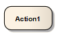
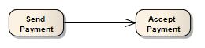
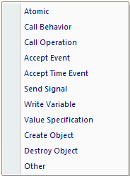
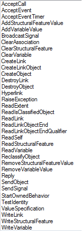
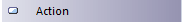

#### <a href="https://sparxsystems.com/enterprise_architect_user_guide/15.1/model_domains/action.html" target="_blank">Action</a> действие

Description
An Action element describes a basic process or transformation that occurs within a system, and is the basic functional unit within an Activity diagram. Actions can be thought of as children of Activities; both represent processes, but Activities can contain multiple steps or decomposable processes, each of which can be embodied by an Action. An Action cannot be further broken down or decomposed.

Элемент Action описывает базовый процесс или преобразование, происходящее в системе, и является базовой функциональной единицей на диаграмме Activity. Действия можно рассматривать как дочерние элементы Activity; оба представляют процессы, но действия могут содержать несколько шагов или декомпозируемых процессов, каждый из которых может быть воплощен в действии. Действие не может быть далее разбито или разложено.

For the purposes of simulation, you can define the effect of a basic (Atomic) Action on the 'Action' tab of the Properties window for the element, using a JavaScript expression in the 'Effect' field to define the duration of the effect and selecting to display the effect on the diagram. An Action can be further defined with pre-condition and post-condition notes.

В целях моделирования вы можете определить эффект базового (атомарного) действия на вкладке «Действие» в окне «Свойства» для элемента, используя выражение JavaScript в поле «Эффект» для определения продолжительности эффекта и выберите, чтобы отобразить эффект на диаграмме. Действие может быть дополнительно определено с помощью примечаний до и после условия.

Certain properties can be graphically depicted on the Action. When you first drag the 'Action' icon from the Toolbox onto a diagram, the system prompts you to select from a list of the more common types of Action to create. If you select the 'Other' option on this list, the 'New Action' dialog displays; the 'Other' drop-down list on this dialog enables you to select a more specialized type of Action from a complete list of Action types.

Некоторые свойства могут быть графически отображены в действии. Когда вы впервые перетаскиваете значок «Действие» из панели инструментов на диаграмму, система предлагает вам выбрать из списка наиболее распространенные типы действий для создания. Если вы выберете опцию «Другое» в этом списке, отобразится диалоговое окно «Новое действие»; раскрывающийся список «Другое» в этом диалоговом окне позволяет выбрать более специализированный тип действия из полного списка типов действий.

If you later decide that the Action type is not appropriate, you can change it on the 'Action' tab of the Properties window - select the required new type from the 'Kind' drop-down list. For a Value Specification Action, you can also set the value on this tab.

Если позже вы решите, что тип действия не подходит, вы можете изменить его на вкладке «Действие» в окне «Свойства» - выберите требуемый новый тип из раскрывающегося списка «Тип». Для действия по спецификации значения вы также можете установить значение на этой вкладке.

The data values passed out of and into an Action can be represented by Action Pins. For an Action type other than a basic Action, you can also assign Action Pins to represent specific properties.

Значения данных, передаваемые из и в действие, могут быть представлены контактами действия. Для типа действия, отличного от основного действия, вы также можете назначить контакты действий для представления определенных свойств.

An Action can also be depicted as an Expansion Node to indicate that the Action consists of an Expansion Region

Действие также может быть изображено как узел расширения, чтобы указать, что действие состоит из области расширения.

If you have defined a Decision Table for the Action element, you can select options on the element's context menu to render the element on a diagram as the Decision Table, showing the rules as either rows or columns. You can also return the element to its normal element shape.

Если вы определили таблицу решений для элемента действия, вы можете выбрать параметры в контекстном меню элемента, чтобы отобразить элемент на диаграмме как таблицу решений, показывая правила в виде строк или столбцов. Вы также можете вернуть элемент к его нормальной форме.

Toolbox icon

Learn more

<ul>
	<li><a href="../model_domains/activity.html">Activity Element</a></li>
	<li><a href="../model_domains/activitydiagram.html">Activity Diagram</a></li>
	<li><a href="../model_domains/localprepostconditions.html">Local Pre/Post Conditions</a></li>
	<li><a href="../model_domains/actionnotation.html">Action Types</a></li>
	<li><a href="../model_domains/actionpin.html">Action Pin</a></li>
	<li><a href="../model_domains/assign_action_pins.html">Assign Action Pins</a></li>
	<li><a href="../model_domains/actionexpansionnode.html">Expansion Node</a></li>
	<li><a href="../model_domains/expansionregion.html">Expansion Region</a></li>
	<li><a href="../model_domains/class_operations_in_activity_d.html">Class Operations in Diagrams</a></li>
	<li><a href="../model_domains/code_generation-activity_dia.html">Code Generation - Activity Diagrams</a></li>
	<li><a href="../modeling/hyperlink_facilities.html">Hyperlink Facilities</a></li>
	<li><a href="../model_simulation/specified_actions.html">Action Behavior By Type</a> (Simulation)</li>
	<li><a href="../modeling/elementcontextmenu2.html">Element Context Menu Operations</a></li>
	<li><a href="../model_domains/decision_models.html">Decision Models</a></li>
</ul>

Выучить больше
* Элемент деятельности
* Диаграмма деятельности
* Местные условия до и после публикации
* Типы действий
* Значок действия
* Назначить контакты действий
* Узел расширения
* Регион расширения
* Операции классов в диаграммах
* Генерация кода - диаграммы действий
* Гиперссылки
* Поведение действия по типу (моделирование)
* Элемент Контекстное меню Операции
* Модели принятия решений

OMG UML Specification:
The OMG UML specification (UML Superstructure Specification, v2.1.1, p. 241) states:

An action is a named element that is the fundamental unit of executable functionality. The execution of an action represents some transformation or processing in the modeled system, be it a computer system or otherwise.

Спецификация OMG UML:
Спецификация OMG UML (Спецификация надстройки UML, v2.1.1, стр. 241) гласит:

Действие - это именованный элемент, который является основной единицей исполняемой функциональности. Выполнение действия представляет собой некое преобразование или обработку в моделируемой системе, будь то компьютерная система или что-то еще.

The OMG UML specification (UML Superstructure Specification, v2.1.1, p. 313) also states:

An action may have sets of incoming and outgoing activity edges that specify control flow and data flow from and to other nodes. An action will not begin execution until all of its input conditions are satisfied. The completion of the execution of an action may enable the execution of a set of successor nodes and actions that take their inputs from the outputs of the action.

В спецификации OMG UML (UML Superstructure Specification, v2.1.1, p. 313) также говорится:

Действие может иметь наборы входящей и исходящей границ активности, которые определяют поток управления и поток данных от и к другим узлам. Действие не начнет выполнение, пока не будут выполнены все его входные условия. Завершение выполнения действия может позволить выполнение набора узлов-преемников и действий, которые принимают свои входные данные из выходов действия.

<ul>
<li class="plus"><a href='actionnotation.html'>Action Types</a></li>
<li class="noplus"><a href='localprepostconditions.html'>Local Pre/Post Conditions</a></li>
<li class="noplus"><a href='class_operations_in_activity_d.html'>Class Operations in Diagrams</a></li>
<li class="noplus"><a href='actionpin.html'>Action Pin</a></li>
<li class="noplus"><a href='assign_action_pins.html'>Assign Action Pins</a></li></ul>

