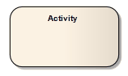
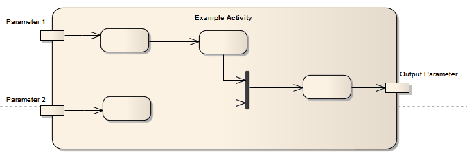

#### <a href="https://sparxsystems.com/enterprise_architect_user_guide/15.1/model_domains/activity.html" target="_blank">Activity</a> Деятельность

Description

An Activity organizes and specifies the participation of subordinate behaviors, such as sub-Activities or Actions, to reflect the control and data flow of a process. Activities are used in Activity diagrams for various modeling purposes, from procedural-type application development for system design, to business process modeling of organizational structures or workflow.

Действие организует и определяет участие подчиненных действий, таких как подчиненные действия или действия, чтобы отразить управление и поток данных процесса. Действия используются в диаграммах действий для различных целей моделирования, от разработки приложений процедурного типа для системного проектирования до моделирования бизнес-процессов организационных структур или рабочего процесса.

This simple diagram of an Activity contains Action elements and includes input parameters and output parameters.

Эта простая диаграмма Activity содержит элементы Action и включает параметры ввода и вывода.

You can define an Activity as a composite element, either during creation or during later edits. When creating a composite Activity element, it is simpler to apply the mechanism for creating Structured Activity elements, which reduces the number of steps to work through. If converting an existing Activity element, right-click on the element and select the 'New Child Diagram | Composite Structure Diagram' option.

Вы можете определить Activity как составной элемент либо во время создания, либо во время последующих изменений. При создании составного элемента Activity проще применить механизм создания элементов Structured Activity, который сокращает количество шагов для работы. При преобразовании существующего элемента Activity щелкните его правой кнопкой мыши и выберите «New Child Diagram | Составная структурная диаграмма ».

Certain properties can be graphically depicted on an Activity. The Actions in an Activity can be further organized by Activity Partitions.

Некоторые свойства могут быть графически отображены в Activity. Действия в действии могут быть дополнительно организованы по разделам действий.

An Activity can also be depicted as an Expansion Node to indicate that the Activity consists of an Expansion Region.

Действие также может быть изображено как узел расширения, чтобы указать, что действие состоит из области расширения.

If you have defined a Decision Table for the Activity element, you can select options on the element's context menu to render the element on a diagram as the Decision Table, showing the rules as either rows or columns. You can also return the element to its normal element shape.

Если вы определили таблицу решений для элемента Activity, вы можете выбрать параметры в контекстном меню элемента, чтобы отобразить элемент на диаграмме как таблицу решений, показывая правила в виде строк или столбцов. Вы также можете вернуть элемент к его нормальной форме.

Toolbox icon

Learn more
<ul>
	<li><a href="https://sparxsystems.com/enterprise_architect_user_guide/15.1/model_domains/activitynotation.html">Activity Notation</a></li>
	<li><a href="https://sparxsystems.com/enterprise_architect_user_guide/15.1/model_domains/activityparameternodes.html">Activity Parameter Nodes</a></li>
	<li><a href="https://sparxsystems.com/enterprise_architect_user_guide/15.1/model_domains/activitypartition.html">Activity Partition</a></li>
	<li><a href="https://sparxsystems.com/enterprise_architect_user_guide/15.1/model_domains/action.html">Action</a></li>
	<li><a href="https://sparxsystems.com/enterprise_architect_user_guide/15.1/model_domains/object_node.html">Object Node</a></li>
	<li><a href="https://sparxsystems.com/enterprise_architect_user_guide/15.1/model_domains/activitydiagram.html">Activity Diagram</a></li>
	<li><a href="https://sparxsystems.com/enterprise_architect_user_guide/15.1/modeling/compositeelements.html">Composite Element</a></li>
	<li><a href="https://sparxsystems.com/enterprise_architect_user_guide/15.1/model_domains/loop_and_conditional_nodes.html">Structured Activity</a></li>
	<li><a href="https://sparxsystems.com/enterprise_architect_user_guide/15.1/model_domains/actionexpansionnode.html">Expansion Node</a></li>
	<li><a href="https://sparxsystems.com/enterprise_architect_user_guide/15.1/model_domains/expansionregion.html">Expansion Region</a></li>
	<li><a href="https://sparxsystems.com/enterprise_architect_user_guide/15.1/model_domains/decision_models.html">Decision Models</a></li>
	<li><a href="https://sparxsystems.com/enterprise_architect_user_guide/15.1/modeling/elementcontextmenu2.html">Element Context Menu Operations</a></li>
</ul>

Выучить больше
* Обозначение активности
* Узлы параметров деятельности
* Раздел деятельности
* действие
* Узел объекта
* Диаграмма деятельности
* Составной элемент
* Структурированная деятельность
* Узел расширения
* Регион расширения
* Модели принятия решений
* Элемент Контекстное меню Операции

OMG UML Specification:
The OMG UML specification (UML Superstructure Specification, v2.1.1, p.318) states:

An activity specifies the coordination of executions of subordinate behaviors, using a control and data flow model. The subordinate behaviors coordinated by these models may be initiated because other behaviors in the model finish executing, because objects and data become available, or because events occur external to the flow. The flow of execution is modeled as activity nodes connected by activity edges. A node can be the execution of a subordinate behavior, such as an arithmetic computation, a call to an operation, or manipulation of object contents. Activity nodes also include flow-of-control constructs, such as synchronization, decision, and concurrency control. Activities may form invocation hierarchies invoking other activities, ultimately resolving to individual actions. In an object-oriented model, activities are usually invoked indirectly as methods bound to operations that are directly invoked.

Спецификация OMG UML:
Спецификация OMG UML (Спецификация надстройки UML, v2.1.1, стр. 318) гласит:

Действие определяет координацию выполнения подчиненных действий с использованием модели управления и потока данных. Подчиненное поведение, координируемое этими моделями, может быть инициировано, потому что другие поведения в модели завершают выполнение, потому что объекты и данные становятся доступными, или потому что события происходят вне потока. Поток выполнения моделируется как узлы активности, соединенные границами активности. Узел может быть выполнением подчиненного поведения, такого как арифметическое вычисление, вызов операции или манипулирование содержимым объекта. Узлы действий также включают конструкции потока управления, такие как синхронизация, принятие решений и управление параллелизмом. Действия могут формировать иерархии вызовов, вызывая другие действия, в конечном итоге преобразовываясь в отдельные действия. В объектно-ориентированной модели

Activities may describe procedural computation. In this context, they are the methods corresponding to operations on classes. Activities may be applied to organizational modeling for business process engineering and workflow. In this context, events often originate from inside the system, such as the finishing of a task, but also from outside the system, such as a customer call. Activities can also be used for information system modeling to specify system level processes. Activities may contain actions of various kinds:

Действия могут описывать процедурные вычисления. В этом контексте это методы, соответствующие операциям над классами. Действия могут быть применены к организационному моделированию для проектирования бизнес-процессов и рабочего процесса. В этом контексте события часто происходят внутри системы, например, завершение задачи, но также и извне системы, например, звонок клиента. Действия также можно использовать для моделирования информационных систем, чтобы определить процессы системного уровня. Действия могут содержать действия разного рода:

* Occurrences of primitive functions, such as arithmetic functions.
* Invocations of behavior, such as activities.
* Communication actions, such as sending of signals.
* Manipulations of objects, such as reading or writing attributes or associations.

* Появления примитивных функций, таких как арифметические функции.
* Призывы к поведению, например к действиям.
* Коммуникационные действия, такие как отправка сигналов.
* Манипуляции с объектами, например чтение или запись атрибутов или ассоциаций.

Actions have no further decomposition in the activity containing them. However, the execution of a single action may induce the execution of many other actions. For example, a call action invokes an operation that is implemented by an activity containing actions that execute before the call action completes.

Действия не подлежат дальнейшей декомпозиции в активности, содержащей их. Однако выполнение одного действия может вызвать выполнение многих других действий. Например, действие вызова вызывает операцию, которая реализуется действием, содержащим действия, которые выполняются до завершения действия вызова.