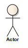

#### <a href="https://sparxsystems.com/enterprise_architect_user_guide/15.1/model_domains/actor.html" target="_blank">Actor</a> Актер

Description

An Actor is a user of the system; user can mean a human user, a machine, or even another system or subsystem in the model. Anything that interacts with the system from the outside or system boundary is termed an Actor. Actors are typically associated with Use Cases.

Актер - пользователь системы; Пользователь может означать человека-пользователя, машину или даже другую систему или подсистему в модели. Все, что взаимодействует с системой извне или с границ системы, называется Актером. Актеры обычно связаны с вариантами использования.

Actors can use the system through a graphical user interface, through a batch interface or through some other media. An Actor's interaction with a Use Case is documented in a Use Case scenario, which details the functions a system must provide to satisfy the user requirements.

Актеры могут использовать систему через графический пользовательский интерфейс, через пакетный интерфейс или через некоторые другие средства массовой информации. Взаимодействие субъекта с вариантом использования задокументировано в сценарии варианта использования, в котором подробно описаны функции, которые система должна предоставить для удовлетворения требований пользователя.

Actors also represent the role of a user in Sequence diagrams, where you can display them using rectangle notation. Enterprise Architect supports a stereotyped Actor element for business modeling. The business modeling elements also represent Actors as stereotyped Objects.

Актеры также представляют роль пользователя на диаграммах последовательности, где вы можете отображать их, используя прямоугольную нотацию. Enterprise Architect поддерживает стереотипный элемент Actor для бизнес-моделирования. Элементы бизнес-моделирования также представляют Актеров как стереотипные Объекты.

Toolbox icon

Learn more

<ul><li><a href="../model_domains/sequencediagram.html">Sequence Diagrams</a> </li><li><a href="../model_domains/business_interaction.html">Business Modeling</a> </li><li><a href="../model_domains/usecase.html">Use Case</a> </li></ul>

Выучить больше
* Диаграммы последовательности
* Бизнес-моделирование
* Пример использования

OMG UML Specification:
The OMG UML specification (UML Superstructure Specification, v2.1.1, p.584) states:

An actor models a type of role played by an entity that interacts with the subject (e.g. by exchanging signals and data), but which is external to the subject. ... Actors may represent roles played by human users, external hardware, or other subjects. Note that an actor does not necessarily represent a specific physical entity but merely a particular facet (i.e. "role") of some entity that is relevant to the specification of its associated Use Cases. Thus, a single physical instance may play the role of several different actors and, conversely, a given actor may be played by multiple different instances.

Спецификация OMG UML:
Спецификация OMG UML (Спецификация надстройки UML, v2.1.1, стр.584) гласит:

Актер моделирует тип роли, которую играет сущность, которая взаимодействует с субъектом (например, обменивается сигналами и данными), но является внешней по отношению к субъекту. ... Актеры могут представлять роли, которые играют пользователи-люди, внешнее оборудование или другие субъекты. Обратите внимание, что субъект не обязательно представляет конкретный физический объект, а просто конкретный аспект (то есть «роль») некоторого объекта, который имеет отношение к спецификации связанных с ним вариантов использования. Таким образом, один физический экземпляр может играть роль нескольких разных субъектов, и, наоборот, данный субъект может играть несколько разных экземпляров.

<ul>
					<li class="plus"><a href='action.html'>Action</a></li>
					<li class="plus"><a href='activity.html'>Activity</a></li>
					<li class="noplus"><a href='actor.html'>Actor</a></li>
					<li class="noplus"><a href='central_buffer_node.html'>Central Buffer Node</a></li>
					<li class="noplus"><a href='choice.html'>Choice</a></li>
					<li class="plus"><a href='fragment.html'>Combined Fragment</a></li>
					<li class="noplus"><a href='datastore.html'>Datastore</a></li>
					<li class="noplus"><a href='decision.html'>Decision</a></li>
					<li class="noplus"><a href='diagram_frame.html'>Diagram Frame</a></li>
					<li class="noplus"><a href='diagramgate.html'>Diagram Gate</a></li>
					<li class="noplus"><a href='endpoint.html'>Endpoint</a></li>
					<li class="noplus"><a href='entrypoints.html'>Entry Point</a></li>
					<li class="noplus"><a href='event.html'>Event</a></li>
					<li class="noplus"><a href='exception.html'>Exception</a></li>
					<li class="noplus"><a href='actionexpansionnode.html'>Expansion Node</a></li>
					<li class="noplus"><a href='expansionregion.html'>Expansion Region</a></li>
					<li class="noplus"><a href='exitpoints.html'>Exit Point</a></li>
					<li class="noplus"><a href='final.html'>Final</a></li>
					<li class="noplus"><a href='flowfinal.html'>Flow Final</a></li>
					<li class="plus"><a href='forkjoin.html'>Fork/Join</a></li>
					<li class="noplus"><a href='historystate.html'>History</a></li>
					<li class="noplus"><a href='initial.html'>Initial</a></li>
					<li class="noplus"><a href='interaction.html'>Interaction</a></li>
					<li class="noplus"><a href='interactionoccurrence.html'>Interaction Occurrence</a></li>
					<li class="noplus"><a href='interruptibleactivityregion.html'>Interruptible Activity Region</a></li>
					<li class="noplus"><a href='junction.html'>Junction</a></li>
					<li class="noplus"><a href='lifeline.html'>Lifeline</a></li>
					<li class="noplus"><a href='merge_node.html'>Merge</a></li>
					<li class="noplus"><a href='messageendpoint.html'>Message Endpoint</a></li>
					<li class="noplus"><a href='messagelabel.html'>Message Label</a></li>
					<li class="noplus"><a href='element_note.html'>Note</a></li>
					<li class="noplus"><a href='object_node.html'>Object Node</a></li>
					<li class="noplus"><a href='partition.html'>Partition</a></li>
					<li class="noplus"><a href='receive.html'>Receive</a></li>
					<li class="noplus"><a href='region.html'>Region</a></li>
					<li class="noplus"><a href='send.html'>Send</a></li>
					<li class="plus"><a href='state.html'>State</a></li>
					<li class="plus"><a href='statecontinuation.html'>State/Continuation</a></li>
					<li class="noplus"><a href='statelifeline.html'>State Lifeline</a></li>
					<li class="noplus"><a href='submachine.html'>State Machine</a></li>
					<li class="plus"><a href='loop_and_conditional_nodes.html'>Structured Activity</a></li>
					<li class="noplus"><a href='synch.html'>Synch</a></li>
					<li class="plus"><a href='systemboundary.html'>System Boundary</a></li>
					<li class="noplus"><a href='terminate.html'>Terminate</a></li>
					<li class="noplus"><a href='trigger_element.html'>Trigger</a></li>
					<li class="plus"><a href='usecase.html'>Use Case</a></li>
					<li class="noplus"><a href='valuelifeline.html'>Value Lifeline</a></li></ul>