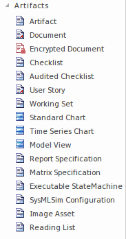
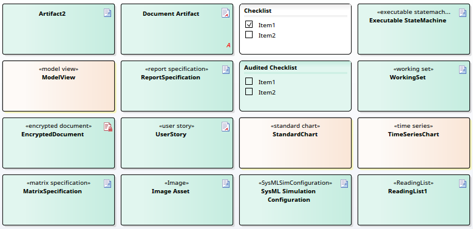

#### [Artifact](https://sparxsystems.com/enterprise_architect_user_guide/15.1/model_domains/artifact_element.html) Артефакт

An artifact is any physical piece of information used or produced by a system. In Enterprise Architect an artifact is represented by an Artifact element, which can have one of a number of stereotypes to tailor it to a specific purpose, including internal operations and structures within the model, as indicated in the examples. Artifacts can have associated properties or operations, and can be instantiated or associated with other Artifacts according to the object they represent.

Артефакт - это любая физическая информация, используемая или производимая системой. В Enterprise Architect артефакт представлен элементом Artifact, который может иметь один из ряда стереотипов, позволяющих адаптировать его к определенной цели, включая внутренние операции и структуры в модели, как указано в примерах. Артефакты могут иметь связанные свойства или операции и могут быть созданы или связаны с другими артефактами в соответствии с объектом, который они представляют.

You can create an Artifact element by dragging one of the 'Artifact' icons from the 'Artifacts' page of the Diagram Toolbox, or from one of several other Toolbox pages according to type. The 'Common' page of the Toolbox also has a generic 'Artifact' icon that - when you drag it onto a diagram - offers a choice of types of Artifact to create.

Вы можете создать элемент «Артефакт», перетащив один из значков «Артефакт» со страницы «Артефакты» панели инструментов диаграммы или с одной из нескольких других страниц панели инструментов в зависимости от типа. На странице «Общие» панели инструментов также есть общий значок «Артефакт», который - когда вы перетаскиваете его на диаграмму - предлагает выбор типов артефактов для создания.

Types of Artifact

| Type                                     | Description                              | See also                                 |
|------------------------------------------|------------------------------------------|------------------------------------------|
|  			
 				(Base) Artifact 			
 		 |  			
A Base Artifact defines the external artifacts used in a process and the internal artifacts generated in the process, such as model files, source files, database tables, development deliverables or support documents. The files represented by the Artifact are listed on the 'Files' tab of the Properties window for the element.
 			
To open the files represented by the Artifact, click on the element on the diagram and press Ctrl+E. Each file is opened either on a separate tab in the Diagram View workspace (if the file can be opened within Enterprise Architect) or in the default Windows viewer/editor for the file type (if the file cannot be opened within Enterprise Architect). 
 			
Files can also be launched individually from the 'Files' tab (opening in the Windows default editor), as for elements of any other type that have associated files. 
 		 |  			<a href="https://sparxsystems.com/enterprise_architect_user_guide/15.1/model_domains/create_artifact_for_external_f.html">Create File Artifacts</a> 			<a href="https://sparxsystems.com/enterprise_architect_user_guide/15.1/modeling/associatedfiles.html">Associated Files</a> 			<a href="https://sparxsystems.com/enterprise_architect_user_guide/15.1/visual_execution_analysis/save_and_load_reports.html">Generate, Save and Load Profile Reports</a> 		 |
|  			
 				Document Artifact 			
 		 |  			
A Document Artifact is an Artifact having a stereotype of «document». You create the Document Artifact using the Artifacts, Component, Documentation or Deployment pages of the Diagram Toolbox, and associate it with an RTF document or CSV file.
 			
Double-click on the element to display the Linked Document Editor. When you have created the Linked Document, the Document Artifact element on the diagram shows an 'A' symbol in the bottom right corner.
 			

 		 |  			<a href="https://sparxsystems.com/enterprise_architect_user_guide/15.1/modeling/linking_documentation.html">Linked Documents</a> 			<a href="https://sparxsystems.com/enterprise_architect_user_guide/15.1/modeling/add_quick_linker_definition_to.html">Add Quick Linker Definition To Profile</a> 		 |
|  			
 				Checklist Artifact 			
 		 |  			
A Checklist Artifact provides the facility for generating a list of items, each with a checkbox, to be used as a checklist. You can set each checkbox to default to being selected or unselected, and set all selected options to be grayed out or struck through, so that the unselected options are more prominent. The end users can then work with the element to tick off items that have been obtained or activities that have been completed.
 			
A version of this Artifact - the Requirements Checklist - is available in the 'Extended Requirements' Toolbox page. This automatically contains ten characteristics of a good Requirement, for a Requirement author to tick off as they check that their Requirement has been set up to show those characteristics.
 			
 
 		 |  			<a href="https://sparxsystems.com/enterprise_architect_user_guide/15.1/model_domains/checklart.html">Using the Checklist and Audited Checklist Artifacts</a> 		 |
|  			
 				Audited Checklist Artifact 			
 		 |  			
This Artifact is identical to the Checklist Artifact, except that it has an associated 'Audit Log' page that identifies any changes made to the checklist, when those changes were made, who made them and what the changes were. This is a very useful Project Management tool, adding tracking and accountability to the use of checklists.
 		 |  			<a href="https://sparxsystems.com/enterprise_architect_user_guide/15.1/model_domains/checklart.html">Using the Checklist and Audited Checklist Artifacts</a> 		 |
|  			
 				Encrypted Document Artifact 			
 		 |  			
An Encrypted Document Artifact is used to create and hold a Linked Document that is automatically encrypted, and that cannot be opened and automatically decrypted within Enterprise Architect without entering a password. You can therefore use the generated Artifact element to record sensitive information, which you protect from general access by assigning a password.
 			
When you drag the 'Encrypted Document' icon onto the diagram from the 'Artifacts' page of the Toolbox, a prompt displays to type in a password. When you enter this password, you can create the Linked Document. Thereafter, when any user attempts to open the document, the same password prompt displays. If the user does not provide the password that you originally specified, the document will not open, whilst if the correct password is provided the document is decrypted and opened, and the text can be viewed and edited. 
 			
You cannot change the password, nor can you delete the Linked Document from the Artifact (although you can delete the artifact itself).
 			
Other facilities that display 'normal' Linked Documents - such as the Document window or report generator - will ignore an encrypted document.
 			
The Encrypted Document is indicated in the Toolbox page, diagram and Browser window by a red 'document' icon - .
 		 |  			<a href="https://sparxsystems.com/enterprise_architect_user_guide/15.1/modeling/linking_documentation.html">Linked Documents</a> 		 |
|  			
 				User Story 			
 		 |  			
A User Story Artifact provides a means of documenting a business Use Case in the context of Agile methodologies such as Extreme Programming (XP). In the Linked Document, you define the functions a business system must provide; it captures the 'who', 'what' and 'why' of a requirement in a simple, concise format. The User Story Artifact behaves as a Document Artifact, prompting you to select a Linked Document template to base the document on.
 		 |  		                                   |
|  			
 				Working Set Artifact 			
 		 |  			
A Working Set Artifact defines a Working Set that opens various windows, diagrams and views, recreating a work environment that you frequently use. 
 <ul> 	<li>To create or modify the Working Set, right-click on the element and select the 'Edit Working Set' option</li> 	<li>To execute the Working Set to open the defined windows and views and execute any commands, double-click on the element</li> </ul> 		 |  			<a href="https://sparxsystems.com/enterprise_architect_user_guide/15.1/user_interface/working_sets.html">Working Sets</a> 		 |
|  			
 				Custom Table Artifact 			
 		 |  			
A Custom Table Artifact generates a diagram object that displays custom data in a grid format similar to a spreadsheet, providing extra 'non-modeled' information on elements, diagrams or project management exactly where it is applicable. 
 		 |  		                                   |
|  			
 				Standard Chart 			
 		 |  			
A Standard Chart Artifact provides the facilities for generating a Pie Chart or Bar Chart on an aspect of the data in your model. It adds three 'Chart Details' tabs to the standard tabs of the element 'Properties' dialog. 
 			
After you have added the element to your diagram, double-click on it. The element 'Properties' dialog automatically opens at the 'Chart Details - Source' tab. Define the chart type and data source, then go on to define any filters you want to apply, and how the chart should display. 
 			
Once you have defined the chart, it automatically displays with the latest information whenever you open the parent diagram. 
 		 |  			<a href="https://sparxsystems.com/enterprise_architect_user_guide/15.1/model_publishing/chart_data.html">Standard Chart Data</a> 			<a href="https://sparxsystems.com/enterprise_architect_user_guide/15.1/model_publishing/chart_appearance.html">Chart Appearance</a> 		 |
|  			
 				Time Series Chart 			
 		 |  			
A Time Series Chart Artifact provides the facilities for generating a linear graph of a model property over time. 
 			
After you have added the element to your diagram, double-click on it. The element 'Properties' dialog automatically opens at the 'Chart Details - Source' tab. Define the Package from which the data is to be extracted, and the time interval over which the data is to be sampled. Then go on to define the appearance of the chart. 
 			
Once you have defined the chart, it automatically displays with the latest information whenever you open the parent diagram. 
 		 |  			<a href="https://sparxsystems.com/enterprise_architect_user_guide/15.1/model_publishing/define_a_time_series_chart.html">Define a Time Series Chart</a> 		 |
|  			
 				Model View 			
 		 |  			
A Model View Artifact provides the facilities for generating a tabular Model View Chart on a segment of the data in your model, extracted using a custom SQL search. 
 			
After you have added the element to your diagram, double-click on it. The element 'Properties' dialog automatically opens at the 'Chart Details - Source' tab. Define the SQL Search to extract and tabulate the information. 
 			
Once you have defined the chart, it automatically displays with the latest information whenever you open the parent diagram. 
 		 |  			<a href="https://sparxsystems.com/enterprise_architect_user_guide/15.1/model_publishing/define_a_model_view_chart.html">Define a Model View Chart</a> 		 |
|  			
 				Report Specification 			
 		 |  			
A Report Specification Artifact encapsulates a report definition. When you have created the element on the diagram, you double-click on it to display the 'Generate Documentation' dialog, on which you enter the report parameters and generate the report.
 			
After you create the Report Specification, each time you double-click on the Artifact element the 'Generate Documentation' dialog again displays with the same report parameters. You can continue to generate the same report, or alter the parameters if necessary. If you change the parameters, they are re-presented until such time as you change them again, 
 		 |  			<a href="https://sparxsystems.com/enterprise_architect_user_guide/15.1/model_publishing/rtfdialogoptions.html">Generate Documentation</a> 		 |
|  			
 				Matrix Specification 			
 		 |  			
A Matrix Specification Artifact encapsulates a Relationship Matrix Profile definition. When you have created the element on the diagram, you double-click on it to display the 'Matrix Specification' dialog, in which you create the Profile definition. The Profile takes the name of the element. The profile defined in the Artifact is independent of the Package that contains the Artifact element, and therefore could specify source and target Packages other than parent Package. 
 			
After you create the Profile definition, each time you double-click on the Artifact element the Relationship Matrix displays with the Profile applied. 
 			
To edit the Profile, right-click on the Artifact and select the 'Documentation > Edit Matrix Profile' option. 
 		 |  			<a href="https://sparxsystems.com/enterprise_architect_user_guide/15.1/modeling/specification_matrix_profile.html">Create Matrix Profile</a> 		 |
|  			
 				Executable StateMachine 			
 		 |  			
An Executable StateMachine Artifact is the vehicle through which you can generate, build (compile) and execute - via simulation - code for a StateMachine or complex of StateMachines. 
 			
Each StateMachine is the child of a Class element; when you drag the Class from the Browser window onto the Artifact element, it is pasted inside the Artifact as a Part. You can paste several Classes - and, therefore, Parts - into a single Artifact. 
 			
Having set up the Executable StateMachine Artifact, you use simple context menu options on the Artifact to perform the code generation, build and execution operations on all StateMachines bound within the Artifact. 
 		 |  			<a href="https://sparxsystems.com/enterprise_architect_user_guide/15.1/model_domains/code_state_machine.html">Code Generation - StateMachines</a> 		 |
|  			
 				Business Process Simulation 			
 		 |  			
The Business Process Simulation Artifact appears in the 'Artifacts' page of the Toolbox when the BPSim Simulation Engine has been installed and registered on your system. You use the Artifact as a container for - and an access point to - a Business Process Simulation Configuration, which defines what business process model to simulate and what parameters to apply during the simulation. 
 			
When you drag the Artifact onto a diagram, a prompt displays from which you can select to create the BPSim Configuration from the perspective of Control, Resource, Temporal (Time), or all three. Select the appropriate option; the Configure BPSim window displays. 
 		 |  			<a href="https://sparxsystems.com/enterprise_architect_user_guide/15.1/model_simulation/bpsim_configuration.html">BPSim Configuration</a> 		 |
|  			
 				BPSim Result Chart 			
 		 |  			
The BPSim Result Chart and BPSim Custom Result Chart Artifacts appear in the 'Artifacts' page of the Toolbox when the BPSim Simulation Engine has been installed and registered on your system. These Artifacts generate charts that reflect selected results from BPSim simulations:
 <ul> 	<li>BPSim Result Chart - generates a Chart that reflects selected results from a series of standard BPSim simulations</li> 	<li>BPSim Custom Result Chart - generates a Chart that reflects results from a series of customized BPSim simulations</li> </ul> 			
As for other Chart Artifacts, both BPSim Chart types can be quickly configured to display the simulation results in variations of a line chart, two-dimensional bar chart or 3-dimensional bar chart. The results that both Artifacts operate on are captured in Results Artifacts that are automatically generated during a Business Process Simulation.
 		 |  			<a href="https://sparxsystems.com/enterprise_architect_user_guide/15.1/model_simulation/bpsim_charts.html">BPSim Charts</a> 		 |
|  			
 				SysMLSim Configuration 			
 		 |  			
This Artifact provides access to the Configure SysML Simulation Window, and contains a specific SysML simulation configuration. To access the Configure SysML Simulation Window, double-click on the Artifact or right-click and select the 'Show SysML Configuration' option.
 		 |  			<a href="https://sparxsystems.com/enterprise_architect_user_guide/15.1/model_simulation/sysml_sim_window.html">Configure SysML Simulation Window</a> 		 |
|  			
 				Image Asset 			
 		 |  			
Image Assets are model elements that are used to store images in the model. You can create them by dragging the 'Image Asset' icon onto a diagram and choosing an image file, or by dragging an image file from your file system straight onto a diagram. Enterprise Architect creates an Image Asset Artifact, then stores the image from the file in the Artifact as the 'owned image'. The element can display on the diagram either as the image or as a rectangular element; to toggle between them, right-click on the object and click on the 'Show Owned Image' option.
 			
When the Artifact is displaying as an image, you can double-click on it to display the element 'Properties' dialog. If the Artifact is displaying in element format, double-clicking on it will open the image in the default external viewer for images.
 			
An Image Asset image can be used in model documentation in the same way as for an image from the Image Manager, by inserting a hyperlink to the Image Asset element. As you create the hyperlink, you are prompted to select the type of object to link to; click on 'Element Image' and select the appropriate Image Asset element from the list. If you Ctrl+click on the hyperlink, the image is displayed in the default external viewer for images. When a report is generated, the hyperlinked Image Asset element is rendered using its 'owned image'.
 		 |  			<a href="https://sparxsystems.com/enterprise_architect_user_guide/15.1/modeling/image_assets.html">Image Assets</a> 		 |
|  			
 				Reading List 			
 		 |  			
The Reading List Artifact provides a list of elements that contain information of particular significance to a task or process. The intention is for the information from each element to be displayed in the Document window, in the sequence in which the elements are organized in the Reading List. The Document window provides 'Next' and 'Previous' options to move through the elements.
 		 |  			<a href="https://sparxsystems.com/enterprise_architect_user_guide/15.1/model_domains/readinglists.html">Using the Reading List Artifact</a> 		 |

| Тип                                      | Описание                                 | Смотрите также                           |
|------------------------------------------|------------------------------------------|------------------------------------------|
|  			
 				(База) Артефакт 			
 		 |  			
Базовый артефакт определяет внешние артефакты, используемые в процессе, и внутренние артефакты, генерируемые в процессе, такие как файлы моделей, исходные файлы, таблицы базы данных, результаты разработки или вспомогательные документы. Файлы, представленные Артефактом, перечислены на вкладке «Файлы» в окне свойств для элемента.
 			
Для того, чтобы открыть файлы , представленные артефакта, нажмите на элемент на диаграмме и нажмите Ctrl + E . Каждый файл открывается либо на отдельной вкладке в рабочей области представления диаграммы (если файл можно открыть в Enterprise Architect), либо в программе просмотра / редакторе Windows по умолчанию для данного типа файла (если файл не может быть открыт в Enterprise Architect).
 			
Файлы также можно запускать индивидуально из вкладки «Файлы» (открывается в редакторе Windows по умолчанию), как и для элементов любого другого типа, с которыми связаны файлы. 
 		 |  			<a href="https://sparxsystems.com/enterprise_architect_user_guide/15.1/model_domains/create_artifact_for_external_f.html">Создать файловые артефакты</a> 			<a href="https://sparxsystems.com/enterprise_architect_user_guide/15.1/modeling/associatedfiles.html">Связанные файлы</a> 			<a href="https://sparxsystems.com/enterprise_architect_user_guide/15.1/visual_execution_analysis/save_and_load_reports.html">Создание, сохранение и загрузка отчетов профиля</a> 		 |
|  			
 				Документ Артефакт 			
 		 |  			
Артефакт документа - это Артефакт, имеющий стереотип «документ». Вы создаете артефакт документа, используя страницы «Артефакты», «Компонент», «Документация» или «Развертывание» панели инструментов диаграммы , и связываете его с документом RTF или файлом CSV.
 			
Дважды щелкните элемент, чтобы открыть редактор связанных документов. После создания связанного документа в элементе «Артефакт документа» на диаграмме отображается символ «A» в правом нижнем углу.
 			

 		 |  			<a href="https://sparxsystems.com/enterprise_architect_user_guide/15.1/modeling/linking_documentation.html">Связанные документы</a> 			<a href="https://sparxsystems.com/enterprise_architect_user_guide/15.1/modeling/add_quick_linker_definition_to.html">Добавить определение быстрого компоновщика в профиль</a> 		 |
|  			
 				Контрольный список Артефакт 			
 		 |  			
Артефакт контрольного списка предоставляет возможность создания списка элементов, каждый с флажком, который будет использоваться в качестве контрольного списка. Вы можете установить каждый флажок по умолчанию, чтобы он был выбран или не выбран, и установить все выбранные параметры, чтобы они были затенены или зачеркнуты, чтобы невыбранные параметры были более заметными. Затем конечные пользователи могут работать с элементом, отмечая полученные элементы или завершенные действия.
 			
Версия этого артефакта - Контрольный список требований - доступна на странице инструментов «Расширенные требования». Он автоматически содержит десять характеристик хорошего требования, которые автор требования должен отметить, когда он проверяет, настроено ли его требование для отображения этих характеристик.
 			
 
 		 |  			<a href="https://sparxsystems.com/enterprise_architect_user_guide/15.1/model_domains/checklart.html">Использование контрольного списка и проверенных артефактов контрольного списка</a> 		 |
|  			
 				Артефакт проверенного контрольного списка 			
 		 |  			
Этот артефакт идентичен артефакту контрольного списка, за исключением того, что у него есть связанная страница «Журнал аудита», на которой указаны любые изменения, внесенные в контрольный список, когда эти изменения были внесены, кто их сделал и каковы были изменения. Это очень полезный инструмент управления проектами, добавляющий отслеживание и подотчетность при использовании контрольных списков.
 		 |  			<a href="https://sparxsystems.com/enterprise_architect_user_guide/15.1/model_domains/checklart.html">Использование контрольного списка и проверенных артефактов контрольного списка</a> 		 |
|  			
 				Артефакт зашифрованного документа 			
 		 |  			
Артефакт зашифрованного документа используется для создания и хранения связанного документа, который автоматически зашифровывается и не может быть открыт и автоматически расшифрован в Enterprise Architect без ввода пароля. Таким образом, вы можете использовать сгенерированный элемент Artifact для записи конфиденциальной информации, которую вы защищаете от общего доступа, назначая пароль.
 			
Когда вы перетаскиваете значок «Зашифрованный документ» на диаграмму со страницы «Артефакты» панели инструментов, отображается запрос для ввода пароля. Когда вы вводите этот пароль, вы можете создать связанный документ. После этого, когда любой пользователь попытается открыть документ, отобразится тот же запрос пароля. Если пользователь не предоставит пароль, который вы изначально указали, документ не откроется, в то время как при вводе правильного пароля документ будет расшифрован и открыт, а текст можно будет просматривать и редактировать.
 			
Вы не можете изменить пароль или удалить связанный документ из артефакта (хотя вы можете удалить сам артефакт).
 			
Другие средства, отображающие «обычные» связанные документы, такие как окно документа или генератор отчетов, будут игнорировать зашифрованный документ.
 			
Зашифрованный документ обозначается на странице Toolbox, диаграмме и в окне браузера красным значком «документ» - .
 		 |  			<a href="https://sparxsystems.com/enterprise_architect_user_guide/15.1/modeling/linking_documentation.html">Связанные документы</a> 		 |
|  			
 				История пользователя 			
 		 |  			
Артефакт пользовательской истории предоставляет средства документирования бизнес-сценария использования в контексте гибких методологий, таких как экстремальное программирование (XP). В связанном документе вы определяете функции, которые должна обеспечивать бизнес-система; он фиксирует «кто», «что» и «почему» требования в простом и лаконичном формате. Артефакт пользовательской истории ведет себя как артефакт документа, предлагая вам выбрать шаблон связанного документа, на котором будет основан документ.
 		 |  		                                   |
|  			
 				Артефакт рабочего набора 			
 		 |  			
Артефакт рабочего набора определяет рабочий набор, который открывает различные окна, диаграммы и представления, воссоздавая рабочую среду, которую вы часто используете. 
 <ul> 	<li>Чтобы создать или изменить рабочий набор, щелкните элемент правой кнопкой мыши и выберите опцию «Редактировать рабочий набор».</li> 	<li>Чтобы выполнить рабочий набор для открытия определенных окон и представлений и выполнения любых команд, дважды щелкните элемент</li> </ul> 		 |  			<a href="https://sparxsystems.com/enterprise_architect_user_guide/15.1/user_interface/working_sets.html">Рабочие наборы</a> 		 |
|  			
 				Артефакт настраиваемой таблицы 			
 		 |  			
Артефакт настраиваемой таблицы создает объект диаграммы, который отображает настраиваемые данные в формате сетки, аналогичном электронной таблице, предоставляя дополнительную «немоделированную» информацию об элементах, диаграммах или управлении проектами именно там, где это применимо. 
 		 |  		                                   |
|  			
 				Стандартный график 			
 		 |  			
Артефакт стандартной диаграммы предоставляет средства для создания круговой диаграммы или гистограммы по аспекту данных в вашей модели. Он добавляет три вкладки «Детали диаграммы» к стандартным вкладкам диалогового окна «Свойства» элемента.
 			
После того, как вы добавили элемент на диаграмму, дважды щелкните по нему. На вкладке «Детали диаграммы - Источник» автоматически открывается диалоговое окно «Свойства» элемента. Определите тип диаграммы и источник данных, затем перейдите к определению любых фильтров, которые вы хотите применить, и того, как должна отображаться диаграмма.
 			
После того, как вы определили диаграмму, она автоматически отображает самую последнюю информацию всякий раз, когда вы открываете родительскую диаграмму. 
 		 |  			<a href="https://sparxsystems.com/enterprise_architect_user_guide/15.1/model_publishing/chart_data.html">Стандартные данные диаграммы</a> 			<a href="https://sparxsystems.com/enterprise_architect_user_guide/15.1/model_publishing/chart_appearance.html">Внешний вид диаграммы</a> 		 |
|  			
 				График временных рядов 			
 		 |  			
Артефакт диаграммы временных рядов предоставляет средства для создания линейного графика свойства модели во времени. 
 			
После того, как вы добавили элемент на диаграмму, дважды щелкните по нему. На вкладке «Детали диаграммы - Источник» автоматически открывается диалоговое окно «Свойства» элемента. Определите Пакет, из которого должны быть извлечены данные, и временной интервал, в течение которого данные должны быть взяты. Затем перейдите к определению внешнего вида диаграммы.
 			
После того, как вы определили диаграмму, она автоматически отображает самую последнюю информацию всякий раз, когда вы открываете родительскую диаграмму. 
 		 |  			<a href="https://sparxsystems.com/enterprise_architect_user_guide/15.1/model_publishing/define_a_time_series_chart.html">Определите диаграмму временных рядов</a> 		 |
|  			
 				Просмотр модели 			
 		 |  			
Model View Artifact предоставляет средства для создания табличного Model View Chart на сегменте данных в вашей модели, извлеченном с помощью поиска пользовательской SQL.
 			
После того, как вы добавили элемент на диаграмму, дважды щелкните по нему. На вкладке «Детали диаграммы - Источник» автоматически открывается диалоговое окно «Свойства» элемента. Определите поиск SQL для извлечения и табулирования информации.
 			
После того, как вы определили диаграмму, она автоматически отображает самую последнюю информацию всякий раз, когда вы открываете родительскую диаграмму. 
 		 |  			<a href="https://sparxsystems.com/enterprise_architect_user_guide/15.1/model_publishing/define_a_model_view_chart.html">Определите диаграмму вида модели</a> 		 |
|  			
 				Спецификация отчета 			
 		 |  			
Артефакт спецификации отчета инкапсулирует определение отчета. Когда вы создали элемент на диаграмме, вы дважды щелкните по нему, чтобы открыть диалоговое окно «Создать документацию», в котором вы вводите параметры отчета и генерируете отчет.
 			
После создания спецификации отчета каждый раз, когда вы дважды щелкаете элемент «Артефакт», диалоговое окно «Создать документацию» снова отображается с теми же параметрами отчета. Вы можете продолжить создание того же отчета или при необходимости изменить параметры. Если вы измените параметры, они будут повторно представлены до тех пор, пока вы не измените их снова,
 		 |  			<a href="https://sparxsystems.com/enterprise_architect_user_guide/15.1/model_publishing/rtfdialogoptions.html">Создать документацию</a> 		 |
|  			
 				Спецификация матрицы 			
 		 |  			
Артефакт спецификации матрицы инкапсулирует определение профиля матрицы отношений . Когда вы создали элемент на схеме, вы дважды щелкаете по нему, чтобы отобразить диалоговое окно «Спецификация матрицы», в котором вы создаете определение профиля. Профиль принимает имя элемента. Профиль, определенный в Артефакте, не зависит от Пакета, который содержит элемент Артефакт, и поэтому может указывать исходный и целевой Пакеты, отличные от родительского Пакета.
 			
После создания определения профиля каждый раз, когда вы дважды щелкаете элемент Artifact, отображается матрица отношений с примененным профилем. 
 			
Чтобы отредактировать Профиль, щелкните Артефакт правой кнопкой мыши и выберите «Документация > Редактировать профиль матрицы ».
 		 |  			<a href="https://sparxsystems.com/enterprise_architect_user_guide/15.1/modeling/specification_matrix_profile.html">Создать матричный профиль</a> 		 |
|  			
 				Исполняемый StateMachine 			
 		 |  			
Исполняемый артефакт StateMachine - это средство, с помощью которого вы можете генерировать, строить (компилировать) и выполнять - посредством моделирования - код для StateMachine или комплекса StateMachines. 
 			
Каждый StateMachine является потомком элемента Class; когда вы перетаскиваете класс из окна браузера на элемент артефакта, он вставляется внутри артефакта как часть. Вы можете вставить несколько классов и, следовательно, частей в один артефакт.
 			
Настроив исполняемый объект StateMachine, вы используете простые параметры контекстного меню на артефакте для выполнения операций генерации кода, построения и выполнения на всех StateMachine, связанных внутри артефакта. 
 		 |  			<a href="https://sparxsystems.com/enterprise_architect_user_guide/15.1/model_domains/code_state_machine.html">Генерация кода - StateMachines</a> 		 |
|  			
 				Моделирование бизнес-процессов 			
 		 |  			
Артефакт моделирования бизнес-процессов появляется на странице «Артефакты» панели инструментов, когда в вашей системе установлен и зарегистрирован механизм моделирования BPSim. Вы используете Артефакт в качестве контейнера и точки доступа для конфигурации моделирования бизнес-процессов, которая определяет, какую модель бизнес-процесса моделировать и какие параметры применять во время моделирования.
 			
Когда вы перетаскиваете артефакт на диаграмму, отображается подсказка, в которой вы можете выбрать создание конфигурации BPSim с точки зрения управления, ресурса, времени (времени) или всех трех. Выберите подходящий вариант; в окне Настройка BPSim дисплеев.
 		 |  			<a href="https://sparxsystems.com/enterprise_architect_user_guide/15.1/model_simulation/bpsim_configuration.html">Конфигурация BPSim</a> 		 |
|  			
 				Таблица результатов BPSim 			
 		 |  			
Диаграмма результатов BPSim и настраиваемая диаграмма результатов BPSim Артефакты появляются на странице «Артефакты» панели инструментов, когда BPSim Simulation Engine установлен и зарегистрирован в вашей системе. Эти артефакты создают диаграммы, отражающие выбранные результаты моделирования BPSim:
 <ul> 	<li>Диаграмма результатов BPSim - генерирует диаграмму, которая отражает выбранные результаты из серии стандартных симуляций BPSim.</li> 	<li>Диаграмма пользовательских результатов BPSim - генерирует диаграмму, отражающую результаты серии настроенных имитаций BPSim.</li> </ul> 			
Что касается других артефактов диаграмм, оба типа диаграмм BPSim можно быстро настроить для отображения результатов моделирования в виде линейной диаграммы, двухмерной гистограммы или 3-мерной гистограммы. Результаты, с которыми работают оба артефакта, фиксируются в артефактах результатов, которые автоматически создаются во время моделирования бизнес-процесса.
 		 |  			<a href="https://sparxsystems.com/enterprise_architect_user_guide/15.1/model_simulation/bpsim_charts.html">Графики BPSim</a> 		 |
|  			
 				Конфигурация SysMLSim 			
 		 |  			
Этот артефакт обеспечивает доступ к окну настройки моделирования SysML и содержит конкретную конфигурацию моделирования SysML. Чтобы получить доступ к окну Configure SysML Simulation, дважды щелкните артефакт или щелкните правой кнопкой мыши и выберите параметр «Показать конфигурацию SysML».
 		 |  			<a href="https://sparxsystems.com/enterprise_architect_user_guide/15.1/model_simulation/sysml_sim_window.html">Окно настройки моделирования SysML</a> 		 |
|  			
 				Изображение 			
 		 |  			
Активы изображений - это элементы модели, которые используются для хранения изображений в модели. Вы можете создать их, перетащив значок «Image Asset» на диаграмму и выбрав файл изображения, или перетащив файл изображения из файловой системы прямо на диаграмму. Enterprise Architect создает артефакт объекта изображения, а затем сохраняет изображение из файла в артефакте как «собственное изображение». Элемент может отображаться на диаграмме как изображение или как прямоугольный элемент; чтобы переключаться между ними, щелкните объект правой кнопкой мыши и выберите параметр «Показать собственное изображение».
 			
Когда Артефакт отображается как изображение, вы можете дважды щелкнуть по нему, чтобы отобразить диалоговое окно «Свойства» элемента. Если артефакт отображается в формате элемента, двойной щелчок по нему откроет изображение во внешнем средстве просмотра изображений по умолчанию.
 			
Изображение Image Asset можно использовать в документации модели так же, как и изображение из Image Manager , путем вставки гиперссылки на элемент Image Asset. При создании гиперссылки вам будет предложено выбрать тип объекта для ссылки; щелкните «Изображение элемента» и выберите соответствующий элемент ресурса изображения из списка. Если вы удерживаете Ctrl + щелчок по гиперссылке, изображение отображается во внешнем средстве просмотра изображений по умолчанию. Когда создается отчет, элемент Image Asset с гиперссылкой отображается с использованием его «собственного изображения».
 		 |  			<a href="https://sparxsystems.com/enterprise_architect_user_guide/15.1/modeling/image_assets.html">Изображения</a> 		 |
|  			
 				Список для чтения 			
 		 |  			
Артефакт списка чтения предоставляет список элементов, содержащих информацию, имеющую особое значение для задачи или процесса. Намерение состоит в том, чтобы информация из каждого элемента отображалась в окне документа в последовательности, в которой элементы организованы в списке для чтения. В окне документа есть опции «Далее» и «Назад» для перемещения по элементам.
 		 |  			<a href="https://sparxsystems.com/enterprise_architect_user_guide/15.1/model_domains/readinglists.html">Использование артефакта списка чтения</a> 		 |

Learn more
* [Deployment Diagram](https://sparxsystems.com/enterprise_architect_user_guide/15.1/model_domains/deploymentdiagram.html)

<ul>
					<li class="noplus"><a href='https://sparxsystems.com/enterprise_architect_user_guide/15.1/model_domains/create_artifact_for_external_f.html'>Create File Artifacts</a></li>
					<li class="noplus"><a href='https://sparxsystems.com/enterprise_architect_user_guide/15.1/model_domains/checklart.html'>Using the Checklist and Audited Checklist Artifacts</a></li>
					<li class="noplus"><a href='https://sparxsystems.com/enterprise_architect_user_guide/15.1/model_domains/readinglists.html'>Using the Reading List Artifact</a></li>
					<li class="noplus"><a href='https://sparxsystems.com/enterprise_architect_user_guide/15.1/model_domains/document_artifact.html'>Document Artifact</a></li>
					<li class="noplus"><a href='https://sparxsystems.com/enterprise_architect_user_guide/15.1/model_domains/custom_table_artifact.html'>Custom Table Artifact</a></li></ul>