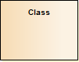
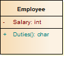

#### <a href="https://sparxsystems.com/enterprise_architect_user_guide/15.1/model_domains/class.html" target="_blank">Class</a> Класс

Description

A Class is a representation of a type of object that reflects the structure and behavior of such objects within the system. It is a template from which actual running instances are created, although a Class can be defined either to control its own execution or as a template or parameterized Class that specifies parameters that must be defined by any binding Class.

Класс - это представление типа объекта, которое отражает структуру и поведение таких объектов в системе. Это шаблон, из которого создаются фактические запущенные экземпляры, хотя класс может быть определен либо для управления его собственным выполнением, либо как шаблон или параметризованный класс, который определяет параметры, которые должны быть определены любым классом привязки.

A Class can have attributes (data) and methods (operations or behavior). Classes can inherit characteristics from parent Classes and delegate behavior to other Classes. Class models usually describe the logical structure of the system and are the building blocks from which components are built.

Класс может иметь атрибуты (данные) и методы (операции или поведение). Классы могут наследовать характеристики от родительских классов и делегировать поведение другим классам. Модели классов обычно описывают логическую структуру системы и являются строительными блоками, из которых строятся компоненты.

The top section of a Class shows the attributes (or data elements) associated with the Class. These hold the 'state' of an object at run-time. If the information is saved to a data store and can be reloaded, it is termed 'persistent'. The lower section contains the Class operations (or methods at run-time). Operations describe the behavior a Class offers to other Classes, and the internal behavior it has (private methods).

В верхней части класса показаны атрибуты (или элементы данных), связанные с классом. Они хранят «состояние» объекта во время выполнения. Если информация сохраняется в хранилище данных и может быть перезагружена, она называется «постоянной». Нижний раздел содержит операции класса (или методы во время выполнения). Операции описывают поведение, которое класс предлагает другим классам, и его внутреннее поведение (частные методы).

Class elements are generally used in Class diagrams and Composite Structure diagrams.

Элементы класса обычно используются в диаграммах классов и диаграммах составной структуры .

Enterprise Architect also supports a number of stereotyped Class elements to represent various entities in web-page modeling. A Class can also be integrated with an Associate connector to form an Association Class, to allow the Associate connector to have operations and attributes that define certain types of UML relationship.

Enterprise Architect также поддерживает ряд стереотипных элементов Class для представления различных сущностей при моделировании веб-страниц. Класс также можно интегрировать с соединителем Associate, чтобы сформировать класс ассоциации, чтобы позволить соединителю Associate иметь операции и атрибуты, которые определяют определенные типы отношений UML.

Toolbox icon

<ul>
	<li><a href="../model_domains/activeclasses.html">Active Classes</a></li>
	<li><a href="../model_domains/parameterisedclassestemplate.html">Parameterized Classes (Templates)</a></li>
	<li><a href="../model_domains/classdiagram.html">Class Diagrams</a></li>
	<li><a href="../model_domains/compositestructurediagram.html">Composite Structure Diagram</a></li>
	<li><a href="../model_domains/associationclass.html">Association Class</a></li>
	<li><a href="../model_domains/associate.html">Association</a></li>
	<li><a href="../modeling/attributes.html">Attributes</a></li>
	<li><a href="../modeling/operations.html">Operations</a></li>
	<li><a href="../model_domains/webstereotypes.html">Web-page Modeling</a></li>
</ul>

Выучить больше
* Активные классы
* Параметризованные классы (шаблоны)
* Диаграммы классов
* Схема составной структуры
* Класс ассоциации
* ассоциация
* Атрибуты
* операции

OMG UML Specification:
The OMG UML specification (UML Superstructure Specification, v2.1.1, pp.52-53) states:

'The purpose of a class is to specify a classification of objects and to specify the features that characterize the structure and behavior of those objects.

Спецификация OMG UML:
Спецификация OMG UML (Спецификация надстройки UML, версия 2.1.1, стр. 52-53) гласит:

«Цель класса - указать классификацию объектов и указать особенности, которые характеризуют структуру и поведение этих объектов.

Objects of a class must contain values for each attribute that is a member of that class, in accordance with the characteristics of the attribute, for example its type and multiplicity.

Объекты класса должны содержать значения для каждого атрибута, который является членом этого класса, в соответствии с характеристиками атрибута, например его типом и множественностью.

When an object is instantiated in a class, for every attribute of the class that has a specified default, if an initial value of the attribute is not specified explicitly for the instantiation, then the default value specification is evaluated to set the initial value of the attribute for the object.

Когда объект создается в классе, для каждого атрибута класса, который имеет заданное значение по умолчанию, если начальное значение атрибута не указано явно для создания экземпляра, то спецификация значения по умолчанию оценивается для установки начального значения атрибут объекта.

Operations of a class can be invoked on an object, given a particular set of substitutions for the parameters of the operation. An operation invocation may cause changes to the values of the attributes of that object. It may also return a value as a result, where a result type for the operation has been defined. Operation invocations may also cause changes in value to the attributes of other objects that can be navigated to, directly or indirectly, from the object on which the operation is invoked, to its output parameters, to objects navigable from its parameters, or to other objects in the scope of the operation's execution. Operation invocations may also cause the creation and deletion of objects.'

Операции класса могут быть вызваны с объектом, если задан конкретный набор замен для параметров операции. Вызов операции может вызвать изменения значений атрибутов этого объекта. Он также может возвращать значение в качестве результата, в котором был определен тип результата для операции. Вызовы операций могут также вызывать изменения значений атрибутов других объектов, к которым можно перейти, прямо или косвенно, от объекта, для которого вызывается операция, до его выходных параметров, к объектам, по которым можно перемещаться из его параметров, или к другим объектам. в объеме выполнения операции. Вызов операций также может вызывать создание и удаление объектов. '

