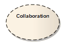

#### <a href="https://sparxsystems.com/enterprise_architect_user_guide/15.1/model_domains/collaboration2.html" target="_blank">Collaboration</a> сотрудничество

Description

A Collaboration defines a set of cooperating roles and their connectors. These are used to collectively illustrate a specific functionality, in a Composite Structure diagram. A Collaboration should specify only the roles and attributes required to accomplish a specific task or function. Although in practice a behavior and its roles could involve many tangential attributes and properties, isolating the primary roles and their requisites simplifies and clarifies the behavior, as well as providing for reuse. A Collaboration often implements a Pattern to apply to various situations

Сотрудничество определяет набор взаимодействующих ролей и их соединителей. Они используются для общей иллюстрации определенной функциональности на диаграмме составной структуры . Сотрудничество должно определять только роли и атрибуты, необходимые для выполнения конкретной задачи или функции. Хотя на практике поведение и его роли могут включать множество косвенных атрибутов и свойств, выделение основных ролей и их реквизитов упрощает и проясняет поведение, а также обеспечивает возможность повторного использования. Сотрудничество часто реализует шаблон для применения в различных ситуациях.

This example illustrates an Install Collaboration, with three roles (Objects) connected as shown. The process for this Collaboration can be demonstrated by attaching an Interaction diagram (Sequence, Timing, Communication or Interaction Overview).

Этот пример иллюстрирует совместную установку с тремя подключенными ролями (объектами), как показано. Процесс этого сотрудничества можно продемонстрировать, прикрепив диаграмму взаимодействия (последовательность, время, общение или обзор взаимодействия).

To understand referencing a Collaboration in a specific situation, see the Collaboration Use Help topic.

Чтобы понять, как ссылаться на сотрудничество в конкретной ситуации, см. Раздел справки по использованию совместной работы .

Enterprise Architect supports a stereotyped Collaboration to represent a Business Use Case Realization in business modeling.

Enterprise Architect поддерживает стереотипное сотрудничество для представления реализации бизнес-сценария в бизнес-моделировании.

Toolbox icon

Learn more
<ul><li><a href="https://sparxsystems.com/enterprise_architect_user_guide/15.1/model_domains/compositestructurediagram.html">Composite Structure Diagram</a> </li><li><a href="https://sparxsystems.com/enterprise_architect_user_guide/15.1/model_domains/sequencediagram.html">Sequence Diagram</a> </li><li><a href="https://sparxsystems.com/enterprise_architect_user_guide/15.1/model_domains/timingdiagram.html">Timing Diagram</a> </li><li><a href="https://sparxsystems.com/enterprise_architect_user_guide/15.1/model_domains/communicationdiagram.html">Communication Diagram</a> </li><li><a href="https://sparxsystems.com/enterprise_architect_user_guide/15.1/model_domains/interactionoverviewdiagram.html">Interaction Overview Diagram</a> </li><li><a href="https://sparxsystems.com/enterprise_architect_user_guide/15.1/model_domains/colloccurrence.html">Collaboration Use</a> </li><li><a href="https://sparxsystems.com/enterprise_architect_user_guide/15.1/model_domains/object.html">Object Element</a> </li><li><a href="https://sparxsystems.com/enterprise_architect_user_guide/15.1/model_domains/business_interaction.html">Business Use Case Realization</a>  
</li></ul>

Выучить больше
* Схема составной структуры
* Схема последовательности
* Временная диаграмма
* Схема связи
* Диаграмма обзора взаимодействия
* Совместное использование
* Элемент объекта
* Реализация бизнес-сценария использования

OMG UML Specification:
The OMG UML specification (UML Superstructure Specification, v2.1.1, p.171) states:

A collaboration describes a structure of collaborating elements (roles), each performing a specialized function, which collectively accomplish some desired functionality. Its primary purpose is to explain how a system works and, therefore, it typically only incorporates those aspects of reality that are deemed relevant to the explanation.

Спецификация OMG UML:
Спецификация OMG UML (Спецификация надстройки UML, v2.1.1, стр.171) гласит:

Сотрудничество описывает структуру взаимодействующих элементов (ролей), каждый из которых выполняет определенную функцию, которые в совокупности выполняют некоторые желаемые функции. Его основная цель - объяснить, как работает система, и, следовательно, он обычно включает только те аспекты реальности, которые считаются относящимися к объяснению.

[ancor_2](follow/ancor_2.md)