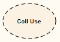
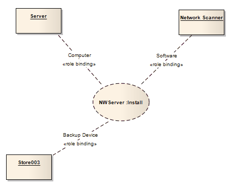

### [Collaboration Use](https://sparxsystems.com/enterprise_architect_user_guide/15.1/model_domains/colloccurrence.html) Совместное использование

Description

Use a Collaboration Use to apply a Pattern defined by a Collaboration to a specific situation, in a Composite Structure diagram.

Использование совместной работы Использование для применения шаблона, определенного совместной работой, к конкретной ситуации на диаграмме составной структуры .

This example shows a Use, NWServer, of the Collaboration Install, to define the installation process of a network scanner. This process can be defined by an interaction attached to the Collaboration. (See the Collaboration topic for a representation of the Install Collaboration.)

В этом примере показано использование NWServer совместной установки для определения процесса установки сетевого сканера. Этот процесс может быть определен посредством взаимодействия, связанного с Сотрудничеством. (См. Раздел « Совместная работа» для представления совместной работы при установке.)

To create a Collaboration Use, drag the icon from the Toolbox onto the diagram.

Чтобы создать совместное использование, перетащите значок с панели инструментов на диаграмму.

Toolbox icon

Learn more
* [Composite Structure Diagram](https://sparxsystems.com/enterprise_architect_user_guide/15.1/model_domains/compositestructurediagram.html)
* [Collaboration Element](https://sparxsystems.com/enterprise_architect_user_guide/15.1/model_domains/collaboration2.html)

Выучить больше
* Схема составной структуры
* Элемент сотрудничества

OMG UML Specification:
The OMG UML specification (UML Superstructure Specification, v2.1.1, p.173) states:

A collaboration use represents one particular use of a collaboration to explain the relationships between the properties of a classifier. A collaboration use shows how the pattern described by a collaboration is applied in a given context, by binding specific entities from that context to the roles of the collaboration. Depending on the context, these entities could be structural features of a classifier, instance specifications, or even roles in some containing collaboration. There may be multiple occurrences of a given collaboration within a classifier, each involving a different set of roles and connectors. A given role or connector may be involved in multiple occurrences of the same or different collaborations.

Спецификация OMG UML:
Спецификация OMG UML (Спецификация надстройки UML, v2.1.1, стр.173) гласит:

Использование сотрудничества представляет собой одно конкретное использование сотрудничества для объяснения отношений между свойствами классификатора. Использование совместной работы показывает, как шаблон, описываемый совместной работой, применяется в данном контексте, путем привязки конкретных сущностей из этого контекста к ролям сотрудничества. В зависимости от контекста, эти сущности могут быть структурными элементами классификатора, спецификациями экземпляров или даже ролями в некоторых, содержащих сотрудничество. В классификаторе может быть несколько экземпляров данного сотрудничества, в каждом из которых задействован другой набор ролей и соединителей. Данная роль или соединитель могут быть задействованы в нескольких случаях одного и того же или разных взаимодействий.

<a href="follow%2Fancor_2.md" target="_blank">ancor_2</a>
