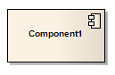

#### [Component](https://sparxsystems.com/enterprise_architect_user_guide/15.1/model_domains/component.html) Составная часть

Description

A Component is a modular part of a system, whose behavior is defined by its provided and required interfaces; the internal workings of the Component should be invisible and its usage environment-independent. Source code files, DLLs, Java beans and other artifacts defining the system can be manifested in Components.

Описание

Компонент - это модульная часть системы, поведение которой определяется предоставленными и необходимыми интерфейсами; внутренняя работа компонента должна быть невидимой и независимой от среды использования. Файлы исходного кода, библиотеки DLL, Java-бины и другие артефакты, определяющие систему, могут быть представлены в компонентах.

A Component can be composed of multiple Classes, or Components pieced together. As smaller Components come together to create bigger Components, the eventual system can be modeled, building-block style, in Component diagrams. By building the system in discrete Components, localization of data and behavior enables decreased dependency between Classes and Objects, providing a more robust and maintainable design.

Компонент может состоять из нескольких классов или компонентов, собранных вместе. По мере того как меньшие Компоненты объединяются для создания более крупных Компонентов, конечная система может быть смоделирована в стиле строительных блоков на диаграммах Компонентов. Создавая систему в виде дискретных компонентов, локализация данных и поведения позволяет уменьшить зависимость между классами и объектами, обеспечивая более надежную и удобную в обслуживании конструкцию.

Toolbox icon

Learn more
* [Component Diagram](https://sparxsystems.com/enterprise_architect_user_guide/15.1/model_domains/componentdiagram.html)
* [Class Element](https://sparxsystems.com/enterprise_architect_user_guide/15.1/model_domains/class.html)
* [Object Element](https://sparxsystems.com/enterprise_architect_user_guide/15.1/model_domains/object.html)

Выучить больше
* Схема компонентов
* Элемент класса
* Элемент объекта

OMG UML Specification:
The OMG UML specification (UML Superstructure Specification, v2.1.1, p.148) states:

A component represents a modular part of a system that encapsulates its contents and whose manifestation is replaceable within its environment.

Компонент представляет собой модульную часть системы, которая инкапсулирует ее содержимое и чье воплощение можно заменить в ее среде.

A component defines its behavior in terms of provided and required interfaces. As such, a component serves as a type whose conformance is defined by these provided and required interfaces (encompassing both their static as well as dynamic semantics).

Компонент определяет свое поведение с точки зрения предоставленных и требуемых интерфейсов. Таким образом, компонент служит типом, соответствие которого определяется этими предоставленными и обязательными интерфейсами (включая как их статическую, так и динамическую семантику).

<a href="follow%2Fancor_2.md" target="_blank">ancor_2</a>

