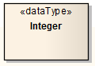
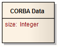

#### <a href="https://sparxsystems.com/enterprise_architect_user_guide/15.1/model_domains/datatypeelem.html" target="_blank">Data Type</a> Тип данных

Description

A Data Type is a specific kind of classifier, similar to a Class except that a Data Type cannot own sub Data Types, and instances of a Data Type are identified only by their value. For example, an instance of a Person Class is a Helen object, but an instance of an Integer Data Type is 12.

Тип данных - это особый вид классификатора, подобный классу, за исключением того, что тип данных не может владеть подтипами данных, а экземпляры типа данных идентифицируются только по их значению. Например, экземпляром класса Person является объект Helen, а экземпляром целочисленного типа данных - 12.

All copies of an instance of a Data Type, and any instances of that Data Type with the same value, are considered to be the same instance. That is, instances of Helen are not necessarily the same Helen, but all 12s are the same 12. For example, the 12 on a watch face is exactly the same integer as the number of months in a year.

Все копии экземпляра типа данных и любые экземпляры этого типа данных с одинаковым значением считаются одним и тем же экземпляром. То есть, экземпляры Helen не обязательно совпадают с Helen, но все 12 - это одно и то же 12. Например, 12 на циферблате - это точно такое же целое число, как количество месяцев в году.

Instances of a Data Type that have attributes (that is, are instances of a structured Data Type) are considered to be the same if the structure is the same and the values of the corresponding attributes are the same. If a Data Type has attributes, instances of that Data Type contain attribute values matching the attributes.

Экземпляры типа данных, которые имеют атрибуты (т. Е. Являются экземплярами структурированного типа данных), считаются одинаковыми, если одинаковая структура и одинаковые значения соответствующих атрибутов. Если тип данных имеет атрибуты, экземпляры этого типа данных содержат значения атрибутов, соответствующие атрибутам.

A typical use of Data Types would be to represent programming language primitive types or CORBA basic types. For example, integer and string types are often treated as Data Types.

Типичное использование типов данных - представление примитивных типов языка программирования или базовых типов CORBA. Например, целочисленные и строковые типы часто рассматриваются как типы данных.

A Data Type is denoted by a rectangle with the keyword «dataType» or, when it is referenced by (for example) an attribute, by a string containing the name of the Data Type, as shown:

Тип данных обозначается прямоугольником с ключевым словом «dataType» или, когда на него ссылается (например) атрибут, строкой, содержащей имя типа данных, как показано:

Toolbox icon

Learn more
* [Class Element](https://sparxsystems.com/enterprise_architect_user_guide/15.1/model_domains/class.html)

<a href="follow%2Fancor_2.md" target="_blank">ancor_2</a>
 

