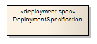
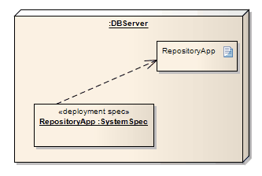

#### <a href="https://sparxsystems.com/enterprise_architect_user_guide/15.1/model_domains/deploymentspec.html" target="_blank">Deployment Specification</a> Спецификация развертывания

Description

A Deployment Specification specifies parameters guiding deployment of an artifact, as is necessary with most hardware and software technologies. A specification lists those properties that must be defined for deployment to occur, as represented in a Deployment diagram. An instance of this specification specifies the values for the parameters; a single specification can be instantiated for multiple artifacts.

Спецификация развертывания определяет параметры, управляющие развертыванием артефакта, что необходимо для большинства аппаратных и программных технологий. В спецификации перечислены те свойства, которые должны быть определены для развертывания, как показано на диаграмме развертывания. Экземпляр этой спецификации определяет значения параметров; одна спецификация может быть создана для нескольких артефактов.

These specifications can be extended by certain component profiles. Examples of standard Tagged Values that a profile might add to a Deployment Specification are «concurrencyMode» with Tagged Values {thread, process, none} or «transactionMode» with Tagged Values {transaction, nestedTransaction, none}.

Эти характеристики могут быть расширены определенными профилями компонентов. Примерами стандартных значений с тегами, которые профиль может добавить к спецификации развертывания, являются «concurrencyMode» с помеченными значениями {thread, process, none} или «transactionMode» с помеченными значениями {transaction, nestedTransaction, none}.

This example depicts the artifact RepositoryApp deployed on the server node, as per the specifications of RepositoryApp, instantiated from the Deployment Specification SystemSpec.

В этом примере показан артефакт RepositoryApp, развернутый на серверном узле, в соответствии со спецификациями RepositoryApp, созданный из SystemSpec спецификации развертывания.

Toolbox icon

Learn more
* <a href="https://sparxsystems.com/enterprise_architect_user_guide/15.1/model_domains/deploymentdiagram.html" target="_blank">Deployment Diagram</a>

Выучить больше
* Схема развертывания
OMG UML Specification:
The OMG UML specification (UML Superstructure Specification, v2.1.1, p.206) states:

A deployment specification specifies a set of properties that determine execution parameters of a component artifact that is deployed on a node. A deployment specification can be aimed at a specific type of container. An artifact that reifies or implements deployment specification properties is a deployment descriptor.

Спецификация OMG UML:
Спецификация OMG UML (Спецификация надстройки UML, v2.1.1, p.206) гласит:

Спецификация развертывания определяет набор свойств, которые определяют параметры выполнения артефакта компонента, развернутого на узле. Спецификация развертывания может быть нацелена на конкретный тип контейнера. Артефакт, который воплощает или реализует свойства спецификации развертывания, является дескриптором развертывания.

<a href="follow%2Fancor_2.md" target="_blank">ancor_2</a>

