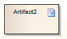
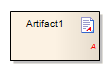

#### <a href="https://sparxsystems.com/enterprise_architect_user_guide/15.1/model_domains/document_artifact.html" target="_blank">Document Artifact</a> Документ Артефакт

Description

A Document Artifact is an artifact having a stereotype of «document». You create the Document Artifact using the Artifact, Common, Component, Documentation or Deployment pages of the Diagram Toolbox, and associate it with a document or CSV file. Double-click on the element to display the Linked Document Editor. When you have created the Linked Document, the Document Artifact element on the diagram shows an 'A' symbol in the bottom right corner.

Артефакт документа - это артефакт, имеющий стереотип «документ». Вы создаете артефакт документа, используя страницы «Артефакт», «Общий», «Компонент», «Документация» или «Развертывание» панели инструментов диаграммы , и связываете его с документом или файлом CSV. Дважды щелкните элемент, чтобы открыть редактор связанных документов. После создания связанного документа в элементе «Артефакт документа» на диаграмме отображается символ «A» в правом нижнем углу.

Toolbox icon

Learn more

<ul><li><a href="https://sparxsystems.com/enterprise_architect_user_guide/15.1/modeling/linking_documentation.html">Linked Documents</a> </li><li><a href="https://sparxsystems.com/enterprise_architect_user_guide/15.1/model_domains/artifact_element.html">Artifact Element</a> </li><li><a href="https://sparxsystems.com/enterprise_architect_user_guide/15.1/modeling/add_quick_linker_definition_to.html">Add Quick Linker Definition To Profile</a> </li></ul>

Выучить больше
* Связанные документы
* Элемент артефакта
* Добавить определение быстрого компоновщика в профиль

<a href="follow%2Fancor_2.md" target="_blank">ancor_2</a>