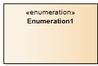

#### <a href="https://sparxsystems.com/enterprise_architect_user_guide/15.1/model_domains/enumeration_element.html" target="_blank">Enumeration</a> перечисление

Description

An Enumeration is a data type, whose instances can be any of a number of user-defined enumeration literals. It is possible to extend the set of applicable enumeration literals in other Packages or profiles. You create Enumerations in Class or Package diagrams, and in diagrams developed using the Metamodel and Profile pages of the Diagram Toolbox.

Перечисление - это тип данных, экземпляры которого могут быть любым из числа определяемых пользователем литералов перечисления. Можно расширить набор применимых литералов перечисления в других пакетах или профилях. Вы создаете перечисления в диаграммах классов или пакетов, а также в диаграммах, разработанных с использованием страниц Metamodel и Profile панели Diagram Toolbox .

Toolbox icon

Learn more

<ul><li><a href="https://sparxsystems.com/enterprise_architect_user_guide/15.1/model_domains/classdiagram.html">Class Diagram</a> </li><li><a href="https://sparxsystems.com/enterprise_architect_user_guide/15.1/model_domains/packagediagram.html">Package Diagram</a>  
</li></ul>

Выучить больше
* Диаграмма классов
* Диаграмма упаковки

OMG UML Specification:
The OMG UML specification (UML Superstructure Specification, v2.1.1, p.69) states:

An enumeration is a data type whose values are enumerated in the model as enumeration literals.

Спецификация OMG UML:
Спецификация OMG UML (Спецификация надстройки UML, v2.1.1, стр.69) гласит:

Перечисление - это тип данных, значения которого перечислены в модели как литералы перечисления.

<ul>
					<li class="plus"><a href='https://sparxsystems.com/enterprise_architect_user_guide/15.1/model_domains/artifact_element.html'>Artifact</a></li>
					<li class="plus"><a href='https://sparxsystems.com/enterprise_architect_user_guide/15.1/model_domains/class.html'>Class</a></li>
					<li class="noplus"><a href='https://sparxsystems.com/enterprise_architect_user_guide/15.1/model_domains/collaboration2.html'>Collaboration</a></li>
					<li class="noplus"><a href='https://sparxsystems.com/enterprise_architect_user_guide/15.1/model_domains/colloccurrence.html'>Collaboration Use</a></li>
					<li class="noplus"><a href='https://sparxsystems.com/enterprise_architect_user_guide/15.1/model_domains/component.html'>Component</a></li>
					<li class="noplus"><a href='https://sparxsystems.com/enterprise_architect_user_guide/15.1/model_domains/datatypeelem.html'>Data Type</a></li>
					<li class="noplus"><a href='https://sparxsystems.com/enterprise_architect_user_guide/15.1/model_domains/deploymentspec.html'>Deployment Specification</a></li>
					<li class="noplus"><a href='https://sparxsystems.com/enterprise_architect_user_guide/15.1/model_domains/device_element.html'>Device</a></li>
					<li class="noplus"><a href='https://sparxsystems.com/enterprise_architect_user_guide/15.1/model_domains/enumeration_element.html'>Enumeration</a></li>
					<li class="noplus"><a href='https://sparxsystems.com/enterprise_architect_user_guide/15.1/model_domains/execution_environment.html'>Execution Environment</a></li>
					<li class="noplus"><a href='https://sparxsystems.com/enterprise_architect_user_guide/15.1/model_domains/exposeinterface.html'>Expose Interface</a></li>
					<li class="noplus"><a href='https://sparxsystems.com/enterprise_architect_user_guide/15.1/model_domains/informationitem.html'>Information Item</a></li>
					<li class="noplus"><a href='https://sparxsystems.com/enterprise_architect_user_guide/15.1/model_domains/interface.html'>Interface</a></li>
					<li class="noplus"><a href='https://sparxsystems.com/enterprise_architect_user_guide/15.1/model_domains/node.html'>Node</a></li>
					<li class="plus"><a href='https://sparxsystems.com/enterprise_architect_user_guide/15.1/model_domains/object.html'>Object</a></li>
					<li class="noplus"><a href='https://sparxsystems.com/enterprise_architect_user_guide/15.1/model_domains/package.html'>Package</a></li>
					<li class="noplus"><a href='https://sparxsystems.com/enterprise_architect_user_guide/15.1/model_domains/packagingcomponent.html'>Packaging Component</a></li>
					<li class="plus"><a href='https://sparxsystems.com/enterprise_architect_user_guide/15.1/model_domains/part.html'>Part</a></li>
					<li class="plus"><a href='https://sparxsystems.com/enterprise_architect_user_guide/15.1/model_domains/port.html'>Port</a></li>
					<li class="noplus"><a href='https://sparxsystems.com/enterprise_architect_user_guide/15.1/model_domains/primitive.html'>Primitive</a></li>
					<li class="plus"><a href='https://sparxsystems.com/enterprise_architect_user_guide/15.1/model_domains/signal_element.html'>Signal</a></li></ul>

