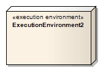

#### <a href="https://sparxsystems.com/enterprise_architect_user_guide/15.1/model_domains/execution_environment.html" target="_blank">Execution Environment</a> Среда выполнения

Description

An Execution Environment is a node that offers an execution environment for specific types of component that are deployed on it in the form of Executable Artifacts. This is depicted in a Deployment diagram.

Среда выполнения - это узел, который предлагает среду выполнения для определенных типов компонентов, которые развернуты на нем в форме исполняемых артефактов. Это изображено на диаграмме развертывания.

Execution Environments can be nested; for example, a database Execution Environment can be nested in an operating system Execution Environment. Components of the appropriate type are then deployed to specific Execution Environment nodes.

Среды выполнения могут быть вложенными; например, среда выполнения базы данных может быть вложена в среду выполнения операционной системы. Затем компоненты соответствующего типа развертываются на определенных узлах среды выполнения.

Toolbox icon

Learn more

<ul><li><a href="https://sparxsystems.com/enterprise_architect_user_guide/15.1/model_domains/deploymentdiagram.html">Deployment Diagram</a> </li><li><a href="https://sparxsystems.com/enterprise_architect_user_guide/15.1/model_domains/node.html">Node Element</a> </li><li><a href="https://sparxsystems.com/enterprise_architect_user_guide/15.1/model_domains/component.html">Component Element</a> </li><li><a href="https://sparxsystems.com/enterprise_architect_user_guide/15.1/model_domains/artifact_element.html">Artifact Element</a>  
</li></ul>

Выучить больше
* Схема развертывания
* Элемент узла
* Компонент Элемент
* Элемент артефакта

OMG UML Specification:
The OMG UML specification (UML Superstructure Specification, v2.1.1, p.210) states:

... an ExecutionEnvironment is ... usually part of a general Node, representing the physical hardware environment on which the ExecutionEnvironment resides. In that environment, the ExecutionEnvironment implements a standard set of services that Components require at execution time (at the modeling level these services are usually implicit). For each component Deployment, aspects of these services may be determined by properties in a DeploymentSpecification for a particular kind of ExecutionEnvironment.

Спецификация OMG UML:
Спецификация OMG UML (Спецификация надстройки UML, v2.1.1, стр.210) гласит:

... ExecutionEnvironment ... обычно является частью общего узла, представляющего физическую аппаратную среду, в которой находится ExecutionEnvironment. В этой среде ExecutionEnvironment реализует стандартный набор служб, которые требуются Компонентам во время выполнения (на уровне моделирования эти службы обычно неявны). Для каждого компонента Deployment аспекты этих сервисов могут определяться свойствами в DeploymentSpecification для конкретного вида ExecutionEnvironment.

<ul>
					<li class="plus"><a href='https://sparxsystems.com/enterprise_architect_user_guide/15.1/model_domains/artifact_element.html'>Artifact</a></li>
					<li class="plus"><a href='https://sparxsystems.com/enterprise_architect_user_guide/15.1/model_domains/class.html'>Class</a></li>
					<li class="noplus"><a href='https://sparxsystems.com/enterprise_architect_user_guide/15.1/model_domains/collaboration2.html'>Collaboration</a></li>
					<li class="noplus"><a href='https://sparxsystems.com/enterprise_architect_user_guide/15.1/model_domains/colloccurrence.html'>Collaboration Use</a></li>
					<li class="noplus"><a href='https://sparxsystems.com/enterprise_architect_user_guide/15.1/model_domains/component.html'>Component</a></li>
					<li class="noplus"><a href='https://sparxsystems.com/enterprise_architect_user_guide/15.1/model_domains/datatypeelem.html'>Data Type</a></li>
					<li class="noplus"><a href='https://sparxsystems.com/enterprise_architect_user_guide/15.1/model_domains/deploymentspec.html'>Deployment Specification</a></li>
					<li class="noplus"><a href='https://sparxsystems.com/enterprise_architect_user_guide/15.1/model_domains/device_element.html'>Device</a></li>
					<li class="noplus"><a href='https://sparxsystems.com/enterprise_architect_user_guide/15.1/model_domains/enumeration_element.html'>Enumeration</a></li>
					<li class="noplus"><a href='https://sparxsystems.com/enterprise_architect_user_guide/15.1/model_domains/execution_environment.html'>Execution Environment</a></li>
					<li class="noplus"><a href='https://sparxsystems.com/enterprise_architect_user_guide/15.1/model_domains/exposeinterface.html'>Expose Interface</a></li>
					<li class="noplus"><a href='https://sparxsystems.com/enterprise_architect_user_guide/15.1/model_domains/informationitem.html'>Information Item</a></li>
					<li class="noplus"><a href='https://sparxsystems.com/enterprise_architect_user_guide/15.1/model_domains/interface.html'>Interface</a></li>
					<li class="noplus"><a href='https://sparxsystems.com/enterprise_architect_user_guide/15.1/model_domains/node.html'>Node</a></li>
					<li class="plus"><a href='https://sparxsystems.com/enterprise_architect_user_guide/15.1/model_domains/object.html'>Object</a></li>
					<li class="noplus"><a href='https://sparxsystems.com/enterprise_architect_user_guide/15.1/model_domains/package.html'>Package</a></li>
					<li class="noplus"><a href='https://sparxsystems.com/enterprise_architect_user_guide/15.1/model_domains/packagingcomponent.html'>Packaging Component</a></li>
					<li class="plus"><a href='https://sparxsystems.com/enterprise_architect_user_guide/15.1/model_domains/part.html'>Part</a></li>
					<li class="plus"><a href='https://sparxsystems.com/enterprise_architect_user_guide/15.1/model_domains/port.html'>Port</a></li>
					<li class="noplus"><a href='https://sparxsystems.com/enterprise_architect_user_guide/15.1/model_domains/primitive.html'>Primitive</a></li>
					<li class="plus"><a href='https://sparxsystems.com/enterprise_architect_user_guide/15.1/model_domains/signal_element.html'>Signal</a></li></ul>
