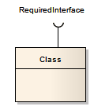
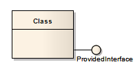

#### <a href="https://sparxsystems.com/enterprise_architect_user_guide/15.1/model_domains/exposeinterface.html" target="_blank">Expose Interface</a> Показать интерфейс

Description

The Expose Interface element is a graphical method of depicting the required or supplied interfaces of a Component, Class or Part, in a Component or Composite Structure diagram. It just identifies the fact that the element provides or requires an interface; to depict the fact that the provided interface is used, or the required interface provided, by another element, use the Assembly connector.

Элемент Expose Interface - это графический метод изображения требуемых или предоставленных интерфейсов компонента, класса или части на диаграмме компонента или составной структуры . Он просто указывает на то, что элемент предоставляет или требует интерфейс; Чтобы отобразить факт использования предоставленного интерфейса или требуемого интерфейса, предоставленного другим элементом, используйте коннектор Assembly.

The Expose Interface element must be attached to the Class or Component element, and it becomes a child element of that Class or Component; it cannot exist independently. You can attach more than one Expose Element to another element.

Элемент Expose Interface должен быть присоединен к элементу Class или Component, и он становится дочерним элементом этого Class или Component; он не может существовать независимо. Вы можете прикрепить более одного элемента Expose к другому элементу.

When you create the Expose Interface element, a dialog displays in which you enter a name for the element and specify whether it represents a required interface or a provided interface.

Когда вы создаете элемент Expose Interface, отображается диалоговое окно, в котором вы вводите имя для элемента и указываете, представляет ли он требуемый интерфейс или предоставленный интерфейс.

Toolbox icon

<ul>
	<li><a href="https://sparxsystems.com/enterprise_architect_user_guide/15.1/model_domains/componentdiagram.html">Component Diagram</a></li>
	<li><a href="https://sparxsystems.com/enterprise_architect_user_guide/15.1/model_domains/compositestructurediagram.html">Composite Structure Diagram</a></li>
	<li><a href="https://sparxsystems.com/enterprise_architect_user_guide/15.1/model_domains/interface.html">Interface</a></li>
	<li><a href="https://sparxsystems.com/enterprise_architect_user_guide/15.1/model_domains/component.html">Component</a></li>
	<li><a href="https://sparxsystems.com/enterprise_architect_user_guide/15.1/model_domains/class.html">Class</a></li>
	<li><a href="https://sparxsystems.com/enterprise_architect_user_guide/15.1/model_domains/part.html">Part</a></li>
	<li><a href="https://sparxsystems.com/enterprise_architect_user_guide/15.1/model_domains/assembly.html">Assembly</a></li>
</ul>

Выучить больше
* Схема компонентов
* Схема составной структуры
* Интерфейс
* Составная часть
* Класс
* Часть
* сборочный

<ul>
					<li class="plus"><a href='https://sparxsystems.com/enterprise_architect_user_guide/15.1/model_domains/artifact_element.html'>Artifact</a></li>
					<li class="plus"><a href='https://sparxsystems.com/enterprise_architect_user_guide/15.1/model_domains/class.html'>Class</a></li>
					<li class="noplus"><a href='https://sparxsystems.com/enterprise_architect_user_guide/15.1/model_domains/collaboration2.html'>Collaboration</a></li>
					<li class="noplus"><a href='https://sparxsystems.com/enterprise_architect_user_guide/15.1/model_domains/colloccurrence.html'>Collaboration Use</a></li>
					<li class="noplus"><a href='https://sparxsystems.com/enterprise_architect_user_guide/15.1/model_domains/component.html'>Component</a></li>
					<li class="noplus"><a href='https://sparxsystems.com/enterprise_architect_user_guide/15.1/model_domains/datatypeelem.html'>Data Type</a></li>
					<li class="noplus"><a href='https://sparxsystems.com/enterprise_architect_user_guide/15.1/model_domains/deploymentspec.html'>Deployment Specification</a></li>
					<li class="noplus"><a href='https://sparxsystems.com/enterprise_architect_user_guide/15.1/model_domains/device_element.html'>Device</a></li>
					<li class="noplus"><a href='https://sparxsystems.com/enterprise_architect_user_guide/15.1/model_domains/enumeration_element.html'>Enumeration</a></li>
					<li class="noplus"><a href='https://sparxsystems.com/enterprise_architect_user_guide/15.1/model_domains/execution_environment.html'>Execution Environment</a></li>
					<li class="noplus"><a href='https://sparxsystems.com/enterprise_architect_user_guide/15.1/model_domains/exposeinterface.html'>Expose Interface</a></li>
					<li class="noplus"><a href='https://sparxsystems.com/enterprise_architect_user_guide/15.1/model_domains/informationitem.html'>Information Item</a></li>
					<li class="noplus"><a href='https://sparxsystems.com/enterprise_architect_user_guide/15.1/model_domains/interface.html'>Interface</a></li>
					<li class="noplus"><a href='https://sparxsystems.com/enterprise_architect_user_guide/15.1/model_domains/node.html'>Node</a></li>
					<li class="plus"><a href='https://sparxsystems.com/enterprise_architect_user_guide/15.1/model_domains/object.html'>Object</a></li>
					<li class="noplus"><a href='https://sparxsystems.com/enterprise_architect_user_guide/15.1/model_domains/package.html'>Package</a></li>
					<li class="noplus"><a href='https://sparxsystems.com/enterprise_architect_user_guide/15.1/model_domains/packagingcomponent.html'>Packaging Component</a></li>
					<li class="plus"><a href='https://sparxsystems.com/enterprise_architect_user_guide/15.1/model_domains/part.html'>Part</a></li>
					<li class="plus"><a href='https://sparxsystems.com/enterprise_architect_user_guide/15.1/model_domains/port.html'>Port</a></li>
					<li class="noplus"><a href='https://sparxsystems.com/enterprise_architect_user_guide/15.1/model_domains/primitive.html'>Primitive</a></li>
					<li class="plus"><a href='https://sparxsystems.com/enterprise_architect_user_guide/15.1/model_domains/signal_element.html'>Signal</a></li></ul>

