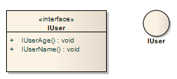

#### <a href="https://sparxsystems.com/enterprise_architect_user_guide/15.1/model_domains/interface.html" target="_blank">Interface</a> 

Description

An Interface is a specification of behavior (or contract) that implementers agree to meet. By implementing an Interface, Classes are guaranteed to support a required behavior, which enables the system to treat non-related elements in the same way; that is, through the common interface. You also use Interfaces in a Composite Structure diagram.

Интерфейс - это спецификация поведения (или контракт), которую разработчики соглашаются соблюдать. Благодаря реализации интерфейса классы гарантированно поддерживают требуемое поведение, которое позволяет системе одинаково обрабатывать несвязанные элементы; то есть через общий интерфейс. Вы также можете использовать интерфейсы в диаграмме составной структуры .

Interfaces are drawn in a similar way to a Class, with operations specified, as shown here. They can also be drawn as a circle with no explicit operations detailed - right-click on the element and select the 'Use Circle Notation' option to switch between styles. Realize connectors to an Interface drawn as a circle are drawn as a solid line without target arrows.

Интерфейсы отрисовываются аналогично классу с указанием операций, как показано здесь. Их также можно нарисовать в виде круга без подробного описания операций - щелкните элемент правой кнопкой мыши и выберите параметр «Использовать обозначение круга» для переключения между стилями. Реализуйте соединители с интерфейсом, нарисованным в виде круга, нарисованного сплошной линией без целевых стрелок.

An Interface cannot be instantiated (that is, you cannot create an object from an Interface). You must create a Class that 'implements' the Interface specification, and in the Class body place operations for each of the Interface operations. You can then instantiate the Class.

Интерфейс не может быть создан (то есть вы не можете создать объект из интерфейса). Вы должны создать класс, который «реализует» спецификацию интерфейса, и в теле класса разместить операции для каждой из операций интерфейса. Затем вы можете создать экземпляр класса.

Toolbox icon

Learn more

<ul><li><a href="https://sparxsystems.com/enterprise_architect_user_guide/15.1/model_domains/model_domains/classdiagram.html">Class Diagram</a> </li><li><a href="https://sparxsystems.com/enterprise_architect_user_guide/15.1/model_domains/model_domains/compositestructurediagram.html">Composite Structure Diagram</a> </li><li><a href="https://sparxsystems.com/enterprise_architect_user_guide/15.1/model_domains/model_domains/realise.html">Realization</a>  
</li></ul>

Выучить больше
* Диаграмма классов
* Схема составной структуры
* реализация

OMG UML Specification:
The OMG UML specification (UML Superstructure Specification, v2.1.1, p.88) states:

An interface is a kind of classifier that represents a declaration of a set of coherent public features and obligations. An interface specifies a contract; any instance of a classifier that realizes the interface must fulfill that contract. The obligations that may be associated with an interface are in the form of various kinds of constraints (such as pre- and post-conditions) or protocol specifications, which may impose ordering restrictions on interactions through the interface.

Спецификация OMG UML:
Спецификация OMG UML (Спецификация надстройки UML, v2.1.1, стр.88) гласит:

Интерфейс - это своего рода классификатор, который представляет собой декларацию набора согласованных общедоступных функций и обязательств. Интерфейс определяет контракт; любой экземпляр классификатора, реализующий интерфейс, должен выполнять этот контракт. Обязательства, которые могут быть связаны с интерфейсом, имеют форму различного рода ограничений (таких как предварительные и последующие условия) или спецификаций протокола, которые могут налагать ограничения на упорядочение взаимодействий через интерфейс.

Since interfaces are declarations, they are not instantiable. Instead, an interface specification is implemented by an instance of an instantiable classifier, which means that the instantiable classifier presents a public facade that conforms to the interface specification. Note that a given classifier may implement more than one interface and that an interface may be implemented by a number of different classifiers.

Поскольку интерфейсы являются объявлениями, они не могут быть созданы. Вместо этого спецификация интерфейса реализуется экземпляром создаваемого классификатора, что означает, что создаваемый классификатор представляет собой общедоступный фасад, который соответствует спецификации интерфейса. Обратите внимание, что данный классификатор может реализовывать более одного интерфейса и что интерфейс может быть реализован с помощью ряда различных классификаторов.

<ul>
					<li class="plus"><a href='https://sparxsystems.com/enterprise_architect_user_guide/15.1/model_domains/artifact_element.html'>Artifact</a></li>
					<li class="plus"><a href='https://sparxsystems.com/enterprise_architect_user_guide/15.1/model_domains/class.html'>Class</a></li>
					<li class="noplus"><a href='https://sparxsystems.com/enterprise_architect_user_guide/15.1/model_domains/collaboration2.html'>Collaboration</a></li>
					<li class="noplus"><a href='https://sparxsystems.com/enterprise_architect_user_guide/15.1/model_domains/colloccurrence.html'>Collaboration Use</a></li>
					<li class="noplus"><a href='https://sparxsystems.com/enterprise_architect_user_guide/15.1/model_domains/component.html'>Component</a></li>
					<li class="noplus"><a href='https://sparxsystems.com/enterprise_architect_user_guide/15.1/model_domains/datatypeelem.html'>Data Type</a></li>
					<li class="noplus"><a href='https://sparxsystems.com/enterprise_architect_user_guide/15.1/model_domains/deploymentspec.html'>Deployment Specification</a></li>
					<li class="noplus"><a href='https://sparxsystems.com/enterprise_architect_user_guide/15.1/model_domains/device_element.html'>Device</a></li>
					<li class="noplus"><a href='https://sparxsystems.com/enterprise_architect_user_guide/15.1/model_domains/enumeration_element.html'>Enumeration</a></li>
					<li class="noplus"><a href='https://sparxsystems.com/enterprise_architect_user_guide/15.1/model_domains/execution_environment.html'>Execution Environment</a></li>
					<li class="noplus"><a href='https://sparxsystems.com/enterprise_architect_user_guide/15.1/model_domains/exposeinterface.html'>Expose Interface</a></li>
					<li class="noplus"><a href='https://sparxsystems.com/enterprise_architect_user_guide/15.1/model_domains/informationitem.html'>Information Item</a></li>
					<li class="noplus"><a href='https://sparxsystems.com/enterprise_architect_user_guide/15.1/model_domains/interface.html'>Interface</a></li>
					<li class="noplus"><a href='https://sparxsystems.com/enterprise_architect_user_guide/15.1/model_domains/node.html'>Node</a></li>
					<li class="plus"><a href='https://sparxsystems.com/enterprise_architect_user_guide/15.1/model_domains/object.html'>Object</a></li>
					<li class="noplus"><a href='https://sparxsystems.com/enterprise_architect_user_guide/15.1/model_domains/package.html'>Package</a></li>
					<li class="noplus"><a href='https://sparxsystems.com/enterprise_architect_user_guide/15.1/model_domains/packagingcomponent.html'>Packaging Component</a></li>
					<li class="plus"><a href='https://sparxsystems.com/enterprise_architect_user_guide/15.1/model_domains/part.html'>Part</a></li>
					<li class="plus"><a href='https://sparxsystems.com/enterprise_architect_user_guide/15.1/model_domains/port.html'>Port</a></li>
					<li class="noplus"><a href='https://sparxsystems.com/enterprise_architect_user_guide/15.1/model_domains/primitive.html'>Primitive</a></li>
					<li class="plus"><a href='https://sparxsystems.com/enterprise_architect_user_guide/15.1/model_domains/signal_element.html'>Signal</a></li></ul>