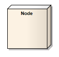

#### <a href="https://sparxsystems.com/enterprise_architect_user_guide/15.1/model_domains/node.html" target="_blank">Node</a>  Узел

Description

A Node is a physical piece of equipment on which the system is deployed, such as a workgroup server or workstation. A Node usually hosts components and other executable pieces of code, which again can be connected to particular processes or execution spaces. Typical Nodes are client workstations, application servers, mainframes, routers and terminal servers.

Узел - это физический элемент оборудования, на котором развертывается система, например сервер рабочей группы или рабочая станция. Узел обычно содержит компоненты и другие исполняемые части кода, которые снова могут быть связаны с конкретными процессами или пространствами выполнения. Типичные узлы - это клиентские рабочие станции, серверы приложений, мэйнфреймы, маршрутизаторы и терминальные серверы.

Nodes are used in Deployment diagrams to model the deployment of a system, and to illustrate the physical allocation of implemented artifacts. They are also used in web modeling, from dedicated web modeling pages in the Toolbox.

Узлы используются в диаграммах развертывания для моделирования развертывания системы и для иллюстрации физического распределения реализованных артефактов. Они также используются в веб-моделировании на специальных страницах веб-моделирования в Toolbox.

Toolbox icon

Learn more
* <a href="https://sparxsystems.com/enterprise_architect_user_guide/15.1/model_domains/deploymentdiagram.html" target="_blank">Deployment Diagram</a>

Выучить больше
* Схема развертывания

OMG UML Specification:
The OMG UML specification (UML Superstructure Specification, v2.1.1, p.213) states:

In the metamodel, a Node is a subclass of Class. It is associated with a Deployment of an Artifact. It is also associated with a set of Elements that are deployed on it. This is a derived association in that these PackageableElements are involved in a Manifestation of an Artifact that is deployed on the Node. Nodes may have an internal structure defined in terms of parts and connectors associated with them for advanced modeling applications.

Спецификация OMG UML:
Спецификация OMG UML (Спецификация надстройки UML, v2.1.1, стр. 213) гласит:

В метамодели узел является подклассом класса. Это связано с развертыванием артефакта. Он также связан с набором развернутых на нем элементов. Это производная ассоциация, поскольку эти PackageableElements участвуют в проявлении артефакта, развернутого на узле. Узлы могут иметь внутреннюю структуру, определяемую с точки зрения частей и соединителей, связанных с ними, для приложений расширенного моделирования.

<ul>
					<li class="plus"><a href='https://sparxsystems.com/enterprise_architect_user_guide/15.1/model_domains/artifact_element.html'>Artifact</a></li>
					<li class="plus"><a href='https://sparxsystems.com/enterprise_architect_user_guide/15.1/model_domains/class.html'>Class</a></li>
					<li class="noplus"><a href='https://sparxsystems.com/enterprise_architect_user_guide/15.1/model_domains/collaboration2.html'>Collaboration</a></li>
					<li class="noplus"><a href='https://sparxsystems.com/enterprise_architect_user_guide/15.1/model_domains/colloccurrence.html'>Collaboration Use</a></li>
					<li class="noplus"><a href='https://sparxsystems.com/enterprise_architect_user_guide/15.1/model_domains/component.html'>Component</a></li>
					<li class="noplus"><a href='https://sparxsystems.com/enterprise_architect_user_guide/15.1/model_domains/datatypeelem.html'>Data Type</a></li>
					<li class="noplus"><a href='https://sparxsystems.com/enterprise_architect_user_guide/15.1/model_domains/deploymentspec.html'>Deployment Specification</a></li>
					<li class="noplus"><a href='https://sparxsystems.com/enterprise_architect_user_guide/15.1/model_domains/device_element.html'>Device</a></li>
					<li class="noplus"><a href='https://sparxsystems.com/enterprise_architect_user_guide/15.1/model_domains/enumeration_element.html'>Enumeration</a></li>
					<li class="noplus"><a href='https://sparxsystems.com/enterprise_architect_user_guide/15.1/model_domains/execution_environment.html'>Execution Environment</a></li>
					<li class="noplus"><a href='https://sparxsystems.com/enterprise_architect_user_guide/15.1/model_domains/exposeinterface.html'>Expose Interface</a></li>
					<li class="noplus"><a href='https://sparxsystems.com/enterprise_architect_user_guide/15.1/model_domains/informationitem.html'>Information Item</a></li>
					<li class="noplus"><a href='https://sparxsystems.com/enterprise_architect_user_guide/15.1/model_domains/interface.html'>Interface</a></li>
					<li class="noplus"><a href='https://sparxsystems.com/enterprise_architect_user_guide/15.1/model_domains/node.html'>Node</a></li>
					<li class="plus"><a href='https://sparxsystems.com/enterprise_architect_user_guide/15.1/model_domains/object.html'>Object</a></li>
					<li class="noplus"><a href='https://sparxsystems.com/enterprise_architect_user_guide/15.1/model_domains/package.html'>Package</a></li>
					<li class="noplus"><a href='https://sparxsystems.com/enterprise_architect_user_guide/15.1/model_domains/packagingcomponent.html'>Packaging Component</a></li>
					<li class="plus"><a href='https://sparxsystems.com/enterprise_architect_user_guide/15.1/model_domains/part.html'>Part</a></li>
					<li class="plus"><a href='https://sparxsystems.com/enterprise_architect_user_guide/15.1/model_domains/port.html'>Port</a></li>
					<li class="noplus"><a href='https://sparxsystems.com/enterprise_architect_user_guide/15.1/model_domains/primitive.html'>Primitive</a></li>
					<li class="plus"><a href='https://sparxsystems.com/enterprise_architect_user_guide/15.1/model_domains/signal_element.html'>Signal</a></li></ul>