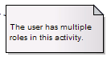

#### <a href="https://sparxsystems.com/enterprise_architect_user_guide/15.1/model_domains/element_note.html" target="_blank">Note</a> Заметка

A Note element is a textual annotation that can be attached to a set of elements of any other type. The attachment is created separately, using a Notelink connector. Both Note and Notelink are available in any Enterprise Architect diagram, through the 'Common' pages of the Toolbox.

Элемент примечания - это текстовая аннотация, которую можно прикрепить к набору элементов любого другого типа. Вложение создается отдельно с помощью коннектора Notelink. И Note, и Notelink доступны на любой диаграмме Enterprise Architect на «общих» страницах Toolbox.

A Note is also called a Comment.

Примечание также называется комментарием.

A Constraint is a form of Note, identifying a constraint on other elements. As for a Note, you can connect the Constraint element to other elements using a Notelink connector. This element is just a means of documenting the fact that there are constraints; it has no impact on the other elements. You define the types of constraint in the project reference data, apply them to the element in the element 'Properties' dialog, and manage them through the Responsibilities window.

Ограничение - это форма примечания, определяющая ограничение для других элементов. Что касается примечания, вы можете соединить элемент Constraint с другими элементами с помощью соединителя Notelink. Этот элемент - всего лишь средство документирования наличия ограничений; это не влияет на другие элементы. Вы определяете типы ограничений в справочных данных проекта, применяете их к элементу в диалоговом окне «Свойства» элемента и управляете ими через окно «Обязанности» .

You can configure Enterprise Architect to display the text in all Notes elements in italics. Select the 'Start > Preferences > Preferences' ribbon option and on the 'Diagram > Appearance' page select the 'Italic Note Element text' checkbox. This has an immediate effect, as does clearing the checkbox to show the text in normal font.
Вы можете настроить Enterprise Architect для отображения текста во всех элементах Notes курсивом. Выберите параметр ленты «Пуск> Настройки> Настройки» и на странице «Диаграмма> Внешний вид» установите флажок «Текст элемента примечания курсивом». Это дает немедленный эффект, как и снятие флажка для отображения текста обычным шрифтом.

Toolbox icon

Learn more

<ul>
	<li><a href="https://sparxsystems.com/enterprise_architect_user_guide/15.1/model_domains/model_domains/notelink_connector.html">Notelink Connector</a></li>
	<li><a href="https://sparxsystems.com/enterprise_architect_user_guide/15.1/model_domains/model_repository/constrainttypes.html">Constraint Types</a></li>
	<li><a href="https://sparxsystems.com/enterprise_architect_user_guide/15.1/model_domains/modeling/ruletab.html">Responsibilities Window</a> </li>
</ul>

Выучить больше
* Коннектор Notelink
* Типы ограничений
* Окно ответственности

OMG UML Specification:
The OMG UML specification (UML Superstructure Specification, v2.1.1, p.59) states:

A comment gives the ability to attach various remarks to elements. A comment carries no semantic force, but may contain information that is useful to a modeler.

A comment can be owned by any element.

Спецификация OMG UML:
Спецификация OMG UML (Спецификация надстройки UML, v2.1.1, стр.59) гласит:

Комментарий дает возможность прикреплять к элементам различные примечания. Комментарий не несет смысловой нагрузки, но может содержать информацию, полезную для разработчика моделей.

Комментарий может принадлежать любому элементу.

<ul>
					<li class="plus"><a href='https://sparxsystems.com/enterprise_architect_user_guide/15.1/model_domains/action.html'>Action</a></li>
					<li class="plus"><a href='https://sparxsystems.com/enterprise_architect_user_guide/15.1/model_domains/activity.html'>Activity</a></li>
					<li class="noplus"><a href='https://sparxsystems.com/enterprise_architect_user_guide/15.1/model_domains/actor.html'>Actor</a></li>
					<li class="noplus"><a href='https://sparxsystems.com/enterprise_architect_user_guide/15.1/model_domains/central_buffer_node.html'>Central Buffer Node</a></li>
					<li class="noplus"><a href='https://sparxsystems.com/enterprise_architect_user_guide/15.1/model_domains/choice.html'>Choice</a></li>
					<li class="plus"><a href='https://sparxsystems.com/enterprise_architect_user_guide/15.1/model_domains/fragment.html'>Combined Fragment</a></li>
					<li class="noplus"><a href='https://sparxsystems.com/enterprise_architect_user_guide/15.1/model_domains/datastore.html'>Datastore</a></li>
					<li class="noplus"><a href='https://sparxsystems.com/enterprise_architect_user_guide/15.1/model_domains/decision.html'>Decision</a></li>
					<li class="noplus"><a href='https://sparxsystems.com/enterprise_architect_user_guide/15.1/model_domains/diagram_frame.html'>Diagram Frame</a></li>
					<li class="noplus"><a href='https://sparxsystems.com/enterprise_architect_user_guide/15.1/model_domains/diagramgate.html'>Diagram Gate</a></li>
					<li class="noplus"><a href='https://sparxsystems.com/enterprise_architect_user_guide/15.1/model_domains/endpoint.html'>Endpoint</a></li>
					<li class="noplus"><a href='https://sparxsystems.com/enterprise_architect_user_guide/15.1/model_domains/entrypoints.html'>Entry Point</a></li>
					<li class="noplus"><a href='https://sparxsystems.com/enterprise_architect_user_guide/15.1/model_domains/event.html'>Event</a></li>
					<li class="noplus"><a href='https://sparxsystems.com/enterprise_architect_user_guide/15.1/model_domains/exception.html'>Exception</a></li>
					<li class="noplus"><a href='https://sparxsystems.com/enterprise_architect_user_guide/15.1/model_domains/actionexpansionnode.html'>Expansion Node</a></li>
					<li class="noplus"><a href='https://sparxsystems.com/enterprise_architect_user_guide/15.1/model_domains/expansionregion.html'>Expansion Region</a></li>
					<li class="noplus"><a href='https://sparxsystems.com/enterprise_architect_user_guide/15.1/model_domains/exitpoints.html'>Exit Point</a></li>
					<li class="noplus"><a href='https://sparxsystems.com/enterprise_architect_user_guide/15.1/model_domains/final.html'>Final</a></li>
					<li class="noplus"><a href='https://sparxsystems.com/enterprise_architect_user_guide/15.1/model_domains/flowfinal.html'>Flow Final</a></li>
					<li class="plus"><a href='https://sparxsystems.com/enterprise_architect_user_guide/15.1/model_domains/forkjoin.html'>Fork/Join</a></li>
					<li class="noplus"><a href='https://sparxsystems.com/enterprise_architect_user_guide/15.1/model_domains/historystate.html'>History</a></li>
					<li class="noplus"><a href='https://sparxsystems.com/enterprise_architect_user_guide/15.1/model_domains/initial.html'>Initial</a></li>
					<li class="noplus"><a href='https://sparxsystems.com/enterprise_architect_user_guide/15.1/model_domains/interaction.html'>Interaction</a></li>
					<li class="noplus"><a href='https://sparxsystems.com/enterprise_architect_user_guide/15.1/model_domains/interactionoccurrence.html'>Interaction Occurrence</a></li>
					<li class="noplus"><a href='https://sparxsystems.com/enterprise_architect_user_guide/15.1/model_domains/interruptibleactivityregion.html'>Interruptible Activity Region</a></li>
					<li class="noplus"><a href='https://sparxsystems.com/enterprise_architect_user_guide/15.1/model_domains/junction.html'>Junction</a></li>
					<li class="noplus"><a href='https://sparxsystems.com/enterprise_architect_user_guide/15.1/model_domains/lifeline.html'>Lifeline</a></li>
					<li class="noplus"><a href='https://sparxsystems.com/enterprise_architect_user_guide/15.1/model_domains/merge_node.html'>Merge</a></li>
					<li class="noplus"><a href='https://sparxsystems.com/enterprise_architect_user_guide/15.1/model_domains/messageendpoint.html'>Message Endpoint</a></li>
					<li class="noplus"><a href='https://sparxsystems.com/enterprise_architect_user_guide/15.1/model_domains/messagelabel.html'>Message Label</a></li>
					<li class="noplus"><a href='https://sparxsystems.com/enterprise_architect_user_guide/15.1/model_domains/element_note.html'>Note</a></li>
					<li class="noplus"><a href='https://sparxsystems.com/enterprise_architect_user_guide/15.1/model_domains/object_node.html'>Object Node</a></li>
					<li class="noplus"><a href='https://sparxsystems.com/enterprise_architect_user_guide/15.1/model_domains/partition.html'>Partition</a></li>
					<li class="noplus"><a href='https://sparxsystems.com/enterprise_architect_user_guide/15.1/model_domains/receive.html'>Receive</a></li>
					<li class="noplus"><a href='https://sparxsystems.com/enterprise_architect_user_guide/15.1/model_domains/region.html'>Region</a></li>
					<li class="noplus"><a href='https://sparxsystems.com/enterprise_architect_user_guide/15.1/model_domains/send.html'>Send</a></li>
					<li class="plus"><a href='https://sparxsystems.com/enterprise_architect_user_guide/15.1/model_domains/state.html'>State</a></li>
					<li class="plus"><a href='https://sparxsystems.com/enterprise_architect_user_guide/15.1/model_domains/statecontinuation.html'>State/Continuation</a></li>
					<li class="noplus"><a href='https://sparxsystems.com/enterprise_architect_user_guide/15.1/model_domains/statelifeline.html'>State Lifeline</a></li>
					<li class="noplus"><a href='https://sparxsystems.com/enterprise_architect_user_guide/15.1/model_domains/submachine.html'>State Machine</a></li>
					<li class="plus"><a href='https://sparxsystems.com/enterprise_architect_user_guide/15.1/model_domains/loop_and_conditional_nodes.html'>Structured Activity</a></li>
					<li class="noplus"><a href='https://sparxsystems.com/enterprise_architect_user_guide/15.1/model_domains/synch.html'>Synch</a></li>
					<li class="plus"><a href='https://sparxsystems.com/enterprise_architect_user_guide/15.1/model_domains/systemboundary.html'>System Boundary</a></li>
					<li class="noplus"><a href='https://sparxsystems.com/enterprise_architect_user_guide/15.1/model_domains/terminate.html'>Terminate</a></li>
					<li class="noplus"><a href='https://sparxsystems.com/enterprise_architect_user_guide/15.1/model_domains/trigger_element.html'>Trigger</a></li>
					<li class="plus"><a href='https://sparxsystems.com/enterprise_architect_user_guide/15.1/model_domains/usecase.html'>Use Case</a></li>
					<li class="noplus"><a href='https://sparxsystems.com/enterprise_architect_user_guide/15.1/model_domains/valuelifeline.html'>Value Lifeline</a></li></ul>