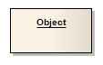
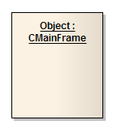

#### <a href="https://sparxsystems.com/enterprise_architect_user_guide/15.1/model_domains/object.html" target="_blank">Object</a> объект

Description

An Object is a particular instance of a Class at run time. For example a car with the license plate AAA-001 is an instance of the general Class of cars with a license plate number attribute. Objects are often used in analysis to represent the numerous artifacts and items that exist in any business, such as pieces of paper, faxes and information. To model the varying behavior of Objects at run-time, use run-time states.

Объект - это конкретный экземпляр класса во время выполнения. Например, автомобиль с номерным знаком AAA-001 является экземпляром общего класса автомобилей с атрибутом номерного знака. Объекты часто используются в анализе для представления многочисленных артефактов и предметов, которые существуют в любом бизнесе, таких как листы бумаги, факсы и информация. Чтобы смоделировать изменяющееся поведение объектов во время выполнения, используйте состояния выполнения.

Early in analysis, Objects can be used to quickly capture all the things that are of relevance within the system domain, in an Object, Composite Structure or Communication diagram. As the model progresses these analysis Objects are refined into generic Classes from which instances can be derived to represent common business items. Once Classes are defined, Objects can be typed; that is they can have a classifier set that indicates their base type - see the Classifiers and Instances topic.

На раннем этапе анализа объекты можно использовать для быстрого захвата всех вещей, которые имеют отношение к системному домену, на диаграмме объекта, составной структуры или коммуникации. По мере развития модели эти объекты анализа преобразуются в общие классы, из которых могут быть получены экземпляры для представления общих бизнес-элементов. После того как классы определены, можно ввести объекты; то есть они могут иметь набор классификаторов, указывающий их базовый тип - см. раздел Классификаторы и экземпляры .

Enterprise Architect also supports a number of stereotyped Object elements to represent various entities in business modeling.

Enterprise Architect также поддерживает ряд стереотипных элементов Object для представления различных сущностей в бизнес-моделировании.

Learn more

<ul>
	<li><a href="https://sparxsystems.com/enterprise_architect_user_guide/15.1/model_domains/model_domains/objectdiagram.html">Object Diagram</a></li>
	<li><a href="https://sparxsystems.com/enterprise_architect_user_guide/15.1/model_domains/model_domains/compositestructurediagram.html">Composite Structure Diagram</a></li>
	<li><a href="https://sparxsystems.com/enterprise_architect_user_guide/15.1/model_domains/model_domains/communicationdiagram.html">Communication Diagram</a></li>
	<li><a href="https://sparxsystems.com/enterprise_architect_user_guide/15.1/model_domains/model_domains/class.html">Class</a></li>
	<li><a href="https://sparxsystems.com/enterprise_architect_user_guide/15.1/model_domains/modeling/objectclassifiers.html">Classifiers and Instances</a></li>
	<li><a href="https://sparxsystems.com/enterprise_architect_user_guide/15.1/model_domains/model_domains/business_interaction.html">Business Modeling/Interaction</a></li>
	<li><a href="https://sparxsystems.com/enterprise_architect_user_guide/15.1/model_domains/model_domains/runtimestate.html">Run-time State</a></li>
	<li><a href="https://sparxsystems.com/enterprise_architect_user_guide/15.1/model_domains/model_domains/defineruntimestate.html">Object State</a></li>
</ul>

Выучить больше
* Диаграмма объекта
* Схема составной структуры
* Схема связи
* Класс
* Классификаторы и экземпляры
* Бизнес-моделирование / взаимодействие
* Состояние выполнения

					<li class="noplus"><a href='https://sparxsystems.com/enterprise_architect_user_guide/15.1/model_domains/runtimestate.html'>Run-time State</a></li>
					<li class="noplus"><a href='https://sparxsystems.com/enterprise_architect_user_guide/15.1/model_domains/defineruntimestate.html'>Object State</a></li></ul>

