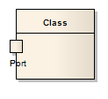

#### <a href="https://sparxsystems.com/enterprise_architect_user_guide/15.1/model_domains/port.html" target="_blank">Port</a>  порт

Description

Ports define the interaction between a classifier and its environment. Interfaces controlling this interaction can be depicted using the Interface element. Any connector to a Port must provide the required interface, if defined. Ports can appear on a contained Part, a Class, or the boundary of a Composite element.

Порты определяют взаимодействие между классификатором и его средой. Интерфейсы, управляющие этим взаимодействием, можно изобразить с помощью элемента Interface. Любой соединитель порта должен предоставлять требуемый интерфейс, если он определен. Порты могут появляться на содержащейся части, классе или границе составного элемента.

A Port is a typed structural feature or property of its containing classifier. Ports are typically created in Class diagrams, Object diagrams and Composite Structure diagrams.

Порт - это типизированная структурная функция или свойство содержащего его классификатора. Порты обычно создаются в диаграммах классов, диаграммах объектов и диаграммах составной структуры .

Toolbox icon

Learn more

<ul>
	<li><a href="https://sparxsystems.com/enterprise_architect_user_guide/15.1/model_domains/model_domains/addingaporttoanelement.html">Add a Port to an Element</a></li>
	<li><a href="https://sparxsystems.com/enterprise_architect_user_guide/15.1/model_domains/model_domains/managinginheritedandredefin.html">Inherited and Redefined Ports</a></li>
	<li><a href="https://sparxsystems.com/enterprise_architect_user_guide/15.1/model_domains/model_domains/the_property_tab.html">The Property Tab</a></li>
	<li><a href="https://sparxsystems.com/enterprise_architect_user_guide/15.1/model_domains/model_domains/compositestructurediagram.html">Composite Structure Diagram</a></li>
</ul>

Выучить больше
* Добавить порт к элементу
* Унаследованные и переопределенные порты
* Вкладка "Свойство"
* Схема составной структуры

OMG UML Specification:
The OMG UML specification (UML Superstructure Specification, v2.1.1, p. 182) states:

A Port is a property of a classifier that specifies a distinct interaction point between that classifier and its environment or between the (behavior of the) classifier and its internal parts. Ports are connected to properties of the classifier by connectors through which requests can be made to invoke the behavioral features of a classifier. A Port may specify the services a classifier provides (offers) to its environment as well as the services that a classifier expects (requires) of its environment.

Спецификация OMG UML:
Спецификация OMG UML (Спецификация надстройки UML, v2.1.1, стр. 182) гласит:

Порт - это свойство классификатора, которое определяет отдельную точку взаимодействия между этим классификатором и его средой или между (поведением) классификатора и его внутренними частями. Порты связаны со свойствами классификатора коннекторами, через которые могут выполняться запросы для вызова поведенческих функций классификатора. Порт может указывать услуги, которые классификатор предоставляет (предлагает) своей среде, а также услуги, которые классификатор ожидает (требует) от своей среды.