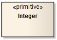

#### <a href="https://sparxsystems.com/enterprise_architect_user_guide/15.1/model_domains/primitive.html" target="_blank">Primitive</a> Примитивный

Description

A Primitive element identifies a predefined data type, without any relevant substructure (that is, it has no parts in the context of UML). It could be regarded as a conceptual Data Type. The Primitive element can be used to support the Meta-Object Facility (MOF) specification.

Toolbox icon

Элемент Primitive идентифицирует предопределенный тип данных без какой-либо соответствующей подструктуры (то есть у него нет частей в контексте UML). Его можно рассматривать как концептуальный тип данных. Элемент Primitive может использоваться для поддержки спецификации Meta-Object Facility (MOF).

Learn more

<ul><li><a href="https://sparxsystems.com/enterprise_architect_user_guide/15.1/model_domains/model_domains/datatypeelem.html">Data Type Element</a> </li><li><a href="https://sparxsystems.com/enterprise_architect_user_guide/15.1/model_domains/model_domains/mof.html">MOF</a>  
</li></ul>

Выучить больше
* Элемент типа данных
* MOF

OMG UML Specification:
The OMG UML specification (UML Superstructure Specification, v2.1.1, p.124) states:

A primitive data type may have an algebra and operations defined outside of UML, for example, mathematically ... The run-time instances of a primitive type are data values. The values are in many-to-one correspondence to mathematical elements defined outside of UML (for example, the various integers). Instances of primitive types do not have identity. If two instances have the same representation, then they are indistinguishable.

Спецификация OMG UML:
Спецификация OMG UML (Спецификация надстройки UML, v2.1.1, стр.124) гласит:

Примитивный тип данных может иметь алгебру и операции, определенные вне UML, например, математически ... Экземпляры примитивного типа во время выполнения являются значениями данных. Значения взаимно однозначно соответствуют математическим элементам, определенным вне UML (например, различным целым числам). Экземпляры примитивных типов не имеют идентичности. Если два экземпляра имеют одинаковое представление, то они неотличимы.
