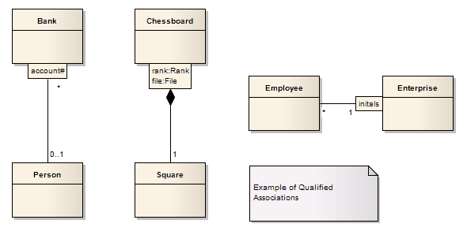

#### <a href="https://sparxsystems.com/enterprise_architect_user_guide/15.1/model_domains/qualifiers.html" target="_blank">Qualifiers</a> Отборочные

Qualifiers are ordered sets of properties of an Association end point, a Part, a Port, or an attribute that limit the nature of the relationship between two classifiers or objects. You define a qualifier on the 'Qualifiers' dialog, which you display by clicking on the  button at the end of the 'Qualifiers' field on the Association, Part, Port or attribute 'Properties' dialog.

Квалификаторы - это упорядоченные наборы свойств конечной точки ассоциации, части, порта или атрибута, которые ограничивают характер связи между двумя классификаторами или объектами. Вы определяете квалификатор в диалоговом окне «Квалификаторы», которое вы открываете, щелкнув кнопку в конце поля «Квалификаторы» в диалоговом окне «Свойства» ассоциации, части, порта или атрибута.

Examples

Notes
* When typing multiple Qualifiers into the 'Qualifier(s)' field on a 'Properties' dialog, separate them with a semi-colon; each Qualifier then displays on a separate line; for example, in the diagram the Qualifier 'rank:Rank;file:File' has been rendered in two lines, with a line break at the ; character
* You can enable or disable Qualifier rectangles in the 'Diagram' page of the 'Preferences' dialog (select the 'Start > Desktop > Preferences > Preferences > Diagram' ribbon option) - if disabled, the old style text Qualifiers are used; it is not recommended that you disable Qualifiers as they are an integral part of the UML
* You can enable or disable a mild shading on the Qualifier rectangles in 
the 'Links' page of the 'Preferences' dialog

Ноты
* При вводе нескольких квалификаторов в поле «Квалификатор (ы)» диалогового окна «Свойства» разделяйте их точкой с запятой; каждый квалификатор затем отображается в отдельной строке; например, на диаграмме квалификатор 'rank: Rank; file: File' представлен в две строки с разрывом строки в точке; персонаж
* Вы можете включить или отключить прямоугольники квалификаторов на странице «Диаграмма» диалогового окна «Настройки» (выберите параметр ленты «Пуск> Рабочий стол> Настройки> Настройки> Диаграмма») - если этот параметр отключен, используются квалификаторы текста в старом стиле; не рекомендуется отключать квалификаторы, поскольку они являются неотъемлемой частью UML.
* Вы можете включить или отключить мягкое затенение прямоугольников квалификатора на странице «Ссылки» диалогового окна «Настройки».

Learn more

<ul>
	<li><a href="https://sparxsystems.com/enterprise_architect_user_guide/15.1/model_domains/model_domains/qualifiers_dialog.html">Qualifiers Dialog</a></li>
	<li><a href="https://sparxsystems.com/enterprise_architect_user_guide/15.1/model_domains/modeling/sourcerole.html">Source Role</a></li>
	<li><a href="https://sparxsystems.com/enterprise_architect_user_guide/15.1/model_domains/model_domains/port.html">Port</a></li>
	<li><a href="https://sparxsystems.com/enterprise_architect_user_guide/15.1/model_domains/model_domains/part.html">Part</a></li>
</ul>

Выучить больше
* Диалог квалификаторов
* Исходная роль
* порт
* Часть
* Атрибут

OMG UML Specification:
The OMG UML specification (UML Superstructure Specification, v2.1.1, p.129) states:

A qualifier declares a partition of the set of associated instances with respect to an instance at the qualified end (the qualified instance is at the end to which the qualifier is attached). A qualifier instance comprises one value for each qualifier attribute. Given a qualified object and a qualifier instance, the number of objects at the other end of the association is constrained by the declared multiplicity. In the common case in which the multiplicity is 0..1, the qualifier value is unique with respect to the qualified object, and designates at most one associated object. In the general case of multiplicity 0..\*, the set of associated instances is partitioned into subsets, each selected by a given qualifier instance. In the case of multiplicity 1 or 0..1, the qualifier has both semantic and implementation consequences. In the case of multiplicity 0..*, it has no real semantic consequences but suggests an implementation that facilitates easy access of sets of associated instances linked by a given qualifier value.

Спецификация OMG UML:
Спецификация OMG UML (Спецификация надстройки UML, v2.1.1, стр.129) гласит:

Квалификатор объявляет секцию набора связанных экземпляров по отношению к экземпляру на квалифицированном конце (квалифицированный экземпляр находится на конце, к которому прикреплен квалификатор). Экземпляр квалификатора содержит одно значение для каждого атрибута квалификатора. Учитывая квалифицированный объект и экземпляр квалификатора, количество объектов на другом конце ассоциации ограничено объявленной множественностью. В общем случае, когда кратность равна 0..1, значение квалификатора уникально по отношению к квалифицированному объекту и обозначает не более одного связанного объекта. В общем случае кратности 0 .. * набор связанных экземпляров разбивается на подмножества, каждое из которых выбирается данным экземпляром квалификатора. В случае кратности 1 или 0..1 квалификатор имеет последствия как для семантики, так и для реализации.

