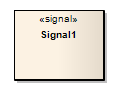

#### [Signal](https://sparxsystems.com/enterprise_architect_user_guide/15.1/model_domains/signal_element.html) сигнал

Description

A Signal is a specification of Send request instances communicated between objects, typically in a Class or Package diagram. The receiving object handles the Received request instances as specified by its Receptions. The data carried by a Send request is represented as attributes of the Signal. A Signal is defined independently of the classifiers handling the signal occurrence.

Сигнал - это спецификация экземпляров запроса отправки, передаваемых между объектами, обычно в диаграмме классов или пакетов. Принимающий объект обрабатывает экземпляры запроса Received, как указано в его приемах. Данные, передаваемые запросом на отправку, представлены в виде атрибутов сигнала. Сигнал определяется независимо от классификаторов, обрабатывающих возникновение сигнала.

A Reception is defined as a feature of the receiving object, derived from the Signal element. The Reception takes the name of the Signal, and the Signal's attributes as its parameters.

Прием определяется как функция принимающего объекта, производная от элемента Сигнал. Прием принимает имя Сигнала и атрибуты Сигнала в качестве своих параметров.

Toolbox icon

Learn more

<ul>
	<li><a href="https://sparxsystems.com/enterprise_architect_user_guide/15.1/model_domains/model_domains/classdiagram.html">Class Diagram</a></li>
	<li><a href="https://sparxsystems.com/enterprise_architect_user_guide/15.1/model_domains/model_domains/packagediagram.html">Package Diagram</a></li>
	<li><a href="https://sparxsystems.com/enterprise_architect_user_guide/15.1/model_domains/modeling/stategroup.html">State Toolbox</a></li>
	<li><a href="https://sparxsystems.com/enterprise_architect_user_guide/15.1/model_domains/model_domains/reception.html">Receptions</a></li>
	<li><a href="https://sparxsystems.com/enterprise_architect_user_guide/15.1/model_domains/model_domains/send.html">Send Element</a></li>
	<li><a href="https://sparxsystems.com/enterprise_architect_user_guide/15.1/model_domains/model_domains/receive.html">Receive Element</a></li>
</ul>

Выучить больше
* Диаграмма классов
* Диаграмма упаковки
* Панель инструментов состояния
* Приемные
* Отправить элемент
* Получить элемент

OMG UML Specification:
The OMG UML specification (UML Superstructure Specification, v2.1.1, p.450) states:

A signal triggers a reaction in the receiver in an asynchronous way and without a reply. The sender of a signal will not block waiting for a reply but continue execution immediately. By declaring a reception associated to a given signal, a classifier specifies that its instances will be able to receive that signal, or a subtype thereof, and will respond to it with the designated behavior.

Спецификация OMG UML:
Спецификация OMG UML (Спецификация надстройки UML, v2.1.1, стр.450) гласит:

Сигнал вызывает реакцию в приемнике асинхронно и без ответа. Отправитель сигнала не будет блокировать ожидание ответа, а немедленно продолжит выполнение. Объявляя прием, связанный с данным сигналом, классификатор указывает, что его экземпляры смогут принимать этот сигнал или его подтип и будут отвечать на него указанным поведением.

And (UML Superstructure Specification, v2.1.1, p.447 - 448):

A reception is a declaration stating that a classifier is prepared to react to the receipt of a signal. A reception designates a signal and specifies the expected behavioral response. The details of handling a signal are specified by the behavior associated with the reception or the classifier itself. ... Receptions are shown using the same notation as for operations with the keyword \<signa\>

И (Спецификация надстройки UML, v2.1.1, стр. 447–448):

Прием - это объявление о том, что классификатор готов отреагировать на получение сигнала. Прием обозначает сигнал и определяет ожидаемую поведенческую реакцию. Детали обработки сигнала определяются поведением, связанным с приемом или самим классификатором. ... Приемы показаны с использованием тех же обозначений, что и для операций с ключевым словом \<signal\>
