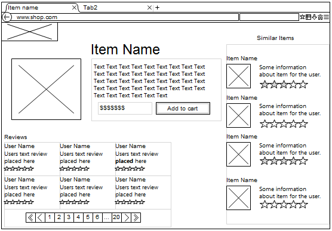

# <a href="https://sparxsystems.com/enterprise_architect_user_guide/15.1/model_domains/wireframe_for_website_modeling.html" target="_blank">Wireframe Models</a> Каркасные модели

The Wireframe Toolbox pages provide a wide range of icons that you can use in wireframe modeling to represent the appearance of a device at a particular point in the execution of an application. Devices you can model include:

* Android Phones and Tablets
* Apple iPhones and Tablets
* Windows 8.1 Phones
* Screen dialogs
* Web pages - to model how the web pages work

Wireframe Modeling

This collection of images shows a variety of wireframing controls.

Каркасное моделирование

В этой коллекции изображений показаны различные элементы управления каркасом.

Access

On the Diagram Toolbox, click  on Search to display the 'Find Toolbox Item' dialog and specify 'Wireframing', 'Android', 'Apple', 'Dialog', 'Windows Phone' or 'Webpage'.

| Ribbon                                   | Design &gt; Diagram &gt; Toolbox         |
|------------------------------------------|------------------------------------------|
| 
Keyboard Shortcuts
 | 
Ctrl+Shift+3
 |

доступ

На панели инструментов диаграммы нажмите, Поиск  чтобы отобразить диалоговое окно «Найти элемент панели инструментов», и укажите «Каркас», «Android», «Apple», «Диалог», «Windows Phone» или «Веб-страница».

| лента                                    | Дизайн&gt; Схема&gt; Панель инструментов |
|------------------------------------------|------------------------------------------|
| 
Горячие клавиши
 | 
Ctrl + Shift + 3
 |

Notes

* Each of the Wireframing Diagram Toolboxes provides one or more Patterns that you can drag onto a diagram as an illustration of what you might achieve, or to act as the basis of the model you are developing
* The 'Properties' dialog for Wireframe elements automatically opens to either a top-level 'Wireframe' tab on which you can edit the element rendering directly, or a second-level 'Wireframing' Tagged Values tab if you define the element rendering by editing the XML for the properties of that element type
* Some of the elements you create from the 'Wireframe' Toolbox pages are properly rendered after you edit the Tagged Values that define their characteristics
* As you develop your Interface diagrams you can establish the positions and layout of the elements freehand by dragging and 'nudging' the elements, or impose some regularity using the 'Snap To Grid' diagram options

Ноты
* Каждый из наборов инструментов каркасной диаграммы предоставляет один или несколько шаблонов, которые вы можете перетащить на диаграмму в качестве иллюстрации того, чего вы можете достичь, или в качестве основы модели, которую вы разрабатываете.
* Диалоговое окно «Свойства» для элементов каркаса автоматически открывается либо на вкладке верхнего уровня «Каркас», на которой вы можете напрямую редактировать визуализацию элемента, либо на вкладке «Значения с тегами« Каркас »второго уровня, если вы определяете визуализацию элемента путем редактирования XML для свойств этого типа элемента
* Некоторые из элементов, которые вы создаете на страницах панели инструментов "Каркас", правильно отображаются после редактирования значений с тегами, определяющих их характеристики.
* По мере разработки диаграмм интерфейса вы можете определять положения и компоновку элементов от руки, перетаскивая и «подталкивая» элементы, или налагать некоторую регулярность, используя параметры диаграммы «Привязка к сетке».

Learn more

<ul>
	<li><a href="../model_domains/webpage_wireframe_toolbox.html">Webpage Wireframe Toolbox</a></li>
	<li><a href="../model_domains/apple_wireframe_toolbox.html">Apple iPhone/Tablet Wireframe Toolbox</a></li>
	<li><a href="../model_domains/windowsphone_wireframetoolbox.html">Windows Phone Wireframe Toolbox</a></li>
	<li><a href="../model_domains/android_wireframe_toolbox.html">Android Wireframe Toolbox</a></li>
	<li><a href="../model_domains/dialog_wireframe_toolbox.html">Dialog Wireframe Toolbox</a></li>
	<li><a href="../user_interface/diagrambehavoir.html">Diagram Behavior Options</a></li>
	<li><a href="../modeling/move_diagram_sections-alt_keys.html">Move Elements In Diagram Sections</a></li>
</ul>

Выучить больше

* Панель инструментов каркаса веб-страницы
* Панель инструментов Apple iPhone / Tablet Wireframe
* Набор инструментов Windows Phone Wireframe
* Панель инструментов Android Wireframe
* Панель инструментов каркаса диалогового окна
* Параметры поведения диаграммы
* Перемещение элементов в разделах схемы

