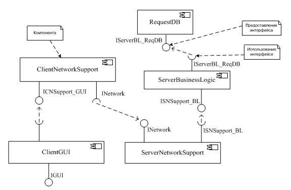

<!-- Start Document Outline -->

* [Введение в UML 2.0](#введение-в-uml-20)
	* [Типы диаграмм UML](#типы-диаграмм-uml)
	* [Система &quot;Телефонная служба приема заявок&quot;](#система-телефонная-служба-приема-заявок)
	* [Диаграммы случаев использования (use case diagrams)](#диаграммы-случаев-использования-use-case-diagrams)
	* [Диаграммы активностей (activity diagrams)](#диаграммы-активностей-activity-diagrams)
	* [Диаграммы развертывания (deployment diagrams)](#диаграммы-развертывания-deployment-diagrams)
	* [Диаграммы компонент (component diagrams)](#диаграммы-компонент-component-diagrams)
	* [Диаграммы коммуникаций (communication diagrams)](#диаграммы-коммуникаций-communication-diagrams)
	* [Диаграммы последовательностей (sequence diagrams)](#диаграммы-последовательностей-sequence-diagrams)
	* [Временные диаграммы (timing diagrams)](#временные-диаграммы-timing-diagrams)
	* [Диаграммы схем взаимодействия (interaction overview diagram)](#диаграммы-схем-взаимодействия-interaction-overview-diagram)
		* [Контрольные вопросы](#контрольные-вопросы)
* [Иерархия метаописаний. Точка зрения моделирования Граф-модели и диаграммы](#иерархия-метаописаний-точка-зрения-моделирования-граф-модели-и-диаграммы)
	* [Предметная область, модель, метамодель, метаметамодель](#предметная-область-модель-метамодель-метаметамодель)
		* [Предметная область (domain)](#предметная-область-domain)
		* [Множество моделей ПО](#множество-моделей-по)
		* [Граф-модели и диаграммы](#граф-модели-и-диаграммы)
		* [Об операциях над графом модели и диаграммами](#об-операциях-над-графом-модели-и-диаграммами)
			* [Контрольные вопросы](#контрольные-вопросы-1)

<!-- End Document Outline -->

http://bourabai.kz/dbt/uml/index.htm

# Введение в UML 2.0
(по Д.В. Кознову)

## Типы диаграмм UML
UML (Unified Modeling Language) версии 2.0 является на данный момент самым распространенным и общеизвестным способом моделирования сложных проектов, в том числе банков данных, баз данных, сетевом планировании, алгоритмизации в процессе разработки программного обеспечения.

"Скелетом" представленного здесь UML-экскурса является диаграммная структура UML. Его авторы выделяют следующие типы диаграмм (diagram types) (см. рис. 3.1):

Структурные диаграммы:
* диаграммы классов (class diagrams) предназначены для моделирования структуры объектно-ориентированных приложений - классов, их атрибутов и заголовков методов, наследования, а также связей классов друг с другом;
* диаграммы компонент (component diagrams) используются при моделировании компонентной структуры распределенных приложений; внутри каждая компонента может быть реализована с помощью множества классов;
* диаграммы объектов (object diagrams) применяются для моделирования фрагментов работающей системы, отображая реально существующие в runtime экземпляры классов и значения их атрибутов;
* диаграммы композитных структур (composite structure diagrams) используются для моделирования составных структурных элементов моделей - коопераций, композитных компонент и т.д.;
* диаграммы развертывания (deployment diagrams) предназначены для моделирования аппаратной части системы, с которой ПО непосредственно связано (размещено или взаимодействует);
* диаграммы пакетов (package diagrams) служат для разбиения объемных моделей на составные части, а также (традиционно) для группировки классов моделируемого ПО, когда их слишком много.

Поведенческие диаграммы:
* диаграммы активностей (activity diagrams) используются для спецификации бизнес-процессов, которые должно автоматизировать разрабатываемое ПО, а также для задания сложных алгоритмов;
* диаграммы случаев использования(use case diagrams) предназначены для "вытягивания" требований из пользователей, заказчика и экспертов предметной области;
* диаграммы конечных автоматов (state machine diagrams) применяются для задания поведения реактивных систем;
* диаграммы взаимодействий (interaction diagrams):

    * диаграммы последовательностей (sequence diagrams) используются для моделирования временных аспектов внутренних и внешних протоколов ПО;
    * диаграммы схем взаимодействия (interaction overview diagrams) служат для организации иерархии диаграмм последовательностей;
    * диаграммы коммуникаций (communication diagrams) являются аналогом диаграмм последовательностей, но по-другому изображаются (в привычной, графовой, манере);
    * временные диаграммы (timing diagrams) являются разновидностью диаграмм последовательностей и позволяют в наглядной форме показывать внутреннюю динамику взаимодействия некоторого набора компонент системы.

На рис. 3.1 не все узлы обозначают типы диаграмм - некоторые изображают лишь группы диаграмм, например, "Структурные", "Поведенческие", "Взаимодействий".

Рис. 3.1.  Типы диаграмм UML 2.0
Отметим новые типы диаграмм, которые появились в UML 2.0 по сравнению с версией 1.5:

* диаграммы композитных структур (composite structure diagrams) - сюда, фактически, вошло два типа диаграмм: (i) коопераций (при этом кооперации UML 1.5 были сильно расширены); (ii) сложных компонент, созданных на базе компонент языка ROOM [3.5];
* диаграммы схем взаимодействий (interaction overview diagrams) - прообразом этого типа диаграмм явились диаграммы MSC overview [3.6];
* диаграммы коммуникаций (communication diagrams) - это упрощенный вариант диаграмм коопераций UML 1.5 ;
* временн ы е диаграммы (timing diagrams) - это новый тип диаграмм, предназначенный для наглядного изображения потока изменения состояний нескольких объектов.

Оставим в стороне тот факт, что английские названия некоторых типов диаграмм изменились, скажу лишь несколько слов о русскоязычной UML -терминологии. К сожалению, она не является устоявшейся: так, "use case" переводят то как "вариант использования", то как "случай использования" или даже просто как "использование", "deployment" - то как "размещение", то как "развертывание", "state machine (statechart)" - то как "состояния и переходы", то как "конечные автоматы" и т. д. На всякий случай для всех терминов в тексте дается исходное, англоязычное название. Будем надеяться, что у читателя не возникнет в голове безнадежной терминологической путаницы.

Описание нотации UML структурировано по разным типам диаграмм, хотя они и не являются строго обязательными. Различные конструкции языка можно вставлять в разнотипные диаграммы. Например, экземпляры классов можно изображать на одной диаграмме с самими классами, и пакеты также могут показываться на диаграммах классов. Таким образом, границы между различными типами диаграмм размываются. Создание диаграмм того или другого типа - всего лишь наиболее устоявшийся, традиционный способ использования UML, не исключающий, однако, и других вариантов.

## Система "Телефонная служба приема заявок"
В дальнейшем в качестве примера будет использоваться система "Телефонная служба приема заявок". Далее будут приведены фрагменты этой системы, изображенные с помощью различных UML -диаграмм. Эти примеры будут снабжены некоторыми "сюжетами" - гипотетическими ситуациями процесса разработки, в которых могла появиться необходимость в создании этих диаграмм. Разумеется, приводимые сюжеты далеко не единственные, даже в рамках разработки данной системы. Но они нужны, чтобы с первых же шагов при знакомстве с UML не появлялось чувство пустоты, подвешенных в воздухе иллюстраций.

Часть примеров будет на русском языке, а часть - на английском (это касается всех дальнейших примеров, а не только тех, которые относятся к телефонной службе приема заявок). Если диаграммы связаны с программным кодом, то есть моделируют какие-либо его абстракции (классы, таблицы баз данных, компоненты и пр.), то используется англоязычная терминология - названия модельных сущностей должны быть идентификаторами в программном коде. Если же такого нет, то при именовании используется обычный русский язык.

Итак, заказчик данной системы - это компания, владеющая сетью продуктовых магазинов. Данная компания, кроме обычной розничной торговли, хочет предоставлять еще и сервис по обслуживанию клиентов по телефонным заявкам. Клиент регистрируется в компании, а потом по телефону, в удобное для себя время, делает заказ товаров, которые к нему привозят домой, и он расплачивается. Для этого компания хочет организовать у себя локальный телефонный центр, состоящий из офисной многоканальной АТС, штата операторов и соответствующего программного обеспечения. При этом в компании уже есть информационная система по обработке заявок от постоянных мелкооптовых клиентов, и заказываемая система должна быть с ней проинтегрирована.

## Диаграммы случаев использования (use case diagrams)
Первым шагом по реализации описанной выше задачи является уточнение требований. Для этого можно применить диаграммы случаев использования UML. Пример такой диаграммы представлен на рис. 3.2.

Рис. 3.2.  Пример диаграммы случаев использования
На ней обозначено следующие виды пользователей - оператор, менеджер и представители технической поддержки. Система должна также поддерживать внешний интерфейс с системой обработки заявок. Это - четвертый пользователь. Еще одним пользователем системы является Петров А.Б. - директор департамента сбыта товаров, который хочет периодически отслеживать деятельность телефонной службы приема заявок. Для него создано специальное пользовательское место с экранными формами статистики. Случаи использования с рис. 3.2. комментировать не будем, считая, что и так все понятно из картинки.

Различные пользователи ПО, изображаемые на диаграммах случаев использования, назваются актерами (actors). Актеры могут обозначать:

* типовых пользователей ("Менеджер", "Оператор", "Техническая поддержка") - работников компании, сгруппированных по исполняемым обязанностям;
* другие системы, взаимодействующие с данной ("Система обработки заявок");
* выделенного пользователя ("Петров А.Б.").

Отметим, что выделенный пользователь существенно отличается от типового пользователя. Он, как правило, Важная Персона, и согласование функциональности для него согласуется лично с ним. Часто он влияет на оплату проекта, от его мнения о системе, во многом, зависит ее успешная сдача. Такие персоны, ради успеха проекта, нужно уметь идентифицировать и в рамках всей системы создавать некоторую функциональность специально для них и очень при этом стараться!

Случай использования (use case) - это независимая часть функциональности системы, обладающая результирующей ценностью для ее пользователей.

"Независимость" означает, что если случай использования всегда исполняется вместе с некоторым другим, то, по всей видимости, один из них нужно включить в другой (какой именно в какой, как назвать получившийся в итоге случай использования - зависит от обстоятельств).

"Результирующая ценность" случая использования для актера системы подразумевает, что он, данный случай использования, должен приносить актеру некоторый законченный и ценный с точки зрения его бизнеса результат. Будучи реализован системой, этот случай использования действительно делает бизнес актера эффективнее, производительнее. Тем самым разработка системы фокусируется на бизнес-целях, а незначительные случаи использования игнорируются. Строится не абстрактная модель функций системы, а набор самых важных (для заказчика и пользователей) сервисов, чтобы каждый из них правильно понять и не один не упустить. И в дальнейшем контроль разработки системы будет осуществляться именно в терминах этого самого важного - того, что нужно заказчику и пользователям.

Казалось бы, что может быть проще - реализовать набор функций, необходимых пользователю. Однако на деле программный проект может незаметно потерять эту цель. Вместо этого можно, например, очень долго заниматься разработкой сложной и многофункциональной архитектуры, после реализации которой разработчики обещают, что все пользовательские функции получатся почти сразу же и очень легко. Однако, как правило, оказывается, что это "сразу же" было сильным преувеличением и проект весьма выбивается из расписания, а многие заказанные пользователем функции в этом окружении сделать тяжело или невозможно. Бывает, что чрезмерная ориентация на "внутреннее совершенство" ПО оканчивается для проекта либо крупными неприятностями, либо полным крахом. Однако бывают и другие случаи, когда только такая ориентация впоследствии и спасает проект. Последнее случается, когда система долго развивается и сопровождается, или когда требования к ней внезапно и сильно меняются, или когда на ее основе делаются другие системы. Необходим баланс между внутренним совершенством программного обеспечения и функциональностью, нужной для заказчика и доставленной ему в срок. Разработка в терминах случаев использования - хороший способ контролировать, что процесс создания системы двигается в нужном направлении.

Итак, основной задачей диаграмм случаев использования является получение требований к системе от заказчика и пользователей. Трудность формализации требований связана с тем, что пользователи и заказчики, с одной стороны, а программисты - с другой, являются специалистами в совершенно разных областях. Первым очень не просто понять логику программной разработки и отделить существенное от несущественного, изъясняться ясно и точно. Вторым трудно разобраться в новой для них предметной области и адекватно отразить это свое понимание в программной системе. К тому же программные системы очень часто являются уникальными. Поэтому набор пожеланий заказчика и пользователей нуждается в дополнительной обработке, освобождению от противоречий, коррекции и, наконец, интеграции, дабы стало возможным "покрыть" его некоторой программной системой. Привлекательность и эффективность диаграмм случаев использования заключается в том, что они просты для понимания непрограммистами и в то же время достаточно формальны.

Отметим, что сами по себе случаи использования не гарантируют того, что программисты и заказчик адекватно понимают друг друга - они могут по-разному трактовать эти случаи использования. Однако в первом приближении масштаб и границы системы очерчены. Для того чтобы детализировать случаи использования, может применяться обычный текст (по одному абзацу на каждый случай использования) и/или другие диаграммы UML.

Существует два вида принципиально разных диаграмм случаев использования - для ПО и для всей системы в целом. Ведь, как правило, ПО является частью более крупной системы. Последняя может включать другое ПО, а также некоторый бизнес-процесс. Пользователями такой системы будут различные клиенты системы (бизнес-актеры), поскольку система создается именно для них. А сама система будет предоставлять для них бизнес-случаи использования. Пример диаграммы бизнес-случаев использования для системы обработки телефонных заявок показан на рис. 3.3.

Рис. 3.3.  Пример диаграммы бизнес-случаев использования
На этом рисунке можно увидеть трех различных клиентов этой системы - постоянного клиента, нового клиента и задающего вопросы (случайного человека, интересующегося услугами магазина, наличием того или иного товара). В общем, для каждого типа клиентов система должна предоставлять разный сервис: для первого типа клиента - возможность сделать заказ (с внесением в базу данных имени клиента, товара, который он заказал, его цены и сроков доставки), для второго - возможность зарегистрироваться (оператор спрашивает у него фамилию, имя, отчество, адрес и пр., персональную информацию и вносит ее в компьютер), для третьего - возможность отвечать на разные вопросы (возможно, со специальными справочниками товаров и пр.). Причем эти актеры наследуют один от другого именно в том порядке, который указан на диаграмме. При наследовании актеров потомок "получает в наследство" все случаи использования своих предков. Таким образом, каждый из этих клиентов может задавать вопросы, а новый клиент, после того как зарегистрировался, может сделать заказ.

Этих бизнес-клиентов можно было бы изобразить и на рис. 3.2, соединив стрелками с оператором (ведь именно через него они взаимодействуют с системой). Но такая диаграмма может вызвать недоумение, хотя некоторые аналитики склонны так делать. Я считаю, что бизнес-актеров лучше изображать на отдельной диаграмме, а на обычной диаграмме случаев использования показывать только пользователей ПО.

## Диаграммы активностей (activity diagrams)
С их помощью удобно изображать бизнес-процессы - алгоритмы, по которым работает компания. Именно в эти алгоритмы должна встроиться информационная система, автоматизировав некоторую их часть. В данном случае в компании должен быть создан новый бизнес-процесс по телефонной обработке заявок. Заказчик как-то себе представляет этот будущий процесс. Перед началом разработки системы необходимо уточнить алгоритм работы этой новой службы. На рис. 3.4 показана общая схема работы оператора с клиентом.

Рис. 3.4.  Пример диаграммы активностей
Программистам полезно ясно представлять себе все бизнес-процессы компании, которые будут затронуты их новой системой. В данном случае у компании еще есть бизнес-процесс обработки заявок, который уже работает и есть у заказчика, и его также нужно понять. Иначе может оказаться, что упущена какая-то важная деталь, которая не позволяет новой системе полноценно выполнять свои функции. Например, может оказаться, что подсистема обработки заявок, с которой должна интегрироваться создаваемая система, реализована… на макросах к Word/Excel! Очевидно, интегрироваться с такой системой весьма затруднительно. На этот и подобные факты необходимо указать заказчику как можно раньше, так как иначе проект может закончиться неуспешно - заказчик потратит деньги и не получит нужных для своего бизнеса сервисов.

Итак, главной сущностью этого типа диаграмм является активность (activity) - активное состояние системы, в котором она выполняет некоторую работу. После ее завершения происходит переход в другую активность. Возможны и более сложные случаи переходов между активностями. Например, переход по событию.

На диаграмме должны присутствовать символы начала (start) и конца (finish).

Далее, на диаграмме может использоваться параллельный разветвитель (fork), который запускает несколько одновременно работающих веток. Такие ветки могут объединяться (все или только часть) конструкцией под названием параллельный соединитель (join).

Наконец, на диаграмме могут использоваться символы логического ветвления и логического соединения (decision). На ветках, идущих из логического ветвления, обозначаются условия перехода.

## Диаграммы развертывания (deployment diagrams)
Теперь настало время в первом приближении определить будущую систему изнутри. Начнем с диаграмм развертывания, которые предназначены для описания аппаратной части системы.

На рис. 3.5, а показано, что телефонная служба приема заявок будет состоять из офисной телефонной станции ( PBX - Public Branch Exchange), сервера, телефонных аппаратов и клиентских компьютеров. На этом рисунке представлена диаграмма развертывания в одном из двух возможных в UML видов - в описательном. На ней определены типы аппаратных узлов системы, а между ними - ассоциации с пометками множественности (см. описание диаграмм классов).

На рис. 3.5, б приведена диаграмма развертывания в экземплярном варианте. Показан тестовый вариант системы, который, кроме сервера и PBX, содержит один пользовательский компьютер для тестирования взаимодействия сервера и клиента и один клиентский компьютер вместе с телефонным аппаратом для тестирования связи клиента с сервером и PBX. Два клиентских компьютера нужны, чтобы тестировать работу ПО в случае более чем одного клиента (при переходе от одного к двум начинают появляться многочисленные ситуации, которые не проявлялись ранее). Большее количество клиентов - три, десять и т. д. - не принципиально на первых стадиях тестирования и отладки.

Описательный и экземплярный виды диаграмм развертывания соотносятся между собой, также, как диаграммы классов и диаграммы объектов.

Таким образом, на диаграммах развертывания показываются узлы (nodes) - элементы аппаратуры, которые также входят в целевую систему, наравне с программным обеспечением. На части этих узлов и развертывается программное обеспечение системы. В рассматриваемом примере такими узлами являются клиентский компьютер и сервер запросов. Кроме того, на диаграммах развертывания могут быть показаны и другие виды узлов - элементы аппаратуры, с которым ПО лишь взаимодействует, например, PBX или телефонный аппарат. Данный тип диаграмм не предназначен для подробного описания аппаратной части системы, а позволяет моделировать только ту часть оборудования, которая прямо или косвенно связана с ПО системы. Например, в данном случае в целевую систему может входить дополнительное сетевое оборудование - переключатели (так называемые "хабы") и т. д. Для подробной спецификации всего этого целесообразно использовать не UML, а средства классического инженерного проектирования.

Построение инженерных чертежей на сегодняшний день также компьютеризировано. Самыми распространенными программными продуктами здесь являются пакеты AutoCAD, Microsoft Visio и др.

Рис. 3.5.  Примеры диаграммы развертывания
Диаграммы развертывания могут использоваться, например, как приложение к техническому заданию, а также при обсуждении цен на различные офисные АТС, телефонные аппараты и компьютеры. Такую диаграмму может нарисовать менеджер проекта перед тем, как начать обсуждение архитектуры системы с разработчиками. Эта диаграмма может лежать на столе во время первых таких обсуждений, пока не родилось ничего более конкретного, что также можно нарисовать. Такое "начало от аппаратуры" часто является хорошим стартом проекта, поскольку именно в терминах аппаратуры для многих программно-аппаратных систем формируется существенная часть их функциональных требований: ПО должно уметь управлять таким-то оборудованием в таких-то режимах и т. д. Наконец, диаграмма развертывания может давать хороший обзор всей системы, доступный для непрограммистов (особенно в составе Power-Point презентации с устными пояснениями), поскольку содержит минимум программистских деталей.

## Диаграммы компонент (component diagrams)
При обсуждении архитектуры системы, в качестве следующего промежуточного результата, может появиться диаграмма, приведенная на рис. 3.6.

Рис. 3.6.  Пример диаграммы компонент
Это - диаграмма компонент UML. На этих диаграммах представляются компоненты (components) - независимые модули ПО, скрывающие свою реализацию и взаимодействующие друг с другом через интерфейсы.

Независимость компонент выражается в следующем.

* Они реализуют существенно различную функциональность системы. Например, модуль ClientGUI реализует пользовательский интерфейс рабочего места оператора, модули ClientNetworkSupport и ServerNetworkSupport - поддержку сетевого взаимодействия между клиентом и сервером, модуль ServerBusinessLogic - бизнес-логику сервера, а модуль RequestDB отвечает за взаимодействие с базой данных заявок и синхронизацию с системой обработки заявок.
* Каждый такой модуль независим с точки зрения физической организации - его реализация скрыта от окружения, все его взаимодействие с окружением происходит по строго определенным правилам, а сам он часто оказывается независимым бинарным файлом (например, DLL-файлом).
* Возможна также независимость периода исполнения - каждая из компонент может находиться или на отдельном компьютере, или в отдельном процессе операционной системы, или работать в контексте отдельной нити (thread).
* Наконец, разработку каждого такого модуля можно поручить отдельному разработчику или команде разработчиков, то есть с помощью компонент организовать разделение коллектива программистов.

В силу своей независимости, а также необходимости взаимодействия, компоненты имеют интерфейсы (interfaces), позволяющие компонентам скрыть их внутреннее устройство и предоставить вовне определенный способ обращения к своим функциям.

Предоставляемый интерфейс на диаграммах UML изображается маленьким кружочком, который соединен обычной линией со своей компонентой. Использование интерфейса показывается пустой чашечкой, которая соединена обычной линией с компонентой и пунктирной линией с "потребляемым" интерфейсом.

Понятие компоненты является очень емким, и однозначного, точного определения для него не существует. Неоднозначность возникает не столько в связи с разночтениями исследователей, сколько в связи с распространением различных технологий и средств программирования, использующих это понятия и по-разному его трактующих.

Самыми распространенными являются компонентные технологии - JavaBeans, EJB, CORBA, DCOM, .Net, web-сервисы и др. Они позволяют создавать распределенные системы, которые, в связи с распространением Интернета, оказываются одним из основных направлений современного программирования. Различные определения понятия компоненты, дискуссию и более глубокое обсуждение данного вопроса можно найти в [3.8].

Информация, представленная на диаграмме с рис. 3.6, может со временем меняться: интерфейсы уточняются, добавляются новые компоненты, существующие разбиваются на более мелкие и т. д. Диаграммы компонент проекта целесообразно поддерживать в актуальном состоянии, (имея в виду итеративность разработки и внесение в проект всяких изменений), поскольку компонентное представление системы часто является ядром ее архитектуры. А иметь корректное и компактное описание архитектуры всегда полезно, с помощью такого описания легче следить за изменениями в проекте и удерживать всю картину целиком.

Но поддержка актуальности каких-либо UML-диаграм, может оказаться непростым делом. Как правило, в начале все просто, концептуально, красиво. Потом - все разваливается на большое число деталей, да и сроки "поджимают" - нужно, чтобы работало. Вследствие этого целостность архитектуры ПО "уходит" из фокуса внимания разработчиков, а поддержка соответствующих UML-диаграмм "забрасывается". Однако есть такое правило - если нельзя ясно и кратко выразить главное в какой-либо сложной деятельности, значит, либо мы делаем что-то не то, либо то, но не так. В данном случае имеет смысл поддерживать актуальность именно этой диаграммы, поскольку она является одной из основных спецификаций архитектуры ПО телефонной службы приема заявок.

Еще один важный аспект системы, изображенный на этой диаграмме - интерфейсы компонент. Их нужно прорабатывать особенно тщательно и вовремя, поскольку если приложение разрабатывается разными рабочими группами, распределенными географически, то запоздалое согласование интерфейсов может потребовать серьезных модификаций в уже написанном коде.

На рис. 3.7 представлена диаграмма, показывающая, каким образом компоненты телефонной службы приема заявок распределяются по аппаратной части системы.

Рис. 3.7.  Пример размещения компонент на диаграммах развертывания
Отметим, что описание типов узлов диаграмм развертывания производится на описательном, а не на экземплярном уровне.

Заметим, что именно диаграмма с рис. 3.6 является "кандидатом в долгожители" в процессе разработки, поскольку лаконична и не содержит лишней информации. То, какие именно компоненты располагаются на сервере, а какие на клиенте - не очень важная деталь здесь, поскольку система не очень большая, все это и так помнят. Кроме того, факт распределения компонент по аппаратуре не является здесь предметом изменений, как в более сложной системе, где существует несколько разных серверов, клиенты различных типов и т. д. Диаграмма с рис. 3.7 является, скорее, "разовой" и полезна для какого-либо отчета, для разговоров с заказчиком и т. д.

## Диаграммы коммуникаций (communication diagrams)

Продолжим разговор об отдельных деталях работы будущей системы, начатый в предыдущем разделе. В разные моменты разработки (не только при проектировании) может понадобиться прояснение определенных деталей работы системы, в особенности, деталей, находящихся на стыках различных компонент, разрабатываемых различными членами проектной команды или рабочими группами. Побудительные причины для выяснения этих деталей могут быть различными. Например, разработчики одной из компонент вдруг обнаруживают, что они не понимают того контекста, в котором будет работать их компонента. Или тестировщики находят ошибки, относительно которых автор каждой из компонент, задействованных в этом стыке, утверждает, что она работает правильно. Во всех этих ситуациях целесообразно собрать совещание с присутствием всех заинтересованных сторон. При этом самый заинтересованный - тестеровщик, менеджер, автор компоненты, у которого возник вопрос и т. д. - готовит гипотезу того, как все должно происходить. И эту гипотезу имеет смысл нарисовать в виде UML-диаграммы. В данном случае целесообразно использовать диаграммы коммуникаций.

На рис. 3.8 изображается, как выглядит ситуация поступления в систему звонка от клиента. Эта диаграмма может быть полезной в случае, если нужно определить, как информация о звонке распространяется через компоненты ПО, какие процессы при этом происходят в его различных частях и какие данные передаются.

Звонок от клиента приходит на офисную АТС, оттуда уходит на телефонный аппарат свободного оператора и на сервер. От сервера через локальную сеть этот звонок приходит на клиентское ПО того же оператора.

Из этой диаграммы становится понятно, что PBX должен передавать серверу вместе с информацией о звонке еще также информацию и об операторе, с которым он прокоммутировал этого клиента. Ведь сервер должен послать информацию о новом звонке на клиентское ПО именно этого оператора. Получая информацию о звонке, клиентское ПО автоматически открывает оператору специальный диалог, в который тот вводит информацию о звонке прямо во время разговора с клиентом. Еще один важный момент, который следует из этой диаграммы: телефонный звонок на аппарате оператора должен прозвенеть одновременно (или почти одновременно) с появлением на его мониторе диалогового окна для внесения информации о звонке. Все эти вопросы удобно обсуждать на фоне этой диаграммы, хоть на ней и нет всей нужной информации.

На диаграммах коммуникаций изображается взаимодействие ролей классов, компонент, а не конкретные экземпляры. Роли будут подробно обсуждаться в лекции о моделировании систем реального времени. Однако отметим здесь, что роль - более общее понятие, чем объект (экземпляр), и является гнездом, куда могут быть вставлены различные объекты. В синтаксисе UML имена ролей обозначаются без подчеркивания, а имена экземпляров - с подчеркиванием.

Диаграммы коммуникаций могут использоваться для пояснения кооперации, композитной компоненты или другого композитного объекта (про различные композитные объекты см. следующую лекцию). Поэтому в ней и используются роли, а не объекты. Имя этого композитного объекта указывается в заголовке диаграммы. Там же, в заголовке, используется тег comm для обозначения диаграммы коммуникаций.

Рис. 3.8.  Пример диаграмм коммуникаций
## Диаграммы последовательностей (sequence diagrams)
Обратимся теперь к временным свойствам алгоритмов работы системы приема телефонных заявок. Для этого в UML есть диаграммы последовательностей (и еще временные диаграммы, рассматриваемые ниже). Пример такой диаграммы представлен на рис. 3.9.

Рис. 3.9.  Пример диаграммы последовательностей
Данная диаграмма сфокусирована на действиях оператора клиентского ПО. Во-первых, на ней явно изображено, что два события - звонок оператору по телефону и появление диалога для внесения информации о звонке на дисплее оператора - должны происходить одновременно. Это "одновременно" может впоследствии доставить много хлопот, поскольку необходимо будет тестировать это требование в условиях, идентичных условиям заказчика, - в его локальной сети, с тем быстродействием, которое она может обеспечивать, с определенным количеством одновременно работающих в сети операторов и т. д. И понятно, что в этой ситуации ПО должно соревноваться по скорости с процессом коммутации в PBX. Вполне возможно, что телефонный аппарат будет звонить существенно раньше, чем соответствующая экранная форма появится на экране оператора, и это может оказаться весьма неудобным. Значит, нужно "убыстрять" обработку звонка сервером ПО. При этом то или иное быстродействие может потребовать существенно разной реализации серверных компонент, поэтому разумно озаботиться этой проблемой заранее. Создание диаграмм последовательностей помогает на этапе проектирования заметить и не забыть о подобных местах в алгоритмах. Программистам рекомендуется преодолеть нетерпеливость и потратить время на прорисовывание различных деталей архитектуры перед началом программирования, а также во время оного, приступая к новому этапу работы. Вроде бы и так все понятно, но предварительное обдумывание с фиксацией решений с помощью диаграмм, обсуждение этих диаграмм с коллегами может предотвратить ошибки, которые, будучи допущенными, потребуют существенных больших усилий на исправление, много превышающих те, что были потрачены на проектирование.

На диаграммах последовательностей, так же как и на диаграммах коммуникаций, показываются роли классов. Фактически, на обоих диаграммах представлена одна и та же информация, но в разных видах. На диаграммах последовательностей она показана с точки зрения временного аспекта, на диаграммах коммуникаций – с точки зрения отношений взаимодействующих частей (то есть здесь яснее выражен структурный аспект). Можно сказать, что диаграмма последовательностей является двойником диаграмм коммуникаций.

## Временные диаграммы (timing diagrams)
Этот тип диаграмм является разновидностью диаграмм последовательностей и предназначен для наглядного изображения потока изменения состояний нескольких ролей (классов, компонент1) ). Последние изображаются не вертикально, а горизонтально, и основной упор делается на наглядное изображение их состояний, точнее, того, как они меняются во времени. Такая возможность полезна, например, при моделировании встроенных систем.

Рис. 3.10. Пример временной диаграммы
На рис. 3.10 показан фрагмент работы системы AccessControl, которая управляет открытием/блокированием двери в помещение по предъявлению человеком электронного ключа. На рисунке показано три компоненты этой системы. Первая, panel, является устройством, у которого есть дисплей для отображения текущего состояния всей системы и устройство считывания электронного ключа. Исходно panel находится в состоянии locked (соответствующая надпись отображается и на дисплее). После того как человек приложил к этому устройству электронный ключ и устройство считало с него информацию, panel посылает эту информацию в виде сообщения verify второй компоненте - процессору ( access_processor ) - и переходит в состояние waiting. Процессор до получения сообщения verify находится в состоянии idle, а после получения этого сообщения он переходит в состояние verifying. После успешного окончания проверки данных электронного ключа процессор посылает компонентам panel и door сообщения unlock и переходит в состояние enable. Компонента panel переходит в состояние open. Третья компонента, door (собственно, сама дверь), до этого находилась в состоянии locked и, получив сообщение unlock, открывается (переходит в состояние unlock ). Открытой она остается ровно 5 секунд, после чего процессор присылает ей команду lock и она закрывается - снова переходит в состояние locked. Одновременно процессор посылает команду lock также и компоненте panel, которая переходит в свое исходное состояние locked и отображает слово "locked" на дисплее.

Видно, что на временных диаграммах, так же как на диаграммах последовательностей и коммуникаций, показываются только главные ветки алгоритмов, а ветвления отсутствуют. Компоненты и их состояния откладываются по оси ординат, время - по оси абсцисс. Время градуировано в какой-либо шкале измерений. В данном примере каждое деление соответствует двум секундам.

Диаграммная область каждой компоненты - это прямоугольник, отделенный от другого, соседнего (представляющего другую компоненту), прямой линией, параллельной оси абсцисс. Компоненты могут обмениваться сообщениями, с помощью которых происходит синхронизация их поведения. Сообщения изображаются вертикальными линиями со стрелками (вверх или вниз).

## Диаграммы схем взаимодействия (interaction overview diagram)
Этот тип диаграмм является смесью диаграмм активностей и диаграмм последовательностей. Вместо действий в узлы диаграмм активностей подставляются диаграммы последовательностей (сценарии). Таким образом, достигается цель задавать сложное поведение с ветвлениями, так как иначе на диаграммах последовательностей ветвления задавать неудобно.

### Контрольные вопросы
1. Перечислите и кратко охарактеризуйте типы диаграмм UML.
2. Сколь строго разделение UML на типы диаграмм?
3. Что такое актер? Перечислите типы актеров и расскажите об их особенностях.
4. Какие отношения возможны между актерами?
5. Что такое случай использования? Расскажите о критериях создания случев использования.
6. Что такое диаграммы бизнес-случаев использования и зачем они нужны?
7. Расскажите, для чего, на ваш взгляд, нужны диаграммы случаев использования.
8. Расскажите о предназначении диаграмм активностей.
9. Расскажите о структуре диаграмм активностей.
10. Чем параллельный разветвитель отличается от логичеcкого?
11. Какой аспект системы призваны моделировать диаграммы развертывания?
12. Каких видов бывают диаграммы развертывания?
13. Какие виды узлов смогут присутствовать на диаграмме развертывания?
14. Предназначаются ли диаграммы развертывания для полной спецификации аппаратной части системы?
15. Расскажите о вариантах использования диаграмм развертывания.
16. Что такое компонента ПО?
17. В чем может выражаться независимоcть компонент?
18. Что такое интерфейс компоненты?
19. Расскажите о проблеме поддержания UML-диаграмм проекта в актуальном состоянии.
20. Как диаграммы компонент могут быть связаны с диаграммами развертывания? Приведите собственный пример.
21. Чем похожи и в чем различаются диаграммы последовательностей и коммуникаций? Какие из них, на ваш взгляд, ближе к структурным, а какие - к поведенческим?
22. Расскажите, в каких случаях, на ваш взгляд, целесообразно применять временн ы е диаграммы. Что в них есть такого, что отсутствует в других поведенческих диаграммах UML?
23. Приведите примеры ситуаций в разработке ПО, когда полезно использовать диаграммы коммуникаций и последовательностей.
24. На примере использования диаграмм последовательностей, изложенном в лекции, постарайтесь обосновать полезность предварительного проектирования ПО.
25. Расскажите о диаграммах схем взаимодействия.
26. Попробуйте составить несколько диаграмм последовательностей и связать их вместе, используя диаграммы схем взаимодействия.

# Иерархия метаописаний. Точка зрения моделирования Граф-модели и диаграммы

## Предметная область, модель, метамодель, метаметамодель
При визуальном моделировании программного обеспечения используются следующие уровни абстракции:

* предметная область ;
* модель;
* метамодель ;
* метаметамодель.

### Предметная область (domain)
Для визуального моделирования в качестве предметной области (domain) обычно выступает:

* тот фрагмент действительности, куда создаваемое ПО будет встроено: бизнес-процессы компании, для которой создается информационная система, электромеханическая среда для встроенного ПО и т. д.; программистам необходимо тщательно изучить тот контекст, в котором их ПО будет работать, чтобы оно было там адекватно;
* архитектурные решения ПО, которые должны быть тщательно проработаны, обсуждены с разными специалистами и ими понятны; с этой целью они и подвергаются визуализации.

Модель (model) - это упрощенное описание предметной области, созданное для удобства выполнения там действий, работы. Более простая модель дает возможность не рассматривать все бесконечное многообразие предметной области, а сосредоточиться лишь на некоторых ее свойствах. Например, для создания информационной системы автоматизации предприятия строится модель предприятия, которая фокусируется на бизнес-процессах, потоках данных, бизнес-ролях. В эту модель не входит следующая информация о предприятии: межличностные отношения сотрудников, детали планировки помещений офисов, расписание работы компании (начало работы, обеденный перерыв, выходные) и т. д.

При визуальном моделировании ПО обычно строятся следующие модели.

* Модели анализа (analysis models), формализующие результаты изучения программистами того контекста, где будет работать их будущее ПО; эти модели позволяют хорошо формализовать требования к ПО, согласовать их с будущими пользователями системы, заказчиком и др. заинтересованными лицами, тем самым, создав хорошую основу для дальнейшей разработки программной системы.
* Модели проектирования (design models), в которых фиксируются архитектурные решения будущего ПО - его структура, внешние и внутренние интерфейсы, принципиальные вопросы реализации с учетом средств разработки, платформ исполнения и т.д.

Модели анализа должны "плавно" переходить в модели проектирования, и это является одним из главных принципов модельно-ориентированного подхода к разработке ПО.

В индустриальном производстве создание той или иной модели - это не единичный прецедент. Например, люди, специализирующиеся на разработке информационных систем, создают много моделей разных компаний. Соответственно, у них возникает потребность в специальном языке, который существенно упростил бы разработку таких моделей. Этот язык должен содержать описание всех тех абстракций, которые обычно нужны при моделировании деятельности предприятий. Само множество этих моделей оказывается предметной областью для новой модели, которую поэтому естественно называть метамоделью (metamodel).

В рамках одной области деятельности может быть востребовано много разных модельных языков, и тогда необходим общий способ по их разработке и спецификации. В этом случае оказывается востребованным язык описания языков (метамоделей) - метаметамодель (meta-metamodel). Предметной областью для этой новой модели являются соответствующие метамодели.

Теоретически, приведенную выше цепочку метауровней можно продолжать бесконечно. Каждый следующий уровень будет служить моделью для предыдущего, а предыдущий уровень оказывается для него предметной областью, как показано на рис. 2.1.

Рис. 2.1.  Уровни моделирования
Переход на следующий метауровень целесообразен лишь тогда, когда на некотром уровне появляется много сходных объектов, нуждающихся в структурировании, а, значит, в метаописании. В какой-то момент будет достигнут предел по количеству объектов, требующих унификации и упорядочивания. На рис. 2.2 приведен пример четырех метауровней с кратким обоснованием, почему пятый уровень и далее не нужны.

1. Предметная область - некоторая программная система, ее функции и пользователи. Пользователей у системы могут быть десятки, сотни и даже тысячи, функциональность может быть очень сложной. Очевидно, что необходима специальная модель, структурирующая все это разнообразие.
2. Модель в данном случае - это одна или несколько диаграмм случаев использования, классифицирующих и описывающих функции системы и ее пользователей. Пользователи сгруппированы по типам, функциональность - по случаям использования (см. следующую лекцию, где этот тип диаграмм будет описываться подробно). Очевидно, что разработчикам ПО приходится часто строить такие модели для разных систем.
3. Поэтому необходима метамодель, описывающая язык случаев использования. В данном случае, в упрощенном варианте она состоит из актера и случая использования, соединенных между собой связью "многие-ко-многим" - один актер может быть связан с несколькими случаями использования, несколько актеров могут быть связаны с одним случаем использования. Очевидно, что подобных метамоделей можно составить множество - для других визуальных языков.
4. Метаметамодель - это язык для создания метамоделей всех визуальных языков. В данном, упрощенном случае она состоит из класса и ассоциации.
5. Попытка построить метаметаметамодель приводит к забавному противоречию - получается ровно такая же диаграмма, как на предыдущем уровне (попробуйте - увидите сами!). Это происходит потому, что метаметамодель (п. 4) также описана с помощью некоторого визуального языка. А раз так, то этот новый язык тоже описываться средствами метаметамодели (см. определение метамодели в п. 4 - ведь она подходит для описания всех визуальных языков).

Есть и объективная предпосылка к тому, что пятый уровень оказывается вырожденным, безотносительно тому, какие средства используются для создания метаметамодели. Дело в том, что не существует большого множества средств для задания метамоделей визуальных языков (в следующих лекциях, посвященных DSM-подходу, будет продемонстрирована еще один подход - грамматики в форме Бэкуса-Науэра). И поэтому не возникает задачи по структурированию и упорядочиванию таких способов путем разработки для них общей модели. То есть метаметаметамодель не требуется…

Язык UML, являясь, очевидно, метамоделью, описан с помощью своего подмножества - диаграмм классов. Это подмножество стандартизовано OMG в качестве стандартной метаметамодели как универсальное средство описания различных метамоделей и названо MOF (Meta Object Facility). С его помощью описываются такие стандарты OMG, как Common Warehouse Metamodel (CWM), СORBA Component Model (CCM) и др.

### Множество моделей ПО
Выше уже говорилось, что модели ПО обычно бывают или моделями анализа, или моделями проектирования. На самом деле моделей оказывается значительно больше, правда, не все они визуализируются. Посмотрим, почему их оказывается много.

Прежде всего, модели в проекте "множатся" из-за разных видов деятельности процесса разработки ПО (см. рис. 2.3).

Рис. 2.3.  Модели "множатся" из-за разных видов деятельности
При анализе на ПО смотрят как на то, что реализует определенную бизнес-функциональность, нужную заказчику. При этом несущественными оказываются принципы и детали реализации. При проектировании, наоборот, на первое место выходят принципы реализации ПО. А при тестировании детали реализации снова неважны - на ПО смотрят как на черный ящик, реализующий (не важно каким способом) некоторый набор пользовательской функциональности. При развертке у заказчика на ПО смотрят как на набор файлов, хранилищ данных и т. д.

Далее, в разработку/использование ПО вовлечено большое количество очень разных специалистов: программисты, инженеры, тестеры, технические писатели, менеджеры, заказчик, пользователи, продавцы-маркетологи и т. д. (см. рис. 2.4). Для всех эти специалистов нужна разная информация о программной системе. Представьте, что произойдет, если, например, продавцу или заказчику-непрограммисту в ответ на просьбу получше ознакомиться с ПО вы дадите почитать программные коды…

Рис. 2.4.  Модели "множатся" из-за разного рода специалистов в проекте
Большое количество конфликтов и трудностей в проектах возникает просто из-за того, что одни специалисты не могут понять других. Например, частой является ситуация, когда инженерам по аппаратуре трудно понять программистов, которые создают ПО, взаимодействующее с этой аппаратурой. Программисты объясняют алгоритмы работы своих программ в терминах процедур, переменных, классов и т. д. И наоборот, инженеры "заваливают" программистов деталями реализации и функционирования своих устройств. Другой пример - очень часто технические писатели, создающие пользовательскую документацию для ПО, плохо разбираются в том программном обеспечении, которое они описывают. И документация получается никуда не годной, для галочки. Еще пример: менеджеры (особенно высокопоставленные, в больших проектах) часто не понимают реальных проблем проекта и склонны "расхлебывать" то, что уже произошло, а не реагировать на первые признаки неурядиц. Подобные проблемы легче разрешаются, если в проекте существуют или могут быть созданы по требованию разные модели, предназначенные для различных специалистов, на которых в доступной форме и без лишних деталей представлена нужная информация.

Итак, разные виды деятельности при разработке ПО и разные категории специалистов, задействованные в программном проекте, - все это приводит к созданию и использованию различных моделей, выполненных с разных точек зрения.

Точка зрения моделирования (viewpoint) - это определенный взгляд на систему, который осуществляется для выполнения какой-то определенной задачи кем-либо из участников проекта. Далее будут рассматриваться только визуальные модели ПО, хотя многое из сказанного ниже справедливо также и для произвольных моделей.

На первый взгляд, введенное выше определение очевидно и ничего нового не привносит. Например, при создании различных инженерных объектов активно используется эта же концепция - принципиальная схема, монтажная схема, генеральный план, различные проекции и "разрезы" деталей, зданий и пр. Все это является моделями создаваемой системы, выполненными с разных точек зрения. Однако в обычных инженерных областях есть стандартные, зафиксированные точки зрения на систему, и им соответствуют стандартные же модели. Например, электрик при создании электропроекта жилого дома не изобретает различные виды чертежей и описаний, а руководствуется существующими нормативами (в России это свод документов, называемый ПУЭ - Правила Устройства Электроустановок). То же самое касается и проектировщиков зданий, конструкторов автомобилей, самолетов и т. д.

В случае с визуальным моделированием ПО таких стандартизированных видов моделей, к сожалению, не существует. Есть, конечно же, типы диаграмм в UML, но какие из них и когда использовать, какую часть системы с их помощью "прорисовывать" - решать самим разработчикам. Более того, само разбиение UML на разные типы диаграмм условно - диаграммы можно смешивать, как будет показано далее, в лекциях по UML.

Забегая вперед, замечу, что, например, диаграммы объектов UML предназначены для моделирования фрагментов системы, и сразу появляется вопрос - каких именно фрагментов? Решать приходится разработчикам, использующим эти диаграммы. Далее, существует очень много разных стратегий по созданию диаграмм случаев использования (use case diagrams): одни авторы считают, что нужно создавать не много случаев использования, (даже для крупных систем), другие предпочитают строить огромные "полотна", одни считают, что не нужно подробно изображать окружение системы на этих диаграммах (только тех актеров, которые непосредственно взаимодействуют с системой), другие, наоборот, считают это важным и т. п. Какой из этих способов избрать, или создать свой собственный, - опять-таки решать разработчикам конкретной системы.
Один из классиков визуального моделирования, Грэди Буч, многократно подчеркивал в своих книгах, что его метод - это не поварская книга готовых рецептов. Создание полезных визуальных моделей является более сложным делом, чем создание чертежей и спецификаций в других инженерных областях. И правильно выбранная и ясно сформулированная точка зрения на систему, которая не "плывет" при моделировании, - это один из основных критериев того, что модель действительно принесет пользу.

Важнейшими характеристиками точки зрения моделирования является цель (зачем создается модель) и целевая аудитория (то есть для кого она предназначается). Важным вопросом, на который нужно честно себе ответить в самом начале моделирования - это зачем вы используете UML. Это и есть определение цели моделирования. Потому что так создавать модели правильнее? И все проблемы (даже те, о которых ничего еще не известно) волшебным образом исчезнут, развеются? Очень часто, например, при создании модели случаев использования присутствует именно такая "цель" моделирования. А потом оказывается, что никакие проблемы не "вылечились", а наоборот, возникли новые (например, созданные нами диаграммы никто не понимает и не принимает). Да и сам аналитик чувствует, что диаграммы получились какие-то странные….

А может все происходить совсем не так. Например, аналитик действительно задался целью выявить требования к системе - не навязать свое собственное видение другим, а выяснить нужную информацию, смоделировать и изложить ее доступно. Для этого он и использует диаграммы случаев использования. Ему важно, чтобы будущие пользователи системы могли участвовать в этом процессе, диаграммы рисуются для них, они понятны и не избыточны. И эти же диаграммы структурируют и проясняют информацию для самого аналитика.

Типична ситуация, когда UML используется, чтобы создавать модели ПО "вообще" - потому что так правильно, потому что люди недавно узнали, что такое UML и т.д. В этом случае какая-то точка зрения при моделировании все-таки есть, но она, как правило, не осознается авторами таких описаний. Цели моделирования расплывчаты и туманны, а люди, которым предназначены данные модели, вообще "потеряны". В результате такие диаграммы никому не нужны, а средства, затраченные на их создание, оказываются выброшенными на ветер.

Другой пример. Аналитик основывается на собственном, очень специфическом видении системы и прямо-таки навязывает его всем остальным участникам проекта, порождая с помощью UML многочисленные модели. Если он к тому же обладает влиянием в проекте, а также большой энергией, то от его UML -моделей не отмахнуться. В итоге с таким аналитиком оказывается очень трудно работать, в частности, его диаграммы никому не понятны и пользы проекту не приносят. Он кипятится, отсылает нерадивых разработчиков к литературе по UML, но никто, разумеется, эти книги не читает (работать надо!). В общем, налицо скрытый или явный конфликт.

Подобных сюжетов на практике происходит множество. Тут важно понимать, что цель модели - это не какая-то гипотетическая задача типа "описания архитектуры, потому, что создавать модели правильно?", а целевая аудитория - это не абстракция типа "люди, желающие познакомиться с ПО". И то и другое - что-то очень конкретное, реально существующее в проекте или рядом с ним. Ведь разработчики ПО не могут позволить себе за деньги заказчика создавать нечто на все века и для всех народов. И цель моделирования, и аудитория, которая будет работать с диаграммами, всегда существуют, важно лишь ясно понимать, какие они…

Вот полезный практический прием для фокусировки на целевую аудиторию, для которой предназначена создаваемая вами модель. Можно выбрать одного представителя такой аудитории - конкретного и известного вам человека - и создавать диаграммы, понятные именно ему. При этом важно не обсуждать чрезмерно с ним ваши модели, поскольку это может создать дополнительный контекст, которого другие пользователи моделей будут лишены. Полезно представлять воображать себе этого человека при работе над моделями - его реакции, вопросы, недоумения и пр. И, исходя из этого, корректировать, исправлять созданное. И, конечно же, полезно проверить свои предположения, показав ему, что получилось.

Кроме того, важно, чтобы точка зрения была "живая", а не выдумывалась аналитиком или бездумно копировалась из книжек и тренингов, посвященных UML. Незаметно для себя аналитик может придумать свой собственный проект, своих собственных пользователей системы, заказчика и т.д. Он может исподволь навязывать самому себе определенное восприятие реально существующих людей, задач, сильно искажая реальное положение дел. И именно в контексте этой воображаемой ситуации он будет создавать свои модели… Идеальный аналитик должен обладать гибкостью сознания, а также чуткостью и искренним стремлением к тому, чтобы сделать каждый конкретный проект, где он участвует, более гармоничным, более адекватным. И в любом случае иметь дело с реальной ситуацией, облегчая, распутывая и освобождая ее. Тут важно не путать:

* профессионализм с жесткостью и агрессивностью, приверженностью к какому-либо одному способу работы, жестко фиксированному набору приемов, техник;
* функции конструктивного лидера, созидателя, с навязыванием фантазий и бесплодным формотворчеством;

и т.д.

И вовремя пресекать свои собственные нежелательные "увлечения", не бояться порой непростых поисков нужных выразительных форм, акцентов и точек зрения на ситуацию.

Концепция точки зрения моделирования появилась при самом зарождении использования графовых нотаций для проектирования ПО, в конце 1960-х годов, в составе подхода SADT [2.4]. Однако в SADT использовалась единственная графическая нотация - просто различных моделей системы могло быть много. Тем не менее авторы подхода, будучи серьезно озабочены эффективностью моделирования, разработали подробные рекомендации относительно того, как определять фокус моделирования, а также как его удерживать при разработке моделей. Позднее, при дальнейшем развитии структурного анализа (1970 - 1980-е годы), появились разные виды диаграмм (сущность-связь, потоков данных, состояний и переходов и т. д.), и идея использовать все это многообразие при разработке ПО никого не смутила. Однако лишь впоследствии, в 1995 году, уже в рамках объектно-ориентированного подхода, Филиппом Кратченом (Philippe Kruchten) [2.5] была в явном виде сформулирована идея использования разных точек зрения при объектно-ориентированном моделировании. В дальнейшем эти идеи легли в основу UML, который был создан как множество нотаций, с помощью которых можно представить систему с разных точек зрения (эта концепция в явном виде присутствовала в первых версиях стандарта). Однако в последнее время делаются последовательные попытки повысить целостность UML, максимально связав исходно разные подмножества языка. По всей видимости истина заключается в балансе между целостностью, единством языка (и создаваемых на его основе моделях) и возможностью отражать разные аспекты системы с помощью разных типов диаграмм. Однако "поймать" такой баланс непросто…

### Граф-модели и диаграммы
Визуальные модели создаются не с помощью карандаша и бумаги, а в специальных программных пакетах (например, CASE-пакетах). Это удобно, но, с другой стороны, усложняет структуру моделей и вводит новые правила работы с ними.

Визуальные спецификации обычно разделяют на граф модели и диаграммы. Граф модели - это набор сущностей визуальной модели, их атрибутов и связей. Диаграмма - это внешнее представление модели: геометрические размеры сущностей, их координаты, цвета, шрифты надписей, толщина линий и пр. Графические редакторы позволяют менять эти и многие другие параметры, делая диаграмму максимально удобной для работы. При этом граф модели остается неизменным.

Это разделение проходит красной нитью через средства визуального моделирования, отражаясь в строении визуальных языков, в интерфейсе и внутренней архитектуре программных инструментов и т. д.

Рассмотрим пример.

Рис. 2.5.  Пример двух разных, но "пересекающихся" по информации диаграмм
На рис. 2.5 а показана диаграмма классов, где приведена полная спецификация класса А - всех его атрибутов, операций, всех его предков в иерархии наследования, а также связей с другими классами. На рис. 2.5 б представлена диаграмма классов, где аналогично определяется класс E. Классы A и E связаны друг с другом ассоциацией, поэтому будут присутствовать на обеих диаграммах. Очевидно, что на этих диаграммах имеется общая информация. А теперь допустим, что изменилось имя класса E на рис. 2.5 б. Очевидно, что и на диаграмме с рис. 2.5 а это имя тоже должно измениться. Поскольку обе диаграммы представляют один и тот же граф модели, то при первом переименовании второе должно произойти автоматически.

И это еще простой пример. А диаграммы могут принадлежать разным типам и все равно быть связанными по информации. Например, в дополнение к диаграммам класса с рис. 2.5 можно создать диаграмму объектов, на которой будет присутствовать объект класса Е. При изменении имени класса Е диаграмма объектов должна также измениться, поскольку имя класса Е указано в имени объекта. Наконец, есть модельная информация, которая вовсе не отображается на диаграммах, но тем не менее нужна. Например, диаграммы могут образовывать иерархию - быть сгруппированы в пакеты, принадлежать отдельным модельным сущностям (например, набор диаграмм состояний и переходов может определять поведение одной компоненты). Для того, чтобы хранить всю информацию, которая связывает разные диаграммы в единое целое, и используется граф модели.

Полная модель для диаграмм с рис. 2.5, а и б представлен на рис. 2.6. Однако далеко не каждую модель удается полностью изобразить на одной диаграмме.

Рис. 2.6.  Полная модель для диаграмм с рис. 2.5
Диаграммы помогают создавать граф модели, а также просматривать и изменять его. Граф модели является хранилищем модельной информации, причем хранилищем "умным". Что это значит? Граф модели не есть склад "диаграмм". В таком случае класс А на рис. 2.5, а и тот же класс на рис. 2.5, б были бы разными сущностями. Граф модели хранит общий граф всех сущностей и связей, фрагменты которого отображаются на диаграммах. Если диаграммы модели сопоставить с файлами исходных текстов некоторой программы, то граф модели - это проанализированный компилятором единый текст этой программы, представленный в виде графа синтаксического разбора. Подобный анализ происходит при компиляции программ в исполняемый код, а в случае визуальных моделей он происходит раньше - при сохранении диаграмм в CASE-средстве.

Как правило, самым распространенным средством обзора графа модели является браузер модели. Такие браузеры есть в каждом CASE-пакете. Пример браузера модели для графа, представленного на рис. 2.6, показан на рис. 2.7. На этом рисунке показаны все классы этой визуальной модели, а также пакеты, в которые они входят. Но в этом браузере не показаны отношения наследования и ассоциации, поскольку их неудобно представлять в таком виде - в дереве.

Рис. 2.7.  Пример браузера модели
Этот браузер - из пакета Microsoft Visio/UML Addon.

В современных CASE-пакетах граф модели хранится в репозитории - едином хранилище модельной информации. В прежних CASE-пакетах репозиторий реализовывался как база данных. С ее помощью решались все вопросы с хранением графа модели, а также с доступом к нему. Несомненным плюсом такого подхода является решение вопросов многопользовательского и сетевого доступа1). Однако многопользовательский аспект не является в настоящее время ключевым, так как современные CASE-пакеты не являются средами разработки, как CASE-пакеты предыдущего поколения. Более важным оказываются вопросы быстродействия репозитория на больших моделях. Для решения этой задачи в современных CASE-пакетах часто применяются объектные базы в памяти, используются также специальные библиотеки для задания бизнес-объектов в памяти, например Eclipse/EMF. Долгосрочное хранение графа модели осуществляется в XML-формате.

### Об операциях над графом модели и диаграммами
Если бы в графе модели из представленного выше примера не было бы класса А, то его добавление на любую диаграмму возможно было бы только в режиме "добавить в граф модели". Но если такой класс уже существует в графе модели, а есть необходимость только отобразить его на очередной диаграмме, выполняется операция "загрузить на диаграмму". То есть если сначала был создан класс А на диаграмме с рис. 2.5, а подробно описаны все его атрибуты, а потом создается диаграмма на рис. 2.5, б, то на эту последнюю диаграмму класс А "загружается". При желании можно "загрузить" также все его атрибуты и методы, а также другие классы, которые с ним связаны. Разница между добавлением в граф модели и "загрузкой" на диаграмму должна быть очевидна: в обоих случаях элемент добавляется на диаграмму, но в первом случае он добавляется еще в граф модели, а во втором случае - нет. Во втором случае, наоборот, из модели берется вся необходимая информация о данном классе и отображается на диаграмме.

В CASE-пакетах операция "добавить в граф модели", доступная из диаграмм, совмещается с операцией "загрузить на диаграмму": при добавлении нового элемента на диаграмму он автоматически добавляется в граф модели.

Если элемент уже есть на диаграмме, его можно туда добавить еще раз, используя операцию "загрузить на диаграмму". Такая возможность часто используется для уменьшения количества пересечения связей на диаграммах.

К этим операциям есть пара двойственных им - "удалить из графа модели" и "выгрузить с диаграммы". Их смысл очевиден. На практике важно их не путать.

Все перечисленные выше операции выполнялись через диаграммы. Но, как правило, можно удалить/добавить элемент в граф модели и помимо диаграмм, в браузере модели. Это можно также делать программно, через скрипт или приложение, которое обращается к репозиторию через программный интерфейс. В таком случае, если удален элемент из графа модели, то CASE-пакет должен обеспечить его автоматическое "исчезновение" со всех диаграмм. При добавлении элемента в граф модели через браузер такой элемент, вообще говоря, не обязан появляться на какой-либо диаграмме.

#### Контрольные вопросы
1. Что такое предметная область, модель, метамодель и метаметамодель?
2. Что является предметной областью для моделей ПО?
3. Что такое модели анализа?
4. Что такое модели проектирования, чем они отличаются от моделей анализа?
5. Что является предметной областью для метамоделей ПО? А для метаметамоделей?
6. Почему в случае визуального моделирования нам хватает четырех метауровней? Дайте два варианта ответа - принципиальный и следующий из способа описания метамоделей.
7. Вообразите и опишите ситуацию, когда здесь вам понадобился пятый уровень.
8. Приведите свой пример для четырех метауровней. Сравните его с примером из лекций.
9. Чем является UML: (i) предметной областью, (ii) моделью (iii) метамоделью (iv) метаметамоделью? Ответ обоснуйте.
10. Что такое точка зрения моделирования? Расскажите подробно о важнейших составляющих в ее определении.
11. С чем связано использование множественности точек зрения при визуальном моделировании ПО?
12. Опишите точку зрения моделей анализа.
13. Опишите точку зрения моделей проектирования.
14. Как вы поняли практический прием по учету целевой аудитории моделирования. Собираетесь ли вы использовать его на практике?
15. Зачем для визуальных моделей выделять граф модели и диаграммы?
16. Что такое браузер модели и зачем он нужен?
17. Расскажите об операциях над графом модели.
18. Расскажите об операциях над диаграммами.
19. Расскажите о сочетании операций над диаграммами с операциями над графом модели.
20. Что такое репозиторий CASE-пакета? Расскажите о способах его реализации.
21. Расскажите об операциях над графом модели через браузер и средствами стороннего приложения (через открытый программный интерфейс). Что при этом происходит (должно происходить) с диаграммами?
