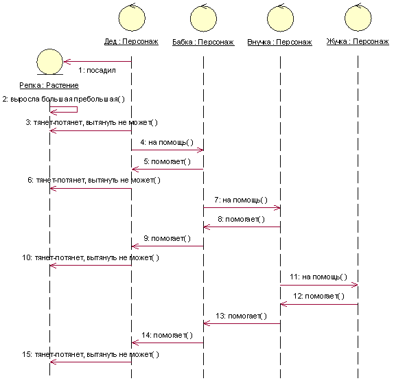
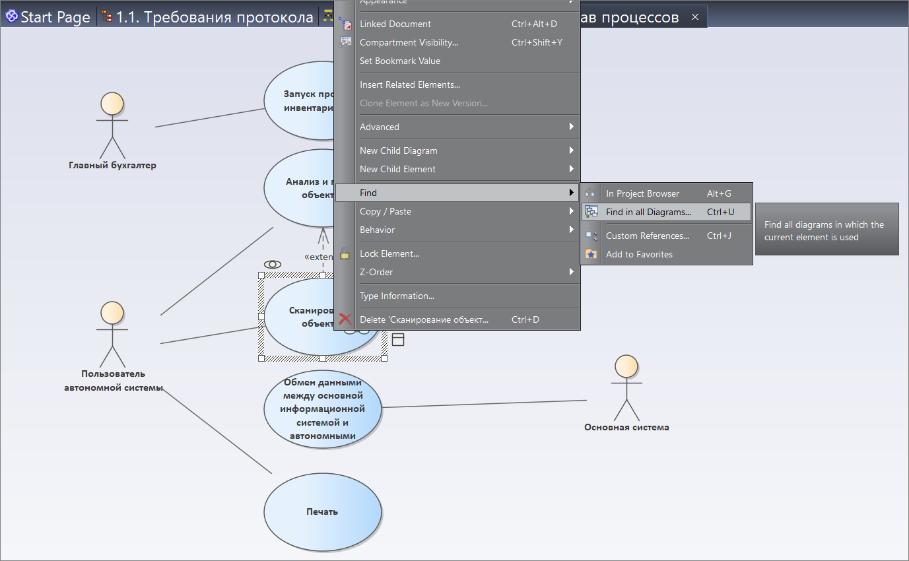

# <a href="https://infostart.ru/1c/articles/1253148/" target="_blank">Находим взаимопонимание с заказчиками с применением Enterprise Architect</a>

Enterprise Architect – мощное средство моделирования бизнес-процессов и информационных систем. Сергей Наумов на мастер-классе конференции Infostart Event 2019 Inception показал, как моделировать бизнес-процессы и составлять понятные заказчику документы при внедрении 1С-систем с помощью Enterprise Architect. Материалы мастер-класса будут полезны как разработчикам на платформе 1С, так и аналитикам, участвующим во внедрении.
Я хочу рассказать, как можно упростить себе жизнь на проекте, применяя Enterprise Architect в качестве инструмента моделирования. Чтобы и заказчикам было понятнее, что вы собираетесь для них делать, и вам было проще понять, чего от вас хотят.

Про моделирование на UML я рассказывал пару лет назад. Сейчас я опять вернусь к этой теме, но теории будет очень мало – будет в основном практика.

## Зачем заниматься моделированием?

Системы моделирования в нашей отрасли в основном применяют, чтобы объяснить исполнителям, как сделать так, чтобы результат их труда максимально соответствовал ожиданиям заказчика. Также чтобы описать бизнес-процессы – как они превратятся в объекты данных, как требования трассируются до конечных результатов.

Но для меня моделирование – это не просто инструмент для процесса взаимодействия с заказчиком, для меня моделирование – это конкретный результат, который дает мне:

* сокращение трудозатрат на переделках (конкретные сэкономленные деньги, которые я положу себе в карман);
* упрощение передачи информации;
* когда вы делаете модель какой-то системы или какого-то объекта, вы, глядя на эту модель, можете понять, какие детали или нюансы вы упустили – потому что сложный объект зачастую трудно удержать в голове, и моделирование помогает не упустить детали;
*  и, конечно, будучи руководителем, я не могу не отметить, что человек может заболеть, уйти, уволиться и т.д. И когда есть модель, есть что-то, на чем новые специалисты могут обучиться и быстро погрузиться в процесс - привлечение новых специалистов очень упрощается.

Давайте посмотрим на эту диаграмму. Что вы здесь видите? Это модель сказки «Репка».

Обратите внимание, что сама сказка «Репка» – это большой текст. А здесь в виде модели она представлена на небольшой диаграмме, которая передает весь смысл этой сказки.

Да, она более сокращенная, но, тем не менее, она дает вам представление об объекте и понимание того, о чем там речь – описывает всю последовательность действий.

Прочитав эту диаграмму, вы уже будете знать весь сценарий этой сказки.

## Модель

Чтобы разобраться, что такое модель, мне нужно два добровольца из зала – Юрий и Сергей.

Вас, Сергей, я попрошу на минуту выйти за дверь. А для вас, Юрий, задача: вам нужно построить модель тыквы так, чтобы Сергей потом смог отгадать по модели, что это за предмет.

Модель нужна, чтобы находить взаимопонимание с заказчиком. При этом неважно, какую вы выберете нотацию описания. Изначально вы можете не знать, в какой нотации заказчику будет комфортнее воспринимать модель. Что такое нотация – мы сейчас рассмотрим.

Модель, в свою очередь, может быть текстовая или с помощью диаграммы – мы сейчас рассмотрим разные варианты.

| Характеристики (что это)                 | Вес – 1.5 кгЦвет – оранжевыйФорма – шарТип – овощ |
|------------------------------------------|------------------------------------------|
| 
Зачем оно (для чего)
 | 
Для приготовления каши

Для запекания

Для еды
 |
| 
Кто использует
 | 
Люди
 |

Смотрите, Юрий выбрал текстовую нотацию и выработал некие параметры, по которым теперь можно описать любой овощ и составить его модель.

Теперь вернем Сергея – пусть он попробует угадать, какой объект был замоделирован.

Вопрос – почему нельзя в модели сразу написать, что это тыква?

Когда вы составляете модель предприятия вы не можете написать, что это предприятие. Вам нужно сделать модель этого объекта. Тыква – это конкретный предмет, а предприятие мы одним словом описать не можем, не можем охарактеризовать весь процесс этого предприятия. О том, что это технологическое предприятие, вы напишете в отчете об обследовании в нескольких местах, но как вы опишете процессы? Словами описывать долго, быстрее сделать картинку.

Исключение составляют какие-то типовые процессы. Условно говоря, есть малая компания, у которой стандартный процесс выставления счета. Его можно не описывать.

А все процессы, построенные на основе типовых, но имеющие особенности, должны быть описаны. У меня сейчас есть проект в металлургии – там есть очень большие особенности с присадками, потому что присадки очень сильно меняют качество изделия. И необходимо указывать – кто какие присадки планирует для этой конкретной серии. Потому что у каждого заказчика свои потребности. И процесс уже получается большой.

Так вот, смотрите, что сделал Юрий. Он взял наш объект и выработал определенные проекции:

*  первая проекция – характеристика этого объекта;
*  вторая проекция – зачем это;
*  третья проекция – кто использует.

Он спроецировал объект реального мира «на бумагу». Точно так же мы можем взять наше предприятие (предприятие, которое является для нас предметом или объектом нашего моделирования) и разложить его по определенным осям:

*  оргструктура;
*  бизнес-процессы;
*  функции этого предприятия;
*  цели и т.д.

То, как мы раскладываем объект моделирования по осям – это нотация. Юрий изобрел нотацию описания овощей.

Модель в свою очередь – это набор диаграмм либо текстовых данных, описанная по этой нотации.

В свою очередь, диаграмма, которую мы будем применять – это конкретный рисунок, который изображает эту ось (мы наш объект как бы раскладываем по многим осям).

## Язык моделирования UML

Я применяю в своей практике UML – это очень удобный, на мой взгляд, язык для того, чтобы передавать знания.

Важно понимать, что UML – это не нотация, это язык. Он вам не объясняет, как разложить ваш объект по каким-то осям и как его представить. Язык UML – универсальный. В состав UML входит набор диаграмм, которые предназначены для описания разных аспектов поведения объекта либо его структуры.

*  структура объекта – это часть объекта;
*  а поведение – это как он действует или как он изменяется во времени.

## Применение UML для практического моделирования

Давайте рассмотрим пару примеров практического применения UML.

Начнем с диаграммы пакетов.

На слайде приведено стандартное определение из википедии, что такое диаграмма пакетов:

«Диаграммы пакетов унифицированного языка моделирования (UML) отображают зависимости между пакетами, составляющими модель».

Когда я читал, что это и для чего, мне было совсем непонятно. Ввиду того, что UML – очень универсальный язык, большинство книг (обычно переводных) оперируют примерно такими терминами, которые не дают представление, зачем это.

На самом деле все просто. Пакеты – это определенные группировки тех или иных проекций (бизнес-процессов, участников бизнес-процессов и т.д.)

Вам понятно, что изображено на картинке справа? Я применяю эту диаграмму так, как мне удобно, и это вполне соответствует нотации.

Следующее определение – диаграмма вариантов использования. Это моя любимая диаграмма.

На некоторых форумах по UML годами продолжаются споры: «Что такое use case – функция или не функция?». Но мы с вами не будем разбираться – функция это или не функция: нет смысла тратить время как воинствующие теоретики на этих форумах. Для практического применения это не важно.

Давайте посмотрим определение:

«Диаграмма вариантов использования в UML – это диаграмма, отражающая отношение между авторами и прецедентами и являющаяся составной частью модели прецедентов, позволяющая описать систему не концептуальном уровне».

Я даже не буду читать это определение дальше – сразу видно, что оно неконструктивно.

На самом деле все очень просто:

* Use case – это сценарий, порядок действий, на выходе которого реализуется определенная цель или появляется определенная ценность (value).
* Цель, которую преследует автор (внешний по отношению к этому сценарию участник), или то, что он получит на выходе, обычно отражается в названии сценария.
* Частный случай сценария – это бизнес-процесс, у которого есть выход и есть заказчик, который что-то хочет от этого бизнес-процесса.

Каждый сценарий в свою очередь мы можем расшифровать в последовательность действий. Обратите внимание, на UML очень удобно моделировать сразу:

*  действия;
*  объекты, которые в этих действиях участвуют;
*  и кто эти действия выполняет.

Вот так, собирая информацию по дорожкам, получаются очень удобные и красивые диаграммы, которые заказчики хорошо понимают без разъяснения нотации.

Язык UML – расширяемый. Мы не обязаны применять диаграмму вариантов использования только с вариантами использования и с акторами (человечками), мы можем добавить на нее требования – я так делаю всегда, это очень удобно.

## Кейс обработки требований заказчика

Давайте теперь на конкретном кейсе из моей практики пройдем путь, который я обычно прохожу, составляя модель.

Это – реальный кейс. Ниже протокол совещаний заказчика, который поступил в качестве входящих данных. Я оставил в этом протоколе все пункты, которые несут основную смысловую нагрузку.

1.  Базы данных на устройствах, использующиеся для инвентаризации, должны работать автономно (далее – автономные базы), т.е. без подключения к информационной сети организации.
2.  В автономные базы должны выгружаться данные по ОС и номенклатуре, участвующих в инвентаризации.
3.  Необходимо в мобильном приложении отражать состав составного объекта с возможностью отметки считывания штрихкода по составляющей части.
4.  Необходимо протоколировать передачу данных в/из автономных баз в основную базу. Для протокола должна реализована возможность печати.
5.  Необходимо фиксирования в автономных базах в составе данных о наличии объектов учета в соответствии с текущей учетной информацией. В автономной базе должна быть возможность указания составного объекта с указанием его местонахождения.
6.  Необходимо в автономных базах фильтровать учетные данные по местам хранения.
7.  Необходимо по завершению инвентаризации или по требованию пользователей обновить информацию о местонахождении объекта в основной базе.
8.  Необходимо иметь возможность инвентаризации номенклатуры, имеющей количество более 1.

 
И приложение к протоколу:

1. Обеспечить формирование инвентаризационных ведомостей непосредственно в момент проведения инвентаризации, с возможностью:
 *  Контроля даты и времени считывания штрих кода
 *  Контроля излишних, недостающих и неисправных активов
2.  Обеспечить возможность визуального информирования пользователя считывающего штрихкоды информацией параметров считанного актива
3.  Обеспечить возможность поиска в мобильном устройстве
4.  Обеспечить возможность в любое время вывода на экран мобильного устройства данных о проинвентаризированных объектах и оставшихся непроинвентаризированных объектах
5.  Обеспечить возможность при повторном считывании штрихкода получать данные о дате, времени и месте предыдущего считывания штрихкода, с последующим подтверждением или отказом о внесении в инвентаризационные ведомости
6.  Обеспечить синхронизацию программы инвентаризации на мобильном устройстве с основной базой
7.  Обеспечить возможность получения отчета о результатах текущей инвентаризации в %.

Доступ к заказчику был строго регламентирован, возможности уточнять не было, и ситуация на проекте была довольно накаленная, мне сказали: «Делай по этому протоколу».

Как я поступил, чтобы такой протокол обработать:

*  сначала я построил модель и пришел с этой моделью к заказчику, уже переработав протокол;
*  при первичном обсуждении модели заказчик мне дал определенные уточнения;
*  и после этих уточнений мои разработчики сделали систему, которая запустилась с первого раза.

Обратите внимание, у меня не было ТЗ или какого-то формализованного документа. У меня просто была некоторая бумажка, которая определяет хотелки клиента.

Давайте на практике рассмотрим, как я такой протокол обрабатывал.

## Формализация бизнес-процессов в Enterprise Architect

Для формализации бизнес-процессов я использую Enterprise Architect. Это та самая система, про которую мы сегодня общаемся. Я показываю все вживую:

*  в левой части мы видим перечень объектов – это наш Project Browser (обозреватель объектов);
*  и справа будут диаграммы.

Система очень простая, в триальном режиме ее можно бесплатно скачать с сайта разработчика.

Первое, что мы делаем – мы формализуем присланный протокол. Для этого вызываем пункт меню Publish – CSV – CSV Import/Export и загружаем файл протокола, сохраненный в csv.

В пакет «1.1. Требования протокола» загружаем первый csv-файл, а в пакет «1.2. Требования приложения» – второй.

Все наши требования протокола загружены в систему – теперь мы можем с ними работать как с объектами.

Мы открываем нашу диаграмму требований протокола, выбираем требования в дереве объектов и копируем их на диаграмму.

Чтобы они на диаграмме выглядели читаемо, изменяем размер одного из требований, приравниваем к нему размер остальных, выравниваем по левому краю и распределяем по высоте диаграммы – система нам все требования расставила.

## Обрабатываем требования протокола

Давайте разберемся с требованиями, которые зафиксированы на первом листе нашего протокола. Мы видим, что у нас в протоколе явно указана цель работы –разработать мобильное приложение для инвентаризации, которое будет передавать информацию в основную информационную базу. Соответственно, нам нужно систематизировать требования к этому мобильному приложению.

Что мы хотим добиться, разбирая этот протокол:

*  во-первых, мы хотим понимать, какие процессы мы автоматизируем;
*  и второе – какие объекты нам для этого нужны (конкретные объекты метаданных).

Это позволит нам перейти от некоторого текстового непонятного описания к конкретике.

Рассмотрим первое требование. О чем нам говорит то, что базы данных должны работать автономно? Это значит, что у нас должен быть процесс обмена – сценарий (элемент с типом Use Case) «Обмен данными между основной информационной системой и автономными». Добавляем этот процесс на диаграмму и связываем его с нашим требованием (в группе Requirements Relationships находим пунктирную стрелку и соединяем блок требования с блоком процесса).

Следующее требование – в автономные базы должны выгружаться данные по ОС и номенклатуре. Это требование у нас также относится к процессу «Обмен данными между основной системой и автономными». Связываем требование с процессом.

Следующее требование – необходимо в мобильном приложении отражать состав объектов составного объекта с возможностью отметки считывания штрихкода составляющей части. Этот пункт говорит нам о том, что:

*  во-первых, его надо явно учесть в процессе обмена данными;
*  и второе – у нас должен быть какой-то процесс сканирования объектов.

Смотрите, как интересно. Допустим, сейчас мы с вами работаем с требованиями и хотим понять – мы вообще все требования обработали или не все?

Мы можем открыть матрицу отношений (в меню Design – Matrix – Open as Source).

Здесь нам нужно выбрать:

*  в качестве источника (Source) – пакет наших требований;
*  а в качестве цели – существующие в системе бизнес-процессы (они у нас сейчас в пакете «2 Состав процессов»).

Смотрите, мы получили матрицу.

*  У нас в левой части требования, с которыми мы работаем.
*  А справа мы видим, с какими процессами эти требования соотносятся, то есть, какие процессы получились из требований.

Кстати, в прошлом году, когда я показывал такую матрицу на выступлении по бюджетированию, меня несколько слушателей отдельно попросили рассказать про Enterprise Architect. Отсюда и родилась идея этого мастер-класса.
 

Идем дальше. Четвертое требование – необходимо протоколирование передачи данных из автономной базы в основную. И должна быть реализована возможность печати.

*  Очевидно, что это требование у нас соотносится с процессом обмена (протоколирование).
*  А для процесса печати мы с вами добавляем новый элемент типа Use Case в пакет «2. Состав процессов».

Новый процесс мы добавляем из набора элементов Use Case (вызывается из меню панели Toolbox). А для требований мы используем набор элементов Requirements.

Обратите внимание, как выбранный набор элементов меняет состав элементов, которые доступны на конкретной диаграмме.

Здесь можно видеть, сколько нотаций поддерживает Enterprise Architect.

Следующее требование – необходимо фиксировать в автономных базах данные о наличии объектов учета в соответствии с текущей учетной информацией:

* в автономной базе должна быть возможность указания составного объекта с указанием его местонахождения – очевидно, что это опять же касается обмена;
* и при сканировании мы должны указать местонахождение (т.е. делаем привязку к процессу сканирования).

Следующее требование – необходимо в автономных базах делать фильтрацию учетных данных по местам хранения.

* Для этого требования у нас должен быть определенный сценарий «Анализ и поиск объектов». Причем при поиске объектов, очевидно, что дальше мы захотим просканировать найденный объект. Соответственно, у нас сценарии «Сканирование» и «Анализ и поиск объектов» между собой связаны. И эта связь здесь у меня сразу задана как расширяемая («Extend») – у нас есть сценарий поиска объектов и подсценарий в нем сканирования объектов (отмечаем, что эти сценарии связаны).

 

Следующее требование – необходимо по завершению инвентаризации или по требованию пользователей обновить информацию о местонахождении объекта в основной базе. Очевидно, что это относится к обмену.

И последнее требование – необходимо иметь возможность инвентаризации номенклатуры, имеющей количество более 1. Это требование относится к сканированию.

В результате мы понимаем, какие у нас сценарии. Всего пять минут работы, и мы разобрали уже весьма мутно сформулированные требования. Мы поняли, какие сценарии и процессы будут автоматизированы.

## Обрабатываем требования приложения к протоколу

Давайте быстро посмотрим на второй протокол. Все то же самое. Меняем размер одного требования, подгоняем под него размер остальных, выравниваем все по левому краю и распределяем по странице.

Давайте разберемся.

* Первое требование – обеспечить формирование ведомостей непосредственно в момент проведения инвентаризации с возможностью контроля даты и состояния остатков. Это требование связано с процессом «Анализ и поиск объектов». Должна быть какая-то инвентаризационная ведомость, где мы видим все, что просканировали.
* Еще одно требование – обеспечить возможность визуального информирования пользователя, считывающего штрихкоды. Это требование связано с процессом «Сканирование объектов» (причем, при его добавлении сразу появляется расширяемая связь между процессами «Анализ и поиск объектов» и «Сканирование объектов»).
* Следующее требование – обеспечить возможность поиска в мобильном устройстве. Добавляем связь с процессом «Анализ и поиск объектов».

Дальше я уже продолжать не буду. Я думаю, что идею вы поняли. У нас появляется определенный набор сценариев, которые явно связаны с исходными требованиями, и мы можем визуально оценить, какие требования покрыты, а какие не покрыты.

## Добавляем связи на объекты

Дальше – нам нужно от сценариев перейти к конкретным объектам информационных баз.

* Какие объекты системы нам понадобятся для сценария «Обмен данными между информационной системой и автономными базами»?
    * во-первых, нам понадобится обработка «Рабочее место мониторинга обмена»;
    * во-вторых, очевидно, что нам, по всей видимости, понадобится какой-то механизм запуска инвентаризации, чтобы пошел обмен с мобильным устройством – документ «Распоряжение на запуск процесса инвентаризации» копируем сюда же, связываем с процессом, и мы уже видим, что у нас есть определенное распоряжение, которое связано с этим процессом.

* Для сценария «Сканирование» нам, скорее всего, понадобится какая-то обработка сканирования объектов («Обработка сканирования и подбора объектов»).
* И для сценария «Анализ и поиск объектов» нам понадобится «Рабочий стол мобильного приложения».

Вот так мы укрупненно накидываем наши метаданные.

Смотрите, наша модель дополняется:

* в первом пакете – наши требования;
* во втором пакете – наш состав процессов;
* дальше мы можем объекты метаданных, которые мы укрупненно накидали при проектировании, разложить по пакету объектов метаданных – у нас появляется почти дерево метаданных. Мы видим в привычном нам дереве те объекты, которые в рамках нашего проекта будут меняться или которые требуют доработок, изменений и т.д.

## Описываем роли с помощью диаграммы Use Case

Что мы еще здесь можем получить?

Мы можем спроектировать роли людей, которые будут работать с нашей системой. Я показывал уже эту диаграмму – мы располагаем на отдельной диаграмме все наши бизнес-процессы:

*  говорим, что для запуска процесса инвентаризации нам нужен главный бухгалтер;
*  пользователь автономной системы будет сканировать, искать объекты, заниматься печатью;
*  кроме этого, у нас будет еще один участник процесса, который мы автоматизируем – это «Основная система», которая упоминается в протоколе.

Слева на диаграммах вариантов использования принято изображать непосредственно участников сценария, а справа – внешних участников сценария, к которым этот сценарий обращается:

*  наш сценарий обмена данными обращается к основной информационной системе – поэтому она справа;
*  а человек, который сканирует – он внутри процесса, поэтому он слева.

Дальше мы начинаем уточнять наши требования: у нас есть процесс сканирования объектов. Чтобы его уточнить, мы начинаем расписывать уже конкретный сценарий, строить конкретный порядок действий – последовательность действий, как мы будем работать с этой системой.

Мы добавляем для процесса сканирования объектов дочернюю диаграмму.

Мы поместим наш бизнес-процесс сканирования объектов в отдельную папку «Бизнес-процессы» и начинаем строить нашу модель.

Теперь вернемся к диаграмме состава процессов, поставим курсор на элемент «Сканирование объектов». Теперь мы связываем его с диаграммой сканирования объектов (выбираем в контекстном меню New Child Diagram -> Select Composite Diagram -> выбираем диаграмму «Сканирование объектов»).

Теперь на элементе процесса появились «очки», и наша модель становится интерактивной – мы можем от элемента перейти непосредственно к расшифровывающей диаграмме.

Причем, мы с любого места можем перейти к этой расшифровывающей диаграмме. Это очень удобно – модель у нас получается интерактивная, связанная.

Начинаем строить нашу модель сканирования объектов. Первое, что мы делаем, мы добавляем наши полоски (в контекстном меню диаграммы пункт Swimlanes and Matrix).

Я обычно добавляю следующие полоски:

*  Вх.вых. (входящая и выходящая информация);
*  Деятельность;
*  Ответственный;
*  и Требования.

Напомню, мы проектируем процесс сканирования объектов. Как выглядит наш процесс сканирования объектов? Нам сначала нужно увидеть, что у нас не просканировано, найти физически то, что
непросканировано, и отсканировать.

Начинаем моделировать. Мы моделируем с помощью диаграммы активности UML. Диаграмма активности – это просто порядок действий.

Добавляем активности:

* начало процесса;
    * поиск непросканированного объекта в МП:
    * очевидно, что у нас есть некоторая обработка, которую мы используем для того, чтобы этот объект найти – мы связываем наше действие и эту обработку;
* сканирование объекта делает пользователь автономной системы – обратите внимание, я на каждой диаграмме использую уже готовый элемент, новых не создаю;
* следующая активность – сканирование;
* связываем наши элементы и завершаем процесс.
* Это очень простой процесс. Я специально его привел для примера. Когда мы с вами были в требованиях, мы набрасывали укрупненные объекты метаданных. Мы еще не могли себе предположить всех наших детальных объектов, которые нам потребуются в этом процессе.

И когда мы с вами расписали процесс сканирования, для нас стало просто очевидно, что при сканировании нужно где-то отметить, зарегистрировать с помощью какого-то объекта базы данных.

И здесь как раз появляется документ «Регистрация сканирования объекта».

Итак, у нас появился документ сканирования объектов, и теперь можно сказать, что наша модель практически завершена. У нас появились документы, отчеты, обработки – мы уже знаем те границы, в которых мы будем изменять систему, и из чего будет состоять наш проект.

Далее – мы начинаем разбираться, все ли требования мы учли в рамках этого процесса сканирования объекта. Мы можем в контекстном меню выбрать пункт Find -> Find in all Diagrams.

Мы сразу видим, на каких диаграммах представлен этот сценарий. Находим и видим – на диаграмме приложения этим сценарием обеспечивается второе требование, а на диаграмме протокола – третье, пятое и восьмое требование.

Переходим в нашу диаграмму, и копируем в нее все связанные требования.

Теперь у нас сразу здесь видны и требования, и процессы. И мы можем здесь четко понять, какими объектами метаданных удовлетворены те или иные требования.

Дальше здесь можно связать требования с конкретным процессом (вызывав в наборе элементов Activity элемент Dependency), но мы, чтобы не загромождать диаграмму, эту стрелку скрываем (мы ее скрыли, но можем построить матрицу трассировки, как я показывал ранее).

Таким образом, мы не упустим никаких деталей. И пользователь сразу видит, что его протокол требований разложили в процесс, какие связанные объекты для него появились. У нас во всей модели есть сквозной набор элементов, в котором от требований идет связь к конечным объектам метаданных.

## Строим диаграмму Ганта для планирования работ по проекту

Смотрите, что самое интересное – у нас появился набор объектов метаданных. Теперь мы можем для этой папки в контекстном меню вызывать View as Gant. У нас появилась диаграмма Ганта. Здесь мы можем вызвать панель назначения ресурсов, добавить аналитика, разработчика.

У нас в одной системе сразу и управление требованиями матрицы, и модель, и диаграмма Ганта для того, чтобы спланировать работу по объектам, которые мы уже смоделировали, мы можем назначить ответственных и сделать прикидку плана проекта.

Да, это не MS Project, здесь не так все функционально, здесь нет возможности хранения базовых версий планов, их сравнения и т.д. Но для большинства наших проектов этой функциональности достаточно.

## Генерируем документацию

После того, как мы построили нашу модель, самое интересное – у нас есть требование, есть состав процессов, есть наши объекты метаданных и бизнес-процессы, мы можем сделать какое-то описание наших объектов (например, для документа «Распоряжение на запуск процесса инвентаризации» укажем, для чего предназначен этот документ).

И сделаем очень интересную штуку: Publish – Report Builder – Generate Documentation.

Выбираем путь к файлу и нажимаем кнопку Generate.

## Вопросы:

* Вы показали на примере десятка требований, пары пользователей, нескольких функций и отчетов. А какой в вашем опыте был максимальный объем объектов, которыми вы управляли через Enterprise Architect в какой-нибудь масштабной разработке?
* Наверное, самый масштабный был с несколькими десятками верхнеуровневых требований. По объектам не вспомню. Но они очень здорово по диаграммам бьются. Я специально сделал два пакета, потому что на одну диаграмму, если даже десяток требований вывалить, будет очень непонятно. Вы их просто бьете по пакетам (декомпозируете), и вполне можно работать.
* Как вы предлагаете это использовать в жизни? Для каких целей и задач? В каких контекстах имеет смысл настолько заморачиваться – обеспечить трассировку требований, взаимосвязи, непротиворечивость и еще много чего? Насколько это нужно? Когда внедряется типовая система, идет ее доработка, кастомизация какая-то, и разработчик сильно связан с этой типовой системой – мне кажется, что бесполезно перетаскивать и описывать процессы в первую очередь самой типовой системы. Потому что, если переложить в эту архитектуру ERP (взять и использовать вместо СППР Enterprise Architect) – потом же не разберешься, будет слишком много всего. Мне кажется, Enterprise Architect интересен тогда, когда новые блоки системы создаются практически с нуля – со слабой взаимосвязью с типовой системой. Какой у вас опыт использования Enterprise Architect, когда речь идет о доработке типовой системы и разработке на ее основе?
* Когда я внедряю типовую систему, я в любом случае делаю описание к процессам. Я его делаю в этой нотации. Да, просто модель из двух пакетов: состав процессов и сами бизнес-процессы. Когда мы идем в проект, я всегда делаю описание процессов. Поэтому очень прекрасно ложится
* Но описание процессов – это не все, что вы показывали. Вы показывали еще и связь с объектами метаданных.
* Да, я здесь показал по максимуму, с учетом разработки. Но когда мы делаем описание типовой конфигурации, есть процессы основные – для них нужно делать модель, потому что они вариативные. А есть вспомогательные процессы (например, основные средства) – они у всех одинаковые. Поставьте кружочек, напишите «Учет основных средств» и хватит. А то, где могут быть варианты, потому что одна компания сначала выставляет счет, а потом оформляет заказ. Другая – сначала делает заказ, а потом выставляет счет. Все эти варианты прекрасно описываются в виде процессов.
* Процессы – бесспорно. К тому же для процессов есть нотации более читабельные для заказчика (вроде BPMN). Вопрос – связываете ли вы моделирование с проектировкой системы, когда речь идет о внедрении типовых прикладных решений?
* Когда внедряются типовые решения, доработки все равно возникают. Поэтому мы тут описываем процессы, и здесь же у меня появляются требования, доработки. На текущем проекте мы и требования собрали, и те доработки, которые выявлялись в ходе обсуждения. Мы прямо брали эту модель и обсуждали ее. У меня был отдельный пакет – доработки, которые я выявил, доработки, которые заказчик просил. И отдельный пакет с задачами. Я открываю модель на совещаниях, и мы идем по этой модели – очень удобно было общаться и фиксировать договоренности. Хотя проект был по бюджетированию, там доработок было немного. По поводу диаграммы BPMN – создаете новую диаграмму, указываете, что при ее описании используется набор элементов BPMN2, и рисуете.
* Я правильно понимаю, что опять приходится рисовать, что Activity-диаграммы и диаграммы BPMN живут своей жизнью и автоматически не могут быть трансформированы?
* Нет, мы работаем с диаграммами BPMN вручную, мы их не трансформируем.
* Вы в своей практике не опускаетесь до уровня метаданных, не описываете реквизиты, модули, роли системы?
* Я делаю верхнеуровневое моделирование – ровно так, как я показал.
* Только требования, бизнес-процессы и диаграммы вариантов использования? А проектирование системы вы здесь не выполняете?
* Частично выполняю. У меня есть описанная нотация моделирования, я пробовал опускаться до метаданных, заставлять разработчиков описывать основные алгоритмы. Например, у нас появляется объект метаданных – мы можем описать его функцию. На основании одного объекта метаданных мы можем ввести другой объект метаданных. Мы их можем друг с другом связать по каким-то правилам. Я пробовал это делать. Но для проектов автоматизации типовых внедрений это избыточно. Это долго, дорого и никакой ценности не несет. Когда ты даешь программисту процесс и говоришь: «Я хочу получить этот процесс» – у нас ребята все понимают.
* Как в Enterprise Architect можно отразить отклонения – что не должно быть, но может быть. У меня на каждом шаге, после которого появляется некий материальный результат, он может не появиться. Я могу просканировать – не просканировалось. Я могу начать искать объект – не нашел. Что я должен делать, и как это можно отразить, чтобы можно было понять, к чему эта штука относится? Вы показали прямую дорогу – необходимое и достаточное, если все в порядке. Как это отразить, если не все в порядке?
* Тут есть классическое решение. Добавляем ветку «Не все в порядке» и возвращаемся в начало. Или вы можете добавить сюда еще одну дорожку с названием «Регламент на случай, когда что-то пошло не так» и вставить объект напротив того действия, когда что-то пошло не так. Это не жесткая система, она не обязывает вас выполнять какие-то определенные шаги. Она позволяет построить некоторую нотацию, с помощью которой вы делаете модель вашей системы. Я для себя использую такую нотацию, а вы можете покреативить – сделать для себя отдельную дорожку и покрасить ее элементы в красный цвет, чтобы выделить разрывы.

Данная статья написана по итогам доклада (<a href="https://infostart.ru/video/w1253243/" target="_blank">видео</a>), прочитанного на конференции INFOSTART EVENT 2019. Больше статей можно прочитать <a href="https://infostart.ru/public/prm_iematerials/" target="_blank">здесь</a>.

В 2020 году приглашаем всех принять участие в 7 региональных митапах, а также юбилейной <a href="https://infostart.ru/public/prm_iematerials/" target="_blank">INFOSTART EVENT</a> 2020 в Москве.

 
 
 

